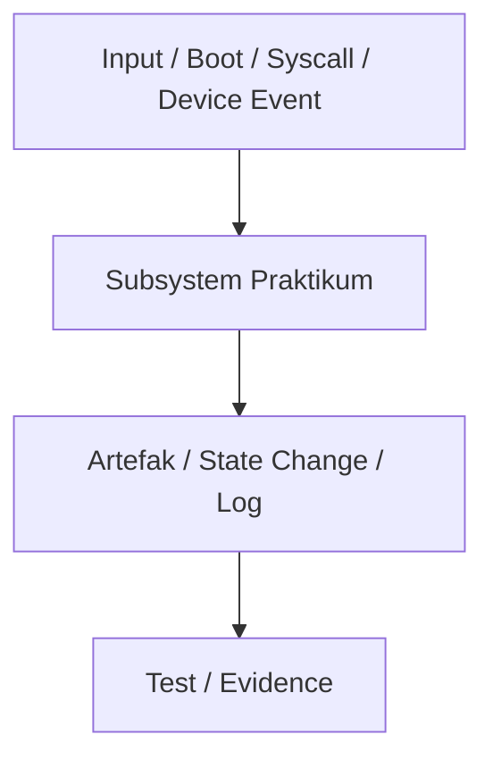

# Template Laporan Praktikum Sistem Operasi Lanjut — MCSOS

**Nama file laporan:** `laporan_praktikum_[kode_praktikum]_[nim_atau_kelompok].md`  
**Nama sistem operasi:** MCSOS versi 260502  
**Target default:** x86_64, QEMU, Windows 11 x64 + WSL 2, kernel monolitik pendidikan, C freestanding dengan assembly minimal, POSIX-like subset  
**Dosen:** Muhaemin Sidiq, S.Pd., M.Pd.  
**Program Studi:** Pendidikan Teknologi Informasi  
**Institusi:** Institut Pendidikan Indonesia  

> Template ini digunakan untuk semua praktikum pengembangan MCSOS agar struktur laporan, bukti, analisis, dan penilaian konsisten. Ganti seluruh teks bertanda `[isi ...]` dengan data praktikum sebenarnya. Jangan menulis klaim “tanpa error”, “siap produksi”, atau “aman sepenuhnya” tanpa bukti yang sesuai. Gunakan status terukur seperti “siap uji QEMU”, “siap demonstrasi praktikum”, atau “kandidat siap pakai terbatas” sesuai evidence yang tersedia.

---

## 0. Metadata Laporan

| Atribut | Isi |
|---|---|
| Kode praktikum | `[mis. M1, M2, M3, ...]` |
| Judul praktikum | `[judul praktikum]` |
| Jenis pengerjaan | `[Individu / Kelompok]` |
| Nama mahasiswa | `[nama lengkap]` |
| NIM | `[NIM]` |
| Kelas | `[kelas]` |
| Nama kelompok | `[isi jika kelompok]` |
| Anggota kelompok | `[nama, NIM, peran ringkas]` |
| Tanggal praktikum | `[YYYY-MM-DD]` |
| Tanggal pengumpulan | `[YYYY-MM-DD]` |
| Repository | `[URL repo privat / path lokal]` |
| Branch | `[nama branch]` |
| Commit awal | `` `[hash commit awal]` `` |
| Commit akhir | `` `[hash commit akhir]` `` |
| Status readiness yang diklaim | `[belum siap uji / siap uji QEMU / siap demonstrasi praktikum / kandidat siap pakai terbatas]` |

---

## 1. Sampul

# Laporan Praktikum `[Kode Praktikum]`  
## `[Judul Praktikum]`

Disusun oleh:

| Nama | NIM | Kelas | Peran |
|---|---|---|---|
| `[nama]` | `[nim]` | `[kelas]` | `[individu / ketua / anggota / implementasi / pengujian / dokumentasi]` |
| `[opsional]` | `[opsional]` | `[opsional]` | `[opsional]` |

Dosen Pengampu: **Muhaemin Sidiq, S.Pd., M.Pd.**  
Program Studi Pendidikan Teknologi Informasi  
Institut Pendidikan Indonesia  
`[Tahun Akademik]`

---

## 2. Pernyataan Orisinalitas dan Integritas Akademik

Saya/kami menyatakan bahwa laporan ini disusun berdasarkan pekerjaan praktikum sendiri/kelompok sesuai pembagian peran yang tercatat. Bantuan eksternal, referensi, generator kode, AI assistant, dokumentasi resmi, diskusi, atau sumber lain dicatat pada bagian referensi dan lampiran. Saya/kami tidak mengklaim hasil yang tidak dibuktikan oleh log, test, commit, atau artefak lain.

| Pernyataan | Status |
|---|---|
| Semua potongan kode eksternal diberi atribusi | `[Ya/Tidak/Tidak ada]` |
| Semua penggunaan AI assistant dicatat | `[Ya/Tidak/Tidak ada]` |
| Repository yang dikumpulkan sesuai commit akhir | `[Ya/Tidak]` |
| Tidak ada klaim readiness tanpa bukti | `[Ya/Tidak]` |

Catatan penggunaan bantuan eksternal:

```text
[Isi: alat, prompt ringkas, sumber, bagian yang dibantu, verifikasi mandiri yang dilakukan.]
```

---

## 3. Tujuan Praktikum

Tuliskan tujuan teknis dan konseptual praktikum. Tujuan harus dapat diuji.

1. `[Tujuan teknis 1: mis. membangun toolchain reproducible untuk target x86_64-elf]`
2. `[Tujuan teknis 2: mis. menghasilkan image bootable QEMU dengan serial log]`
3. `[Tujuan konseptual 1: mis. menjelaskan kontrak boot handoff, linker layout, atau invariant allocator]`
4. `[Tujuan validasi: mis. menyimpan log build, log QEMU, readelf/objdump evidence, dan test result]`

---

## 4. Capaian Pembelajaran Praktikum

Setelah praktikum ini, mahasiswa mampu:

| CPL/CPMK praktikum | Bukti yang harus ditunjukkan |
|---|---|
| `[capaian 1]` | `[log, screenshot, test, diff, diagram, analisis]` |
| `[capaian 2]` | `[log, screenshot, test, diff, diagram, analisis]` |
| `[capaian 3]` | `[log, screenshot, test, diff, diagram, analisis]` |

---

## 5. Peta Milestone MCSOS

Centang milestone yang menjadi fokus laporan ini. Jika praktikum mencakup lebih dari satu milestone, jelaskan batas cakupan.

| Milestone | Fokus | Status dalam laporan |
|---|---|---|
| M0 | Requirements, governance, baseline arsitektur | `[ ] tidak dibahas / [ ] dibahas / [ ] selesai praktikum` |
| M1 | Toolchain reproducible, Git, QEMU, GDB, metadata build | `[ ] tidak dibahas / [ ] dibahas / [ ] selesai praktikum` |
| M2 | Boot image, kernel ELF64, early console | `[ ] tidak dibahas / [ ] dibahas / [ ] selesai praktikum` |
| M3 | Panic path, linker map, GDB, observability awal | `[ ] tidak dibahas / [ ] dibahas / [ ] selesai praktikum` |
| M4 | Trap, exception, interrupt, timer | `[ ] tidak dibahas / [ ] dibahas / [ ] selesai praktikum` |
| M5 | PMM, VMM, page table, kernel heap | `[ ] tidak dibahas / [ ] dibahas / [ ] selesai praktikum` |
| M6 | Thread, scheduler, synchronization | `[ ] tidak dibahas / [ ] dibahas / [ ] selesai praktikum` |
| M7 | Syscall ABI dan user program loader | `[ ] tidak dibahas / [ ] dibahas / [ ] selesai praktikum` |
| M8 | VFS, file descriptor, ramfs | `[ ] tidak dibahas / [ ] dibahas / [ ] selesai praktikum` |
| M9 | Block layer dan device model | `[ ] tidak dibahas / [ ] dibahas / [ ] selesai praktikum` |
| M10 | Persistent filesystem, mcsfs/ext2-like, recovery | `[ ] tidak dibahas / [ ] dibahas / [ ] selesai praktikum` |
| M11 | Networking stack, packet parsing, UDP/TCP subset | `[ ] tidak dibahas / [ ] dibahas / [ ] selesai praktikum` |
| M12 | Security model, capability/ACL, syscall fuzzing, hardening | `[ ] tidak dibahas / [ ] dibahas / [ ] selesai praktikum` |
| M13 | SMP, scalability, lock stress, NUMA-aware preparation | `[ ] tidak dibahas / [ ] dibahas / [ ] selesai praktikum` |
| M14 | Framebuffer, graphics console, visual regression | `[ ] tidak dibahas / [ ] dibahas / [ ] selesai praktikum` |
| M15 | Virtualization/container subset | `[ ] tidak dibahas / [ ] dibahas / [ ] selesai praktikum` |
| M16 | Observability, update/rollback, release image, readiness review | `[ ] tidak dibahas / [ ] dibahas / [ ] selesai praktikum` |

Batas cakupan praktikum:

```text
[Uraikan fitur yang termasuk dan tidak termasuk. Nyatakan non-goals agar laporan tidak memberi klaim berlebihan.]
```

---

## 6. Dasar Teori Ringkas

Tuliskan teori yang langsung diperlukan untuk memahami praktikum. Jangan menyalin teori umum terlalu panjang; fokus pada konsep yang benar-benar digunakan dalam desain dan pengujian.

### 6.1 Konsep Sistem Operasi yang Diuji

```text
[Jelaskan konsep utama: bootloader, ELF, linker script, trap frame, PMM, VMM, scheduler, VFS, driver, networking, security, atau topik lain sesuai praktikum.]
```

### 6.2 Konsep Arsitektur x86_64 yang Relevan

| Konsep | Relevansi pada praktikum | Bukti/verifikasi |
|---|---|---|
| `[long mode / paging / GDT / IDT / APIC / syscall / TLB / DMA / MMIO]` | `[mengapa diperlukan]` | `[readelf, objdump, serial log, register dump, test]` |
| `[konsep lain]` | `[mengapa diperlukan]` | `[bukti]` |

### 6.3 Konsep Implementasi Freestanding

| Aspek | Keputusan praktikum |
|---|---|
| Bahasa | `[C17 freestanding / assembly / Rust no_std / lainnya]` |
| Runtime | `[tanpa hosted libc / libc minimal / crt0 khusus]` |
| ABI | `[x86_64 System V / ABI kernel internal / syscall ABI]` |
| Compiler flags kritis | `[mis. -ffreestanding, -mno-red-zone, -nostdlib]` |
| Risiko undefined behavior | `[mis. pointer invalid, alignment, integer overflow, aliasing]` |

### 6.4 Referensi Teori yang Digunakan

| No. | Sumber | Bagian yang digunakan | Alasan relevansi |
|---|---|---|---|
| `[1]` | `[buku/spesifikasi/dokumentasi]` | `[bab/section]` | `[alasan]` |
| `[2]` | `[buku/spesifikasi/dokumentasi]` | `[bab/section]` | `[alasan]` |

---

## 7. Lingkungan Praktikum

### 7.1 Host dan Target

| Komponen | Nilai |
|---|---|
| Host OS | `[Windows 11 x64 build ...]` |
| Lingkungan build | `[WSL 2 Ubuntu/Debian versi ...]` |
| Target ISA | `x86_64` |
| Target ABI | `[x86_64-elf / x86_64-unknown-none / custom]` |
| Emulator | `[QEMU versi ...]` |
| Firmware emulator | `[OVMF versi/path ...]` |
| Debugger | `[GDB/gdb-multiarch versi ...]` |
| Build system | `[Make/CMake/Meson/Ninja]` |
| Bahasa utama | `[C17 freestanding]` |
| Assembly | `[NASM/GAS versi ...]` |

### 7.2 Versi Toolchain

Tempel output versi toolchain berikut. Jalankan dari clean shell WSL.

```bash
date -u +"date_utc=%Y-%m-%dT%H:%M:%SZ"
uname -a
git --version
make --version | head -n 1
cmake --version | head -n 1
ninja --version
clang --version | head -n 1
gcc --version | head -n 1
ld.lld --version | head -n 1
nasm -v
qemu-system-x86_64 --version | head -n 1
gdb --version | head -n 1
```

Output:

```text
[Tempel output asli di sini.]
```

### 7.3 Lokasi Repository

| Item | Nilai |
|---|---|
| Path repository di WSL | `` `[mis. ~/src/mcsos]` `` |
| Apakah berada di filesystem Linux WSL, bukan `/mnt/c` | `[Ya/Tidak]` |
| Remote repository | `[URL repo privat jika ada]` |
| Branch | `[nama branch]` |
| Commit hash awal | `` `[hash]` `` |
| Commit hash akhir | `` `[hash]` `` |

---

## 8. Repository dan Struktur File

### 8.1 Struktur Direktori yang Relevan

Tampilkan hanya direktori dan file yang relevan dengan praktikum.

```text
[Tempel output tree ringkas, misalnya:
mcsos/
  arch/x86_64/boot/
  kernel/core/
  kernel/mm/
  tools/qemu/
  tests/
  docs/
]
```

### 8.2 File yang Dibuat atau Diubah

| File | Jenis perubahan | Alasan perubahan | Risiko |
|---|---|---|---|
| `[path/file]` | `[baru/ubah/hapus]` | `[alasan teknis]` | `[rendah/sedang/tinggi + alasan]` |
| `[path/file]` | `[baru/ubah/hapus]` | `[alasan teknis]` | `[rendah/sedang/tinggi + alasan]` |

### 8.3 Ringkasan Diff

```bash
git status --short
git diff --stat
git log --oneline -n 5
```

Output:

```text
[Tempel output asli di sini.]
```

---

## 9. Desain Teknis

### 9.1 Masalah yang Diselesaikan

```text
[Jelaskan masalah teknis praktikum. Contoh: “kernel belum memiliki early console sehingga panic awal tidak dapat didiagnosis”, atau “PMM belum memiliki ownership state untuk frame fisik”.]
```

### 9.2 Keputusan Desain

| Keputusan | Alternatif yang dipertimbangkan | Alasan memilih | Konsekuensi |
|---|---|---|---|
| `[keputusan 1]` | `[alternatif]` | `[alasan]` | `[konsekuensi]` |
| `[keputusan 2]` | `[alternatif]` | `[alasan]` | `[konsekuensi]` |

### 9.3 Arsitektur Ringkas

Tambahkan diagram ASCII atau Mermaid. Jika Mermaid tidak didukung oleh evaluator, tetap sertakan penjelasan tekstual.



Penjelasan diagram:

```text
[Jelaskan alur kontrol dan batas tanggung jawab setiap komponen.]
```

### 9.4 Kontrak Antarmuka

| Antarmuka | Pemanggil | Penerima | Precondition | Postcondition | Error path |
|---|---|---|---|---|---|
| `[fungsi/API/syscall/handler]` | `[komponen]` | `[komponen]` | `[syarat sebelum dipanggil]` | `[keadaan setelah berhasil]` | `[jika gagal]` |

### 9.5 Struktur Data Utama

| Struktur data | Field penting | Ownership | Lifetime | Invariant |
|---|---|---|---|---|
| `` `[struct ...]` `` | `[field]` | `[pemilik]` | `[kapan dibuat/dihapus]` | `[invariant]` |
| `` `[struct ...]` `` | `[field]` | `[pemilik]` | `[kapan dibuat/dihapus]` | `[invariant]` |

### 9.6 Invariants

Tuliskan invariant yang harus benar sepanjang eksekusi.

1. `[Invariant 1: mis. setiap physical frame memiliki tepat satu state: free, reserved, kernel, page_table, dma_pinned, mmio, atau bad.]`
2. `[Invariant 2: mis. interrupt hard handler tidak boleh melakukan operasi blocking.]`
3. `[Invariant 3: mis. user pointer tidak boleh di-dereference langsung di kernel.]`
4. `[Invariant 4 sesuai praktikum.]`

### 9.7 Ownership, Locking, dan Concurrency

| Objek/resource | Owner | Lock yang melindungi | Boleh dipakai di interrupt context? | Catatan |
|---|---|---|---|---|
| `[resource]` | `[owner]` | `[spinlock/mutex/none]` | `[Ya/Tidak]` | `[catatan]` |

Lock order yang berlaku:

```text
[Contoh: pmm_lock -> vmm_lock -> process_lock. Jika tidak ada locking, jelaskan mengapa single-core/interrupt-disabled cukup untuk tahap ini.]
```

### 9.8 Memory Safety dan Undefined Behavior Risk

| Risiko | Lokasi | Mitigasi | Bukti |
|---|---|---|---|
| `[out-of-bounds / use-after-free / alignment / aliasing / integer overflow]` | `[file/fungsi]` | `[mitigasi]` | `[test/static analysis/review]` |

### 9.9 Security Boundary

| Boundary | Data tidak tepercaya | Validasi yang dilakukan | Failure mode aman |
|---|---|---|---|
| `[boot handoff / syscall / packet / file metadata / device descriptor]` | `[input]` | `[bounds/type/alignment/permission/capability]` | `[panic/log/error code/deny]` |

---

## 10. Langkah Kerja Implementasi

Gunakan tabel berikut untuk setiap langkah. Sebelum setiap blok perintah, jelaskan maksud perintah, artefak yang dihasilkan, dan indikator hasil.

### Langkah 1 — `[Nama langkah]`

Maksud langkah:

```text
[Jelaskan mengapa langkah ini dilakukan.]
```

Perintah:

```bash
[perintah yang dijalankan]
```

Output ringkas:

```text
[tempel output penting, bukan seluruh log jika terlalu panjang]
```

Artefak yang dihasilkan:

| Artefak | Lokasi | Fungsi |
|---|---|---|
| `[file/log/image]` | `[path]` | `[fungsi]` |

Indikator berhasil:

```text
[Jelaskan tanda objektif bahwa langkah berhasil.]
```

### Langkah 2 — `[Nama langkah]`

Maksud langkah:

```text
[Isi.]
```

Perintah:

```bash
[perintah]
```

Output ringkas:

```text
[output]
```

Artefak yang dihasilkan:

| Artefak | Lokasi | Fungsi |
|---|---|---|
| `[file/log/image]` | `[path]` | `[fungsi]` |

Indikator berhasil:

```text
[Isi.]
```

### Langkah Tambahan

Ulangi pola yang sama untuk semua langkah.

---

## 11. Checkpoint Buildable

Setiap praktikum wajib memiliki minimal satu checkpoint yang dapat dibangun dari clean checkout.

| Checkpoint | Perintah | Expected result | Status |
|---|---|---|---|
| Clean build | `` `make clean && make build` `` | `[kernel/image/test target terbangun]` | `[PASS/FAIL]` |
| Metadata toolchain | `` `make meta` `` | `[build/meta/toolchain-versions.txt ada]` | `[PASS/FAIL]` |
| Image generation | `` `make image` `` | `[mcsos.iso/mcsos.img ada]` | `[PASS/FAIL/NA]` |
| QEMU smoke test | `` `make run` `` | `[serial log stage marker]` | `[PASS/FAIL/NA]` |
| Test suite | `` `make test` `` | `[semua test relevan lulus]` | `[PASS/FAIL/NA]` |

Catatan checkpoint:

```text
[Jelaskan checkpoint yang belum lulus dan alasan teknisnya.]
```

---

## 12. Perintah Uji dan Validasi

### 12.1 Build Test

Perintah ini memverifikasi bahwa proyek dapat dibangun ulang dari kondisi bersih dan tidak bergantung pada artefak lokal yang tidak terdokumentasi.

```bash
make clean
make build
```

Hasil:

```text
[Tempel output ringkas.]
```

Status: `[PASS/FAIL]`

### 12.2 Static Inspection

Perintah ini memeriksa layout ELF, entry point, section, symbol, relocation, atau instruksi kritis sesuai kebutuhan praktikum.

```bash
readelf -hW build/kernel.elf
readelf -lW build/kernel.elf
readelf -SW build/kernel.elf
objdump -drwC build/kernel.elf | head -n 120
```

Hasil penting:

```text
[Tempel bukti entry point, program headers, section flags, atau disassembly yang relevan.]
```

Status: `[PASS/FAIL/NA]`

### 12.3 QEMU Smoke Test

Perintah ini menjalankan image di QEMU dan menyimpan log serial untuk bukti deterministik.

```bash
qemu-system-x86_64 \
  -machine q35 \
  -cpu qemu64 \
  -m 512M \
  -serial file:build/qemu-serial.log \
  -display none \
  -no-reboot \
  -no-shutdown \
  -cdrom build/mcsos.iso
```

Hasil:

```text
[Tempel potongan build/qemu-serial.log.]
```

Status: `[PASS/FAIL/NA]`

### 12.4 GDB Debug Evidence

Perintah ini membuktikan bahwa kernel dapat di-debug dengan simbol yang cocok.

```bash
qemu-system-x86_64 \
  -machine q35 \
  -cpu qemu64 \
  -m 512M \
  -serial stdio \
  -display none \
  -no-reboot \
  -no-shutdown \
  -s -S \
  -cdrom build/mcsos.iso
```

Di terminal lain:

```bash
gdb-multiarch build/kernel.elf
target remote :1234
break kernel_main
continue
info registers
bt
```

Hasil:

```text
[Tempel bukti breakpoint/register/backtrace.]
```

Status: `[PASS/FAIL/NA]`

### 12.5 Unit Test

```bash
make test
```

Hasil:

```text
[Tempel ringkasan test.]
```

Status: `[PASS/FAIL/NA]`

### 12.6 Stress/Fuzz/Fault Injection Test

Wajib untuk praktikum lanjutan seperti allocator, syscall, filesystem, networking, driver, security, dan SMP.

```bash
[perintah stress/fuzz/fault injection]
```

Hasil:

```text
[Tempel hasil.]
```

Status: `[PASS/FAIL/NA]`

### 12.7 Visual Evidence

Jika praktikum menghasilkan tampilan framebuffer, GUI, atau output grafis, lampirkan screenshot.

| Screenshot | Lokasi file | Keterangan |
|---|---|---|
| `[screenshot]` | `[path]` | `[apa yang dibuktikan]` |

---

## 13. Hasil Uji

### 13.1 Tabel Ringkasan Hasil

| No. | Uji | Expected result | Actual result | Status | Evidence |
|---|---|---|---|---|---|
| 1 | `[uji]` | `[expected]` | `[actual]` | `[PASS/FAIL]` | `[file/log/screenshot]` |
| 2 | `[uji]` | `[expected]` | `[actual]` | `[PASS/FAIL]` | `[file/log/screenshot]` |

### 13.2 Log Penting

```text
[Tempel log yang benar-benar penting: boot marker, panic path, test pass/fail, fault injection result.]
```

### 13.3 Artefak Bukti

| Artefak | Path | SHA-256 / hash | Fungsi |
|---|---|---|---|
| `kernel.elf` | `[path]` | `[hash]` | `[kernel binary]` |
| `mcsos.iso` / `mcsos.img` | `[path]` | `[hash]` | `[boot image]` |
| `qemu-serial.log` | `[path]` | `[hash]` | `[log boot]` |
| `kernel.map` | `[path]` | `[hash]` | `[linker map]` |
| `objdump.txt` | `[path]` | `[hash]` | `[disassembly evidence]` |
| `[lainnya]` | `[path]` | `[hash]` | `[fungsi]` |

Perintah hash:

```bash
sha256sum [path/artefak]
```

---

## 14. Analisis Teknis

### 14.1 Analisis Keberhasilan

```text
[Jelaskan mengapa hasil uji berhasil. Kaitkan dengan desain, invariant, dan output log.]
```

### 14.2 Analisis Kegagalan atau Perbedaan Hasil

```text
[Jelaskan kegagalan, gejala, dugaan akar masalah, bukti pendukung, dan tindakan perbaikan.]
```

### 14.3 Perbandingan dengan Teori

| Konsep teori | Implementasi praktikum | Sesuai/tidak sesuai | Penjelasan |
|---|---|---|---|
| `[konsep]` | `[implementasi]` | `[sesuai/tidak]` | `[analisis]` |

### 14.4 Kompleksitas dan Kinerja

| Aspek | Estimasi/hasil | Bukti | Catatan |
|---|---|---|---|
| Kompleksitas algoritma | `[O(...)]` | `[argumen/test]` | `[catatan]` |
| Waktu build | `[detik]` | `[log]` | `[catatan]` |
| Waktu boot QEMU | `[detik/stage marker]` | `[serial log]` | `[catatan]` |
| Penggunaan memori | `[nilai jika ada]` | `[log/metric]` | `[catatan]` |
| Latensi/throughput | `[nilai jika ada]` | `[benchmark]` | `[catatan]` |

---

## 15. Debugging dan Failure Modes

### 15.1 Failure Modes yang Ditemukan

| Failure mode | Gejala | Penyebab sementara | Bukti | Perbaikan |
|---|---|---|---|---|
| `[triple fault / page fault / GPF / hang / deadlock / memory leak / corrupt FS / packet drop]` | `[gejala]` | `[dugaan]` | `[log]` | `[fix/mitigasi]` |

### 15.2 Failure Modes yang Diantisipasi

| Failure mode | Deteksi | Dampak | Mitigasi |
|---|---|---|---|
| `[risiko]` | `[assert/log/test]` | `[dampak]` | `[mitigasi]` |

### 15.3 Triage yang Dilakukan

```text
[Urutan diagnosis: log serial, GDB, register dump, map file, disassembly, git bisect, QEMU monitor, dll.]
```

### 15.4 Panic Path

Jika terjadi panic, tempel output panic.

```text
[Tempel panic log. Jika tidak ada panic, jelaskan bagaimana panic path diuji atau mengapa belum relevan.]
```

---

## 16. Prosedur Rollback

Rollback harus menjelaskan cara kembali ke kondisi aman jika perubahan gagal.

| Skenario rollback | Perintah | Data yang harus diselamatkan | Status |
|---|---|---|---|
| Kembali ke commit awal | `` `git checkout [commit_awal]` `` | `[log/test]` | `[teruji/belum]` |
| Revert commit praktikum | `` `git revert [commit]` `` | `[log/test]` | `[teruji/belum]` |
| Bersihkan artefak build | `` `make clean` `` | `[tidak ada/source aman]` | `[teruji/belum]` |
| Regenerasi image | `` `make image` `` | `[image lama jika diperlukan]` | `[teruji/belum]` |

Catatan rollback:

```text
[Jelaskan apakah rollback diuji. Jika belum diuji, jelaskan alasan dan risiko.]
```

---

## 17. Keamanan dan Reliability

### 17.1 Risiko Keamanan

| Risiko | Boundary | Dampak | Mitigasi | Evidence |
|---|---|---|---|---|
| `[user pointer invalid / privilege escalation / W+X mapping / DMA corruption / packet parser overflow / path traversal]` | `[boundary]` | `[dampak]` | `[mitigasi]` | `[test/log/review]` |

### 17.2 Reliability dan Data Integrity

| Risiko reliability | Dampak | Deteksi | Mitigasi |
|---|---|---|---|
| `[hang / data loss / inconsistent state / race / deadlock / resource leak]` | `[dampak]` | `[test/log]` | `[mitigasi]` |

### 17.3 Negative Test

| Negative test | Input buruk | Expected result | Actual result | Status |
|---|---|---|---|---|
| `[uji]` | `[input]` | `[deny/error/panic terbaca/no corruption]` | `[hasil]` | `[PASS/FAIL/NA]` |

---

## 18. Pembagian Kerja Kelompok

Isi bagian ini hanya jika praktikum dikerjakan berkelompok. Untuk pengerjaan individu, tulis “Tidak berlaku”.

| Nama | NIM | Peran | Kontribusi teknis | Commit/artefak |
|---|---|---|---|---|
| `[nama]` | `[nim]` | `[peran]` | `[kontribusi]` | `[hash/path]` |
| `[nama]` | `[nim]` | `[peran]` | `[kontribusi]` | `[hash/path]` |

### 18.1 Mekanisme Koordinasi

```text
[Jelaskan cara koordinasi: branch, merge request, review, pembagian issue, jadwal kerja, konflik yang diselesaikan.]
```

### 18.2 Evaluasi Kontribusi

| Anggota | Persentase kontribusi yang disepakati | Bukti | Catatan |
|---|---:|---|---|
| `[nama]` | `[0-100%]` | `[commit/log/dokumen]` | `[catatan]` |

---

## 19. Kriteria Lulus Praktikum

Bagian ini wajib diisi. Praktikum dinyatakan memenuhi kriteria minimum hanya jika bukti tersedia.

| Kriteria minimum | Status | Evidence |
|---|---|---|
| Proyek dapat dibangun dari clean checkout | `[PASS/FAIL]` | `[log]` |
| Perintah build terdokumentasi | `[PASS/FAIL]` | `[bagian laporan]` |
| QEMU boot atau test target berjalan deterministik | `[PASS/FAIL/NA]` | `[serial log/test log]` |
| Semua unit test/praktikum test relevan lulus | `[PASS/FAIL]` | `[test result]` |
| Log serial disimpan | `[PASS/FAIL/NA]` | `[path]` |
| Panic path terbaca atau dijelaskan jika belum relevan | `[PASS/FAIL]` | `[log/analisis]` |
| Tidak ada warning kritis pada build | `[PASS/FAIL]` | `[build log]` |
| Perubahan Git terkomit | `[PASS/FAIL]` | `[commit hash]` |
| Desain dan failure mode dijelaskan | `[PASS/FAIL]` | `[bagian laporan]` |
| Laporan berisi screenshot/log yang cukup | `[PASS/FAIL]` | `[lampiran]` |

Kriteria tambahan untuk praktikum lanjutan:

| Kriteria lanjutan | Status | Evidence |
|---|---|---|
| Static analysis dijalankan | `[PASS/FAIL/NA]` | `[cppcheck/clang-tidy log]` |
| Stress test dijalankan | `[PASS/FAIL/NA]` | `[log]` |
| Fuzzing atau malformed-input test dijalankan | `[PASS/FAIL/NA]` | `[log]` |
| Fault injection dijalankan | `[PASS/FAIL/NA]` | `[log]` |
| Disassembly/readelf evidence tersedia | `[PASS/FAIL/NA]` | `[objdump/readelf]` |
| Review keamanan dilakukan | `[PASS/FAIL/NA]` | `[security table]` |
| Rollback diuji | `[PASS/FAIL/NA]` | `[rollback log]` |

---

## 20. Readiness Review

Pilih satu status dengan alasan berbasis bukti.

| Status | Definisi | Pilihan |
|---|---|---|
| Belum siap uji | Build/test belum stabil atau bukti belum cukup | `[ ]` |
| Siap uji QEMU | Build bersih, QEMU/test target berjalan, log tersedia | `[ ]` |
| Siap demonstrasi praktikum | Siap ditunjukkan di kelas dengan bukti uji, failure mode, dan rollback | `[ ]` |
| Kandidat siap pakai terbatas | Hanya untuk penggunaan terbatas setelah test, security review, dokumentasi, dan known issue tersedia | `[ ]` |

Alasan readiness:

```text
[Jelaskan status yang dipilih berdasarkan bukti, bukan klaim.]
```

Known issues:

| No. | Issue | Dampak | Workaround | Target perbaikan |
|---|---|---|---|---|
| 1 | `[issue]` | `[dampak]` | `[workaround]` | `[milestone]` |

Keputusan akhir:

```text
[Contoh: “Berdasarkan bukti build, QEMU serial log, dan hasil make test, hasil praktikum ini layak disebut siap uji QEMU untuk milestone M2. Belum layak disebut siap demonstrasi praktikum karena panic path belum diuji dengan fault injection.”]
```

---

## 21. Rubrik Penilaian 100 Poin

| Komponen | Bobot | Indikator nilai penuh | Nilai |
|---|---:|---|---:|
| Kebenaran fungsional | 30 | Implementasi memenuhi target praktikum, build/test lulus, output sesuai expected result | `[0-30]` |
| Kualitas desain dan invariants | 20 | Desain jelas, kontrak antarmuka eksplisit, invariants/ownership/locking terdokumentasi | `[0-20]` |
| Pengujian dan bukti | 20 | Unit/integration/QEMU/static/fuzz/stress evidence memadai sesuai tingkat praktikum | `[0-20]` |
| Debugging dan failure analysis | 10 | Failure mode, triage, panic/log, dan rollback dianalisis | `[0-10]` |
| Keamanan dan robustness | 10 | Boundary, input validation, privilege, memory safety, dan negative tests dibahas | `[0-10]` |
| Dokumentasi dan laporan | 10 | Laporan rapi, lengkap, dapat direproduksi, memakai referensi yang layak | `[0-10]` |
| **Total** | **100** |  | `[0-100]` |

Catatan penilai:

```text
[Diisi dosen/asisten.]
```

---

## 22. Kesimpulan

### 22.1 Yang Berhasil

```text
[Jelaskan hasil yang berhasil berdasarkan evidence.]
```

### 22.2 Yang Belum Berhasil

```text
[Jelaskan keterbatasan atau target yang belum tercapai.]
```

### 22.3 Rencana Perbaikan

```text
[Jelaskan langkah berikutnya yang realistis dan terukur.]
```

---

## 23. Lampiran

### Lampiran A — Commit Log

```text
[Tempel git log --oneline yang relevan.]
```

### Lampiran B — Diff Ringkas

```diff
[Tempel diff penting. Jangan menempel seluruh kode panjang kecuali diminta.]
```

### Lampiran C — Log Build Lengkap

```text
[Tempel atau beri path ke log build lengkap.]
```

### Lampiran D — Log QEMU Lengkap

```text
[Tempel atau beri path ke qemu-serial.log.]
```

### Lampiran E — Output Readelf/Objdump

```text
[Tempel output penting.]
```

### Lampiran F — Screenshot

| No. | File | Keterangan |
|---|---|---|
| 1 | `[path/screenshot]` | `[keterangan]` |

### Lampiran G — Bukti Tambahan

```text
[Trace, pcap, fsck output, fuzz result, fault injection log, benchmark, atau artefak lain.]
```

---

## 24. Daftar Referensi

Gunakan format IEEE. Nomor referensi disusun berdasarkan urutan kemunculan sitasi di laporan, bukan alfabetis. Contoh format:

```text
[1] R. H. Arpaci-Dusseau and A. C. Arpaci-Dusseau, Operating Systems: Three Easy Pieces. Madison, WI, USA: Arpaci-Dusseau Books, [tahun/edisi yang digunakan]. [Online]. Available: [URL]. Accessed: [tanggal akses].

[2] R. Cox, F. Kaashoek, and R. Morris, “xv6: a simple, Unix-like teaching operating system,” MIT PDOS. [Online]. Available: [URL]. Accessed: [tanggal akses].

[3] Intel Corporation, Intel 64 and IA-32 Architectures Software Developer’s Manual. [Online]. Available: [URL]. Accessed: [tanggal akses].

[4] Advanced Micro Devices, AMD64 Architecture Programmer’s Manual. [Online]. Available: [URL]. Accessed: [tanggal akses].

[5] UEFI Forum, Unified Extensible Firmware Interface Specification. [Online]. Available: [URL]. Accessed: [tanggal akses].

[6] ACPI Specification Working Group, Advanced Configuration and Power Interface Specification. [Online]. Available: [URL]. Accessed: [tanggal akses].
```

Referensi yang benar-benar dipakai dalam laporan:

```text
[1] [Isi referensi pertama.]
[2] [Isi referensi kedua.]
[3] [Isi referensi ketiga.]
```

---

## 25. Checklist Final Sebelum Pengumpulan

| Checklist | Status |
|---|---|
| Semua placeholder `[isi ...]` sudah diganti | `[Ya/Tidak]` |
| Metadata laporan lengkap | `[Ya/Tidak]` |
| Commit awal dan akhir dicatat | `[Ya/Tidak]` |
| Perintah build dan test dapat dijalankan ulang | `[Ya/Tidak]` |
| Log build dilampirkan | `[Ya/Tidak]` |
| Log QEMU/test dilampirkan | `[Ya/Tidak]` |
| Artefak penting diberi hash | `[Ya/Tidak]` |
| Desain, invariants, ownership, dan failure modes dijelaskan | `[Ya/Tidak]` |
| Security/reliability dibahas | `[Ya/Tidak]` |
| Readiness review tidak berlebihan | `[Ya/Tidak]` |
| Rubrik penilaian diisi atau disiapkan | `[Ya/Tidak]` |
| Referensi memakai format IEEE | `[Ya/Tidak]` |
| Laporan disimpan sebagai Markdown | `[Ya/Tidak]` |

---

## 26. Pernyataan Pengumpulan

Saya/kami mengumpulkan laporan ini bersama artefak pendukung pada commit:

```text
[commit hash akhir]
```

Status akhir yang diklaim:

```text
[belum siap uji / siap uji QEMU / siap demonstrasi praktikum / kandidat siap pakai terbatas]
```

Ringkasan satu paragraf:

```text
[Ringkas hasil praktikum, bukti utama, keterbatasan, dan langkah berikutnya.]
```
