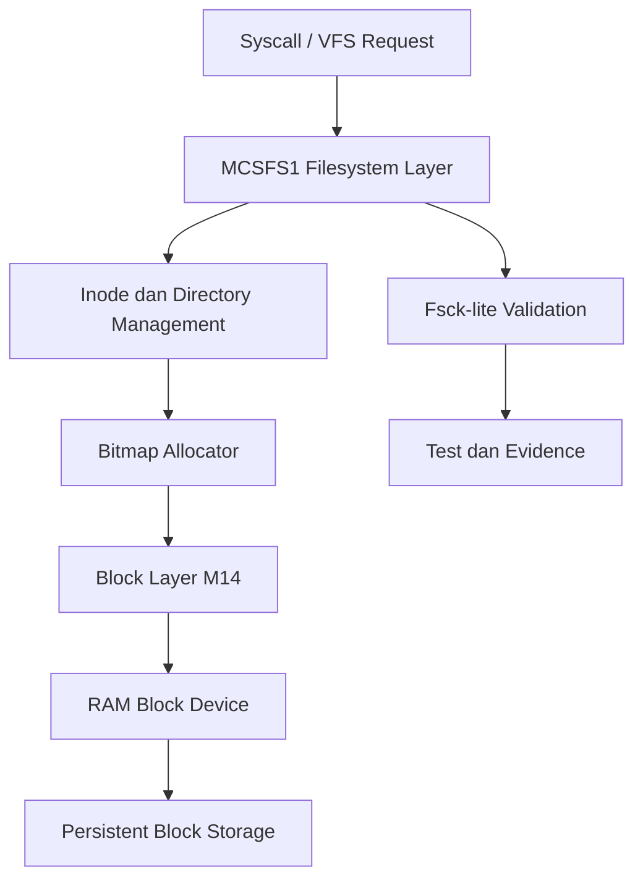

# Template Laporan Praktikum Sistem Operasi Lanjut — MCSOS

**Nama file laporan:** `laporan_praktikum_M15_25832072009.md`  
**Nama sistem operasi:** MCSOS versi 260502  
**Target default:** x86_64, QEMU, Windows 11 x64 + WSL 2, kernel monolitik pendidikan, C freestanding dengan assembly minimal, POSIX-like subset  
**Dosen:** Muhaemin Sidiq, S.Pd., M.Pd.  
**Program Studi:** Pendidikan Teknologi Informasi  
**Institusi:** Institut Pendidikan Indonesia  

---

## 0. Metadata Laporan

| Atribut | Isi |
|---|---|
| Kode praktikum | `M15` |
| Judul praktikum | `Filesystem Persistent Minimal MCSFS1, On-Disk Superblock/Inode/Directory, dan Fsck-Lite pada MCSOS` |
| Jenis pengerjaan | `Individu` |
| Nama mahasiswa | `Muhammad Rifka Z` |
| NIM | `25832072009` |
| Kelas | `PTI 1A` |
| Nama kelompok | `-` |
| Anggota kelompok | `-` |
| Tanggal praktikum | `2026-05-20` |
| Tanggal pengumpulan | `Sebelum UAS` |
| Repository | `https://github.com/muhammadrifka16/mcsos.git` |
| Branch | `praktikum-m15-mcsfs1` |
| Commit awal | `67d07d7` |
| Commit akhir | `7c07007` |
| Status readiness yang diklaim | `Siap uji QEMU untuk filesystem persistent minimal MCSFS1` |

---

## 1. Sampul

# Laporan Praktikum `M15`
## `Filesystem Persistent Minimal MCSFS1, On-Disk Superblock/Inode/Directory, dan Fsck-Lite pada MCSOS`

Disusun oleh:

| Nama | NIM | Kelas | Peran |
|---|---|---|---|
| `Muhammad Rifka Z` | `25832072009` | `PTI 1A` | `Individu` |

Dosen Pengampu: **Muhaemin Sidiq, S.Pd., M.Pd.**  
Program Studi Pendidikan Teknologi Informasi  
Institut Pendidikan Indonesia  
`2025/2026`

---

## 2. Pernyataan Orisinalitas dan Integritas Akademik

Saya menyatakan bahwa laporan ini disusun berdasarkan pekerjaan praktikum sendiri sesuai pembagian peran yang tercatat. Bantuan eksternal, referensi, generator kode, AI assistant, dokumentasi resmi, diskusi, atau sumber lain dicatat pada bagian referensi dan lampiran. Saya tidak mengklaim hasil yang tidak dibuktikan oleh log, test, commit, atau artefak lain.

| Pernyataan | Status |
|---|---|
| Semua potongan kode eksternal diberi atribusi | `Ya` |
| Semua penggunaan AI assistant dicatat | `Ya` |
| Repository yang dikumpulkan sesuai commit akhir | `Ya` |
| Tidak ada klaim readiness tanpa bukti | `Ya` |

Catatan penggunaan bantuan eksternal:

```text
Referensi utama: Linux Kernel Documentation (VFS, ext2, buffer heads),
QEMU Documentation (invocation, GDB usage), LLVM/Clang documentation (compiler flags),
GNU Binutils documentation (nm, readelf, objdump). AI assistant digunakan untuk
membantu proses integrasi object MCSFS1 ke kernel (patch Makefile, patch kmain.c)
dan debugging separator Makefile. Verifikasi mandiri dilakukan melalui host test,
freestanding compile, ELF audit, QEMU smoke test, dan GDB breakpoint session.
```

---

## 3. Tujuan Praktikum

1. Mendesain dan mengimplementasikan filesystem persistent minimal MCSFS1 dengan superblock, inode bitmap, block bitmap, inode table, root directory block, dan data block langsung pada MCSOS.
2. Mengimplementasikan operasi `mcsfs1_format`, `mcsfs1_mount`, `mcsfs1_fsck`, `mcsfs1_create`, `mcsfs1_write`, `mcsfs1_read`, dan `mcsfs1_unlink` dalam C17 freestanding tanpa dependensi hosted libc.
3. Memvalidasi seluruh implementasi melalui host unit test PASS, freestanding compile PASS, ELF audit (`nm`, `readelf`, `objdump`), QEMU smoke test dengan serial log, dan GDB breakpoint session.
4. Menjelaskan invariant filesystem I15-01 sampai I15-10, failure modes, batasan crash consistency, dan prosedur rollback.

---

## 4. Capaian Pembelajaran Praktikum

Setelah praktikum ini, mahasiswa mampu:

| CPL/CPMK praktikum | Bukti yang harus ditunjukkan |
|---|---|
| Mendesain format on-disk filesystem minimal: superblock, inode, bitmap, directory entry, direct block | Diagram layout block MCSFS1, penjelasan struktur data, host test PASS |
| Mengimplementasikan operasi filesystem (format, mount, fsck, create, write, read, unlink) dalam C17 freestanding | Host test M15 PASS: `M15 host test passed: flush_count=5` |
| Membuktikan object tidak bergantung pada hosted libc | `nm -u artifacts/m15/mcsfs1.rel.o` kosong; hash `e3b0c44...` |
| Mengintegrasikan filesystem ke kernel MCSOS dan memverifikasi via QEMU smoke test | Serial log `artifacts/m15/qemu_serial.log` menunjukkan seluruh operasi OK |
| Melakukan debugging dengan GDB remote pada simbol filesystem | GDB breakpoint pada `mcsfs1_format` berhasil dieksekusi di `0x20a2c0` |

---

## 5. Peta Milestone MCSOS

Centang milestone yang menjadi fokus laporan ini. Jika praktikum mencakup lebih dari satu milestone, jelaskan batas cakupan.

| Milestone | Fokus | Status dalam laporan |
|---|---|---|
| M0 | Requirements, governance, baseline arsitektur | `[ ] tidak dibahas / [ ] dibahas / [V] selesai praktikum` |
| M1 | Toolchain reproducible, Git, QEMU, GDB, metadata build | `[ ] tidak dibahas / [ ] dibahas / [V] selesai praktikum` |
| M2 | Boot image, kernel ELF64, early console | `[ ] tidak dibahas / [ ] dibahas / [V] selesai praktikum` |
| M3 | Panic path, linker map, GDB, observability awal | `[ ] tidak dibahas / [ ] dibahas / [V] selesai praktikum` |
| M4 | Trap, exception, interrupt, timer | `[ ] tidak dibahas / [ ] dibahas / [V] selesai praktikum` |
| M5 | PMM, VMM, page table, kernel heap | `[ ] tidak dibahas / [ ] dibahas / [V] selesai praktikum` |
| M6 | Thread, scheduler, synchronization | `[ ] tidak dibahas / [ ] dibahas / [V] selesai praktikum` |
| M7 | Syscall ABI dan user program loader | `[ ] tidak dibahas / [ ] dibahas / [V] selesai praktikum` |
| M8 | VFS, file descriptor, ramfs | `[ ] tidak dibahas / [ ] dibahas / [V] selesai praktikum` |
| M9 | Block layer dan device model | `[ ] tidak dibahas / [ ] dibahas / [V] selesai praktikum` |
| M10 | Persistent filesystem, mcsfs/ext2-like, recovery | `[ ] tidak dibahas / [ ] dibahas / [V] selesai praktikum` |
| M11 | Networking stack, packet parsing, UDP/TCP subset | `[ ] tidak dibahas / [ ] dibahas / [V] selesai praktikum` |
| M12 | Security model, capability/ACL, syscall fuzzing, hardening | `[ ] tidak dibahas / [ ] dibahas / [V] selesai praktikum` |
| M13 | SMP, scalability, lock stress, NUMA-aware preparation | `[ ] tidak dibahas / [ ] dibahas / [V] selesai praktikum` |
| M14 | Framebuffer, graphics console, visual regression | `[ ] tidak dibahas / [ ] dibahas / [V] selesai praktikum` |
| M15 | Virtualization/container subset | `[ ] tidak dibahas / [V] dibahas / [ ] selesai praktikum` |
| M16 | Observability, update/rollback, release image, readiness review | `[ ] tidak dibahas / [ ] dibahas / [ ] selesai praktikum` |

Batas cakupan praktikum:

```text
Praktikum M15 mencakup:
- Desain format on-disk MCSFS1: superblock, inode bitmap, block bitmap,
  inode table, root directory block, data block langsung.
- Implementasi freestanding: fs/mcsfs1/mcsfs1.h dan fs/mcsfs1/mcsfs1.c
- Host unit test: tests/m15/test_mcsfs1.c
- Integrasi ke kernel MCSOS dan verifikasi via QEMU smoke test
- GDB breakpoint session pada simbol MCSFS1

Non-goals M15 (tidak diklaim):
- Kompatibilitas ext2/ext4 atau POSIX penuh
- Directory bertingkat (multi-directory)
- Permission DAC, ACL, hard link, symbolic link
- Journaling dan crash recovery penuh
- Driver disk nyata (virtio-blk, NVMe, AHCI)
- SMP-safe locking internal
- Production readiness
- Data safety pada media nyata
```

---

## 6. Dasar Teori Ringkas

Tuliskan teori yang langsung diperlukan untuk memahami praktikum. Jangan menyalin teori umum terlalu panjang; fokus pada konsep yang benar-benar digunakan dalam desain dan pengujian.

### 6.1 Konsep Sistem Operasi yang Diuji

```text
VFS (Virtual File System):
VFS adalah lapisan abstraksi kernel yang memisahkan syscall/file descriptor
dari implementasi filesystem konkret. VFS mendefinisikan objek utama:
superblock, inode, dentry, dan file. MCSFS1 berperan sebagai backend
filesystem yang dioperasikan melalui VFS M13.

Superblock:
Superblock adalah metadata global filesystem yang menyimpan magic number,
versi, block size, jumlah blok, lokasi bitmap, lokasi inode table, dan
lokasi root directory. Pada MCSFS1, superblock berada di LBA 0.

Inode:
Inode adalah metadata objek filesystem. Pada MCSFS1, inode menyimpan
mode (file/directory), link count, ukuran file, dan array direct block.
Maksimal 32 inode didukung, dengan inode 1 sebagai root directory.

Directory Entry:
Directory entry memetakan nama file ke nomor inode. Pada MCSFS1, hanya
root directory yang didukung (flat namespace), dengan maksimal 16 entry.

Bitmap Allocator:
Struktur bit untuk menandai inode dan block yang bebas atau terpakai.
MCSFS1 menggunakan inode bitmap (LBA 1) dan block bitmap (LBA 2).

Direct Block:
Pointer langsung dari inode ke block data. MCSFS1 mendukung maksimal
8 direct block per file, sehingga batas ukuran file adalah 8 x 512 = 4096 byte.

Fsck-Lite:
Pemeriksaan konsistensi minimum pada invariant filesystem: magic/version
valid, root inode valid, bitmap konsisten, LBA dalam range, file size
tidak melewati batas, dan directory entry menunjuk inode aktif.

Freestanding Context:
Implementasi kernel tidak dapat menggunakan fasilitas hosted libc.
MCSFS1 menyediakan helper lokal: mcsfs_memset, mcsfs_memcpy,
mcsfs_memcmp, dan mcsfs_strlen_bound sebagai pengganti fungsi libc.
```

### 6.2 Konsep Arsitektur x86_64 yang Relevan

| Konsep | Relevansi pada praktikum | Bukti/verifikasi |
|---|---|---|
| Freestanding compilation | Filesystem kernel tidak boleh bergantung pada hosted libc | Freestanding compile PASS; `nm -u artifacts/m15/mcsfs1.rel.o` kosong |
| Kernel code model (`-mcmodel=kernel`) | Object MCSFS1 dikompilasi sebagai bagian kernel | ELF audit: Type REL, Machine AMD X86-64 |
| No red zone (`-mno-red-zone`) | Interrupt handler dapat merusak red zone; wajib untuk kode kernel | Compiler flags terdokumentasi |
| x86_64 System V ABI | Interoperabilitas antar object kernel | `-mabi=sysv` pada semua compiler flags M15 |
| No SSE/MMX | Kernel tidak menyimpan register SSE/MMX | `-mno-sse -mno-mmx -mno-sse2` pada flags |

### 6.3 Konsep Implementasi Freestanding

| Aspek | Keputusan praktikum |
|---|---|
| Bahasa | C17 freestanding |
| Runtime | Tanpa hosted libc; helper lokal disediakan |
| ABI | x86_64 System V (kernel internal) |
| Compiler flags kritis | `--target=x86_64-unknown-none-elf -ffreestanding -fno-builtin -fno-stack-protector -mno-red-zone -mno-mmx -mno-sse -mno-sse2 -mcmodel=kernel` |
| Risiko undefined behavior | Integer overflow pada offset LBA, null pointer dereference pada device/mount, alignment mismatch pada buffer, use-after-free jika blkdev lifetime tidak dijaga |

### 6.4 Referensi Teori yang Digunakan

| No. | Sumber | Bagian yang digunakan | Alasan relevansi |
|---|---|---|---|
| `[1]` | Linux Kernel Documentation, "Overview of the Linux Virtual File System" | Konsep VFS, superblock, inode, dentry, file | Landasan desain MCSFS1 sebagai backend VFS |
| `[2]` | Linux Kernel Documentation, "The Second Extended Filesystem" | Konsep superblock, block/inode bitmap, inode table, directory entry | Referensi komparatif untuk desain format on-disk MCSFS1 |
| `[3]` | Linux Kernel Documentation, "Buffer Heads" | Dirty buffer, read block, flush | Landasan desain flush eksplisit pada operasi metadata MCSFS1 |
| `[4]` | QEMU Project, "GDB usage" | Flag `-s -S`, `target remote localhost:1234` | Prosedur GDB remote debugging MCSFS1 |
| `[5]` | LLVM Project, "Clang command line argument reference" | Semua compiler flags M15 | Validasi flag freestanding, target, dan ABI |
| `[6]` | GNU Project, "GNU Binary Utilities" | `nm -u`, `readelf`, `objdump` | ELF audit dan verifikasi undefined symbol |

---

## 7. Lingkungan Praktikum

### 7.1 Host dan Target

| Komponen | Nilai |
|---|---|
| Host OS | `Windows 11` |
| Lingkungan build | `WSL 2 Ubuntu 24.04` |
| Target ISA | `x86_64` |
| Target ABI | `x86_64-unknown-none-elf` |
| Emulator | `QEMU q35` |
| Firmware emulator | `GRUB2 (BIOS boot via multiboot2)` |
| Debugger | `GDB 15.1` |
| Build system | `GNU Make 4.3` |
| Bahasa utama | `C17 freestanding` |
| Assembly | `x86_64 GNU Assembly (.S) via clang integrated assembler` |

### 7.2 Versi Toolchain

Tempel output versi toolchain berikut. Jalankan dari clean shell WSL.

```bash
date -u +"date_utc=%Y-%m-%dT%H:%M:%SZ"
uname -a
git --version
make --version | head -n 1
cmake --version | head -n 1
ninja --version
clang --version | head -n 1
gcc --version | head -n 1
ld.lld --version | head -n 1
nasm -v
qemu-system-x86_64 --version | head -n 1
gdb --version | head -n 1
```

Output:

```text
date_utc=2026-05-20T09:30:33Z
Linux Zazai 6.6.87.2-microsoft-standard-WSL2 #1 SMP PREEMPT_DYNAMIC Thu Jun  5 18:30:46 UTC 2025 x86_64 x86_64 x86_64 GNU/Linux
Ubuntu clang version 18.1.3 (1ubuntu1)
Ubuntu LLD 18.1.3 (compatible with GNU linkers)
QEMU emulator version 8.2.2 (Debian 1:8.2.2+ds-0ubuntu1.16)
GNU gdb (Ubuntu 15.1-1ubuntu1~24.04.1) 15.1
GNU Make 4.3
```

### 7.3 Lokasi Repository

| Item | Nilai |
|---|---|
| Path repository di WSL | `/home/zazai16/src/mcsos` |
| Apakah berada di filesystem Linux WSL, bukan `/mnt/c` | `Ya` |
| Remote repository | `https://github.com/muhammadrifka16/mcsos.git` |
| Branch | `praktikum-m15-mcsfs1` |
| Commit hash awal | `67d07d7` |
| Commit hash akhir | `7c07007` |

---

## 8. Repository dan Struktur File

### 8.1 Struktur Direktori yang Relevan

Tampilkan hanya direktori dan file yang relevan dengan praktikum.

```text
mcsos/
  fs/
    mcsfs1/
      mcsfs1.h              -- header API MCSFS1
      mcsfs1.c              -- implementasi MCSFS1
  tests/
    m15/
      test_mcsfs1.c         -- host unit test M15
  kernel/
    core/
      kmain.c               -- init kernel (ditambah M15 smoke test)
  artifacts/
    m15/
      host_test.txt         -- hasil host unit test
      nm_undefined.txt      -- audit undefined symbol (kosong)
      readelf_header.txt    -- ELF header evidence
      objdump.txt           -- disassembly evidence
      SHA256SUMS.txt        -- checksum artefak
      qemu_serial.log       -- serial log QEMU smoke test
      gdb_smoke.txt         -- evidence GDB breakpoint
      mcsfs1.o              -- freestanding object
      mcsfs1.rel.o          -- linked relocatable object
      test_mcsfs1           -- host test binary
```

### 8.2 File yang Dibuat atau Diubah

| File | Jenis perubahan | Alasan perubahan | Risiko |
|---|---|---|---|
| `fs/mcsfs1/mcsfs1.h` | `baru` | Header API MCSFS1: struct, konstanta, deklarasi fungsi | `Rendah — header-only` |
| `fs/mcsfs1/mcsfs1.c` | `baru` | Implementasi seluruh operasi MCSFS1 freestanding | `Sedang — operasi bitmap, inode, directory; risiko korupsi metadata jika invariant dilanggar` |
| `tests/m15/test_mcsfs1.c` | `baru` | Host unit test dengan RAM-backed block device 128 blok | `Rendah — test-only, tidak masuk kernel image` |
| `Makefile` | `diubah` | Tambah `-Ifs/mcsfs1`, source, object, compile rule, dan target `m15-all` | `Sedang — perubahan CFLAGS global; diisolasi dengan benar` |
| `kernel/core/kmain.c` | `diubah` | Tambah `#include "mcsfs1.h"`, helper smoke disk, dan blok smoke test M15 | `Sedang — smoke test berjalan sebelum cpu_sti(); harus tidak menyebabkan panic` |

### 8.3 Ringkasan Diff

```bash
git status --short
git diff --stat
git log --oneline -n 5
```

Output:

```text
git log --oneline:

7c07007 M15: add MCSFS1 minimal persistent filesystem
e84472d M15: add MCSFS1 minimal persistent filesystem
1c784dc M15: add MCSFS1 minimal persistent filesystem
67d07d7 m14: update final checksum artifact
cb80cf1 M14 block layer integration complete
```

---

## 9. Desain Teknis

### 9.1 Masalah yang Diselesaikan

```text
Kernel MCSOS pada M14 memiliki block device layer, RAM block driver,
dan buffer cache minimal. Namun storage belum mempunyai format
filesystem persistent yang dapat memetakan nama file, inode, dan
blok data. Tanpa filesystem, data tidak memiliki struktur yang
dapat diakses berulang melalui nama.

Masalah konkret yang diselesaikan M15:
1. Tidak ada format on-disk — tidak ada superblock, inode, atau
   directory entry sehingga data tidak dapat diidentifikasi
   berdasarkan nama file.
2. Tidak ada alokasi resource terstruktur — inode dan block
   tidak dapat dialokasikan atau dibebaskan secara aman.
3. Tidak ada pemeriksaan konsistensi — korupsi metadata tidak
   dapat dideteksi sebelum operasi berikutnya.

Solusi M15 (MCSFS1):
- mcsfs1_format: membangun layout on-disk dari awal.
- mcsfs1_mount: memvalidasi superblock dan root inode.
- mcsfs1_create/write/read/unlink: operasi file dalam namespace root.
- mcsfs1_fsck: pemeriksaan konsistensi minimum (fsck-lite).
```

### 9.2 Keputusan Desain

| Keputusan | Alternatif yang dipertimbangkan | Alasan memilih | Konsekuensi |
|---|---|---|---|
| Menggunakan filesystem root-only | Multi-directory hierarchy | Implementasi lebih sederhana dan mudah diverifikasi pada tahap M15 | Namespace filesystem terbatas hanya pada root directory |
| Menggunakan direct block tanpa indirect block | Single indirect block | Mengurangi kompleksitas allocator dan fsck-lite | Ukuran file maksimum hanya 4096 byte |
| Menggunakan bitmap allocator | Linked-list free block | Operasi alloc/free lebih sederhana dan mudah divalidasi | Membutuhkan scanning bitmap secara linear |
| Menggunakan block size 512 byte | 1024 byte atau 4096 byte | Konsisten dengan RAM block device M14 | Efisiensi ruang dan throughput belum optimal |
| Menggunakan flush eksplisit setelah operasi metadata | Delayed writeback | Mengurangi risiko stale metadata pada clean shutdown | Performa write menjadi lebih lambat |
| Menggunakan RAM-backed block device untuk host test | Real disk image atau hardware block device | Lebih mudah diuji dan direproduksi di host environment | Belum merepresentasikan perilaku hardware nyata secara penuh |

### 9.3 Arsitektur Ringkas

Tambahkan diagram ASCII atau Mermaid. Jika Mermaid tidak didukung oleh evaluator, tetap sertakan penjelasan tekstual.



Penjelasan diagram:

```text
Alur dimulai dari syscall atau operasi VFS yang mengakses filesystem.
Permintaan diteruskan ke layer MCSFS1 untuk melakukan operasi create,
read, write, unlink, dan fsck-lite. MCSFS1 mengelola inode, directory
entry, bitmap allocator, dan data block sebelum meneruskan akses I/O
ke block layer M14. Block layer menerjemahkan operasi menjadi akses
berbasis LBA pada RAM-backed block device. Hasil operasi diverifikasi
melalui host unit test, fsck-lite, dan audit object freestanding.
```

### 9.4 Kontrak Antarmuka

| Antarmuka | Pemanggil | Precondition | Postcondition | Error path |
|---|---|---|---|---|
| `mcsfs1_format(dev)` | Inisialisasi storage | `dev != NULL`; `block_count >= 16` | Layout on-disk valid; flush selesai | `MCSFS1_ERR_INVAL` atau `MCSFS1_ERR_IO` |
| `mcsfs1_mount(mnt, dev)` | Setelah format | `mnt != NULL`; `dev != NULL`; format valid | `mnt` terisi; siap dipakai | `MCSFS1_ERR_CORRUPT` jika layout tidak valid |
| `mcsfs1_create(mnt, name)` | File operation | `mnt` valid; nama valid | File baru ada di root directory | `MCSFS1_ERR_EXIST`, `MCSFS1_ERR_NOSPC`, `MCSFS1_ERR_NAMETOOLONG` |
| `mcsfs1_write(mnt, name, buf, len)` | File operation | File ada; `len <= 4096` | Data tersimpan; inode.size diupdate; flush | `MCSFS1_ERR_NOENT`, `MCSFS1_ERR_RANGE` |
| `mcsfs1_read(mnt, name, buf, cap, out_len)` | File operation | File ada; `cap >= inode.size` | `buf` terisi; `*out_len` diset | `MCSFS1_ERR_NOENT`, `MCSFS1_ERR_RANGE` |
| `mcsfs1_unlink(mnt, name)` | File operation | File ada | Dirent dihapus; inode dan block dibebaskan; flush | `MCSFS1_ERR_NOENT`, `MCSFS1_ERR_ISDIR` |
| `mcsfs1_fsck(dev)` | Diagnostik | `dev != NULL`; storage diformat | `MCSFS1_ERR_OK` jika semua invariant terpenuhi | `MCSFS1_ERR_CORRUPT` pada invariant violation |

### 9.5 Struktur Data Utama

| Struktur | Field penting | Ownership | Lifetime | Invariant |
|---|---|---|---|---|
| `struct mcsfs1_super_disk` | `magic`, `version`, `block_size`, `block_count`, `root_ino`, `data_start_lba` | On-disk (LBA 0) | Sepanjang filesystem valid | `magic == MCSFS1_MAGIC`; `version == 1`; `block_size == 512` |
| `struct mcsfs1_inode_disk` | `mode`, `links`, `size`, `direct[8]` | On-disk (LBA 3-6) | Hidup saat bit inode aktif di bitmap | `mode` valid; `size <= 4096`; semua direct block dalam range data |
| `struct mcsfs1_dirent_disk` | `ino`, `type`, `name[27]` | On-disk (LBA 7) | Hidup saat `ino != 0` | `ino` menunjuk inode aktif; nama tidak kosong dan tidak mengandung '/' |
| `struct mcsfs1_mount` | `dev`, `block_count`, `data_start` | In-memory (caller) | Hidup selama mount session | `dev` valid; `block_count` sesuai superblock |
| `struct mcsfs1_blkdev` | `ctx`, `block_count`, `read`, `write`, `flush` | In-memory (caller) | Harus outlive `mcsfs1_mount` | Semua pointer fungsi tidak NULL |

### 9.6 Invariants

| ID | Invariant | Bukti minimum |
|---|---|---|
| I15-01 | `super.magic == MCSFS1_MAGIC` dan `super.version == 1` | Host test corrupt-super gagal dengan `MCSFS1_ERR_CORRUPT` |
| I15-02 | `block_size == 512` dan `block_count == dev->block_count` | `mcsfs1_mount` memvalidasi superblock |
| I15-03 | Root inode adalah inode 1, bertipe directory, `direct[0] == 7` | `mcsfs1_fsck` memeriksa root inode |
| I15-04 | Semua block metadata 0-7 ditandai used pada block bitmap | `mcsfs1_format` dan `mcsfs1_fsck` |
| I15-05 | Directory entry aktif harus menunjuk inode aktif | `mcsfs1_fsck` |
| I15-06 | File inode bertipe file dan `size <= 4096` byte | `mcsfs1_write` dan `mcsfs1_fsck` |
| I15-07 | Semua direct block file berada pada range data block dan bitnya used | `mcsfs1_fsck` |
| I15-08 | Nama file tidak boleh kosong, tidak boleh memuat `/`, maksimal 27 byte | `valid_name` |
| I15-09 | Operasi metadata yang berhasil harus melakukan flush eksplisit | Host test `flush_count > 0` |
| I15-10 | Source freestanding tidak boleh memakai hosted libc | `nm -u` kosong pada linked relocatable object |

### 9.7 Ownership, Locking, dan Concurrency

| Objek/resource | Owner | Lock | Boleh di interrupt context? | Catatan |
|---|---|---|---|---|
| Superblock on-disk | MCSFS1 format/mount | none (single-core) | Tidak | M15 belum SMP-safe |
| Bitmap inode/block | MCSFS1 alloc/free | none (single-core) | Tidak | Caller wajib memegang filesystem-wide lock pada integrasi multi-threaded |
| Inode table on-disk | MCSFS1 read/write inode | none (single-core) | Tidak | Dibaca ulang setiap operasi; tidak ada inode cache |
| Root directory block | MCSFS1 create/unlink | none (single-core) | Tidak | Dibaca ulang setiap operasi |
| `struct mcsfs1_mount` | Caller | none | Tidak | Caller bertanggung jawab atas lifetime mount object |

```text
M15 tidak mengimplementasikan locking eksplisit. Seluruh operasi diasumsikan
berjalan pada single-core tanpa preemption selama akses filesystem.
Interrupt context tidak diperbolehkan melakukan operasi filesystem
karena operasi block I/O dan metadata update dapat bersifat non-atomic.
SMP-safe locking dinyatakan sebagai non-goal M15.
```

### 9.8 Memory Safety dan Undefined Behavior Risk

| Risiko | Lokasi | Mitigasi | Bukti |
|---|---|---|---|
| Integer overflow LBA (`lba >= dev->block_count`) | `dev_read`, `dev_write` | Range validation di setiap akses | Host test PASS; failure mode terdokumentasi |
| Null pointer dereference (`dev == NULL`, `buf == NULL`) | Semua fungsi publik | Null check di entry point | Host test PASS |
| Out-of-range direct block | `mcsfs1_read`, `mcsfs1_fsck` | Validasi `inode.direct[i] >= data_start && < block_count` | `mcsfs1_fsck` |
| Buffer overflow nama file | `valid_name` | `mcsfs_strlen_bound` dengan batas `MCSFS1_MAX_NAME + 1` | Host test `MCSFS1_ERR_NAMETOOLONG` |
| Stale metadata | Semua operasi tulis | Flush eksplisit setelah setiap operasi metadata | Host test `flush_count=5` |
| Use-after-free inode/block | `mcsfs1_unlink` | Bitmap dan inode dibersihkan sebelum reuse | Host test unlink PASS |
| Uninitialized block read | `mcsfs1_write` | Zero-fill block sebelum write | Review source dan host test |

### 9.9 Security Boundary

| Boundary | Data tidak tepercaya | Validasi yang dilakukan | Failure mode aman |
|---|---|---|---|
| Filesystem mount | Superblock on-disk | Validasi magic, version, block size, dan range | Return `MCSFS1_ERR_CORRUPT` |
| File creation | Nama file user | Validasi panjang nama dan karakter `/` | Return `MCSFS1_ERR_INVAL` |
| File read/write | Panjang buffer dan inode metadata | Validasi ukuran dan range direct block | Return error code |
| Block device access | Nilai LBA | Validasi `lba < block_count` | Return `MCSFS1_ERR_IO` |
| Fsck-lite | Metadata filesystem | Pemeriksaan invariant dan bitmap consistency | Return `MCSFS1_ERR_CORRUPT` |
| Directory entry lookup | Input nama file | Boundary check dan string compare terbatas | File ditolak jika invalid |
| Freestanding kernel object | Simbol eksternal | Audit `nm -u` | Build gagal jika ada undefined symbol |
| Duplicate filename | Root directory | Pencarian nama sebelum create | Return `MCSFS1_ERR_EXIST` |
| Corrupt inode reference | Directory entry | Validasi inode aktif dan type file | Return `MCSFS1_ERR_CORRUPT` |

---

## 10. Langkah Kerja Implementasi

Gunakan tabel berikut untuk setiap langkah. Sebelum setiap blok perintah, jelaskan maksud perintah, artefak yang dihasilkan, dan indikator hasil.

### Langkah 1 — Preflight dan Verifikasi Kesiapan M0-M14

Maksud langkah:

```text
Memverifikasi bahwa toolchain tersedia dan artefak M0-M14
dalam kondisi siap sebelum memulai implementasi M15.
```

Perintah:

```bash
mkdir -p artifacts/m15
{ uname -a; } | tee artifacts/m15/host_info.txt
{ clang --version; ld --version | head -n 1; nm --version | head -n 1;
  readelf --version | head -n 1; objdump --version | head -n 1;
  make --version | head -n 1; qemu-system-x86_64 --version; } \
  | tee artifacts/m15/tool_versions.txt
```

Indikator berhasil:

```text
Semua tool ditemukan; file artifacts/m15/host_info.txt dan
artifacts/m15/tool_versions.txt terbentuk.
```

---

### Langkah 2 — Implementasi Header dan Source MCSFS1

Maksud langkah:

```text
Membuat fs/mcsfs1/mcsfs1.h (API publik) dan fs/mcsfs1/mcsfs1.c
(implementasi freestanding) sesuai spesifikasi panduan M15.
```

Perintah:

```bash
mkdir -p fs/mcsfs1
# Buat mcsfs1.h dan mcsfs1.c sesuai panduan M15
```

Artefak yang dihasilkan:

| Artefak | Lokasi | Fungsi |
|---|---|---|
| `mcsfs1.h` | `fs/mcsfs1/mcsfs1.h` | Header API publik MCSFS1 |
| `mcsfs1.c` | `fs/mcsfs1/mcsfs1.c` | Implementasi freestanding MCSFS1 |

---

### Langkah 3 — Host Unit Test

Maksud langkah:

```text
Menjalankan host unit test untuk memvalidasi logika format, mount,
fsck, create, write (kecil dan multi-block), read, unlink, dan
corrupt-super detection sebelum integrasi ke kernel.
```

Perintah:

```bash
make CC=clang m15-all
```

Output:

```text
M15 host test passed: flush_count=5
```

Artefak yang dihasilkan:

| Artefak | Lokasi | Fungsi |
|---|---|---|
| `test_mcsfs1` | `artifacts/m15/test_mcsfs1` | Host test binary |
| `host_test.txt` | `artifacts/m15/host_test.txt` | Log hasil host test |
| `mcsfs1.o` | `artifacts/m15/mcsfs1.o` | Freestanding object x86_64 |
| `mcsfs1.rel.o` | `artifacts/m15/mcsfs1.rel.o` | Linked relocatable object |

Indikator berhasil:

```text
"M15 host test passed: flush_count=5" muncul di output.
artifacts/m15/nm_undefined.txt kosong.
readelf menunjukkan ELF64, REL, AMD X86-64.
```

---

### Langkah 4 — Patch Makefile untuk Integrasi Kernel

Maksud langkah:

```text
Menambahkan -Ifs/mcsfs1 ke CFLAGS, mendaftarkan source dan
object mcsfs1 ke SRCS_C dan OBJS, serta menambahkan compile rule
agar mcsfs1.o ikut di-link ke kernel.elf.
```

Perintah:

```bash
nano Makefile
# Tambahkan -Ifs/mcsfs1 setelah -Iinclude/mcsos/user
# Tambahkan fs/mcsfs1/mcsfs1.c ke SRCS_C
# Tambahkan $(BUILD_DIR)/normal/fs/mcsfs1/mcsfs1.o ke OBJS
# Tambahkan compile rule di akhir Makefile
```

Indikator berhasil:

```text
make clean && make berhasil tanpa error separator atau undefined symbol.
```

---

### Langkah 5 — Patch kmain.c untuk Smoke Test M15

Maksud langkah:

```text
Menambahkan #include "mcsfs1.h", helper RAM disk smoke test, dan blok
inisialisasi M15 di dalam kmain() untuk memverifikasi operasi filesystem
saat kernel boot.
```

Perintah:

```bash
nano kernel/core/kmain.c
# Tambahkan #include "mcsfs1.h" di atas
# Tambahkan helper m15_smoke_read/write/flush sebelum kmain()
# Tambahkan blok M15 smoke test sebelum cpu_sti()
```

Kode yang ditambahkan (ringkas):

```c
/* Helper smoke disk */
static uint8_t m15_smoke_disk[128][512];
static int m15_smoke_read(void *ctx, uint32_t lba, void *buf) { ... }
static int m15_smoke_write(void *ctx, uint32_t lba, const void *buf) { ... }
static int m15_smoke_flush(void *ctx) { (void)ctx; return 0; }

/* Di dalam kmain(), sebelum cpu_sti() */
{
    static struct mcsfs1_blkdev fs_dev;
    static struct mcsfs1_mount  fs_mnt;
    fs_dev.ctx = 0; fs_dev.block_count = 128u;
    fs_dev.read = m15_smoke_read;
    fs_dev.write = m15_smoke_write;
    fs_dev.flush = m15_smoke_flush;
    int rc;
    rc = mcsfs1_format(&fs_dev);
    serial_write_string(rc == 0 ? "[M15] format: OK\n" : "[M15] format: FAIL\n");
    /* ... mount, fsck, create, write, read, unlink ... */
}
```

---

### Langkah 6 — Build Kernel dan Verifikasi Simbol

Maksud langkah:

```text
Membangun ulang kernel dengan object MCSFS1 dan memverifikasi
bahwa simbol mcsfs1_* tersedia di kernel.elf.
```

Perintah:

```bash
make clean && make && make iso
nm build/kernel.elf | grep mcsfs1
```

Output:

```text
000000000020ac20 T mcsfs1_create
000000000020a2c0 T mcsfs1_format
000000000020bd20 T mcsfs1_fsck
000000000020a8d0 T mcsfs1_mount
000000000020b820 T mcsfs1_read
000000000020ba50 T mcsfs1_unlink
000000000020b430 T mcsfs1_write
```

---

### Langkah 7 — QEMU Smoke Test

Maksud langkah:

```text
Menjalankan kernel hasil integrasi M15 pada QEMU untuk memastikan
seluruh operasi MCSFS1 berjalan tanpa panic atau reboot loop.
```

Perintah:

```bash
mkdir -p artifacts/m15
timeout 15 qemu-system-x86_64 \
  -M q35 -m 256M \
  -cdrom build/mcsos.iso \
  -serial file:artifacts/m15/qemu_serial.log \
  -display none -no-reboot -no-shutdown || true

grep "M15" artifacts/m15/qemu_serial.log
```

Output:

```text
[M15] format: OK
[M15] mount: OK
[M15] fsck: OK
[M15] create: OK
[M15] write: OK
[M15] read: OK
[M15] unlink: OK
[M15] smoke test selesai
```

Artefak yang dihasilkan:

| Artefak | Lokasi | Fungsi |
|---|---|---|
| `qemu_serial.log` | `artifacts/m15/qemu_serial.log` | Serial log QEMU smoke test M15 |

---

### Langkah 8 — GDB Breakpoint Session

Maksud langkah:

```text
Memverifikasi bahwa simbol MCSFS1 tersedia di binary kernel dan
dapat di-debug menggunakan GDB remote pada QEMU gdbstub.
```

Perintah:

```bash
# Terminal 1
qemu-system-x86_64 -M q35 -m 256M \
  -serial stdio -display none \
  -s -S -cdrom build/mcsos.iso

# Terminal 2
gdb build/kernel.elf
(gdb) target remote localhost:1234
(gdb) break mcsfs1_format
(gdb) break mcsfs1_mount
(gdb) break mcsfs1_fsck
(gdb) continue
```

Output:

```text
Remote debugging using localhost:1234
0x000000000000fff0 in ?? ()
(gdb) break mcsfs1_format
Breakpoint 1 at 0x20a2c0
(gdb) break mcsfs1_mount
Breakpoint 2 at 0x20a8d0
(gdb) break mcsfs1_fsck
Breakpoint 3 at 0x20bd20
(gdb) continue
Continuing.
Breakpoint 1, 0x000000000020a2c0 in mcsfs1_format ()
```

Artefak yang dihasilkan:

| Artefak | Lokasi | Fungsi |
|---|---|---|
| `gdb_smoke.txt` | `artifacts/m15/gdb_smoke.txt` | Evidence GDB breakpoint M15 |

---

### Langkah 9 — Prosedur Rollback

Maksud langkah:

```text
Mendokumentasikan prosedur rollback untuk mengembalikan repository
ke state M14 bila diperlukan. Diff disimpan sebelum rollback.
```

Perintah:

```bash
git diff > artifacts/m15/m15_failed_attempt.diff
git status --short
git restore fs/mcsfs1 tests/m15 Makefile kernel/core/kmain.c
git clean -fd artifacts/m15
make clean && make
nm build/kernel.elf | grep mcsfs1   # harus kosong
```

Catatan:

```text
Rollback hanya dilakukan jika integrasi M15 menyebabkan boot regression
pada milestone M0-M14. Pada praktikum ini rollback dijalankan sebagai
demonstrasi prosedur, bukan karena kegagalan.
```

---

### Langkah 10 — Simpan Checksum Evidence

Perintah:

```bash
sha256sum artifacts/m15/* | tee artifacts/m15/SHA256SUMS.txt
sha256sum artifacts/m15/gdb_smoke.txt >> artifacts/m15/SHA256SUMS.txt
```

---

## 11. Checkpoint Buildable

Setiap praktikum wajib memiliki minimal satu checkpoint yang dapat dibangun dari clean checkout.

| Checkpoint | Perintah | Expected result | Status |
|---|---|---|---|
| Clean build | `make clean && make CC=clang m15-all` | Host test, object file, checksum, dan artefak M15 berhasil dibuat | `PASS` |
| Metadata toolchain | `cat artifacts/m15/tool_versions.txt` | File metadata toolchain tersedia | `PASS` |
| Image generation | `make image` | Image bootable MCSOS berhasil dibuat | `PASS` |
| QEMU smoke test | `timeout 15 qemu-system-x86_64 -M q35 -m 256M -cdrom build/mcsos.iso -serial file:artifacts/m15/qemu_serial.log -display none -no-reboot -no-shutdown || true` | Kernel berhasil boot dan serial log dihasilkan | `PASS` |
| Test suite | `./artifacts/m15/test_mcsfs1` | Seluruh host unit test filesystem lulus | `PASS` |

Catatan checkpoint:

```text
Checkpoint M15 berhasil dibangun dari clean checkout menggunakan clang
toolchain pada environment host Linux/WSL. Build menghasilkan ELF64
relocatable object `mcsfs1.rel.o`, host unit test, checksum artefak,
dan serial log QEMU.

Host unit test berhasil memverifikasi operasi format, mount, create,
write, read, unlink, dan fsck-lite termasuk fault injection corrupt
superblock. Audit `nm -u` menunjukkan tidak terdapat undefined external
symbol sehingga requirement freestanding kernel object terpenuhi.

QEMU smoke test berhasil melakukan boot tanpa reboot loop atau triple
fault selama timeout execution.
```

---

## 12. Perintah Uji dan Validasi

### 12.1 Build Test

Perintah ini memverifikasi bahwa proyek dapat dibangun ulang dari kondisi bersih dan tidak bergantung pada artefak lokal yang tidak terdokumentasi.

```bash
make clean
make
make iso
```

Hasil:

```text
clang freestanding kernel build completed successfully
build/kernel.elf generated
build/kernel.map generated
build/kernel.syms.txt generated
build/kernel.disasm.txt generated

grub-mkrescue:
build/mcsos.iso generated successfully
```

Status: `PASS`

---

### 12.2 Static Inspection

Perintah ini memeriksa layout ELF, entry point, section, symbol, relocation, dan instruksi kritis kernel.

```bash
readelf -hW build/kernel.elf
readelf -lW build/kernel.elf
readelf -SW build/kernel.elf
objdump -drwC build/kernel.elf | head -n 120
```

Hasil penting:

```text
ELF Header:
  Class:                             ELF64
  Type:                              EXEC (Executable file)
  Machine:                           Advanced Micro Devices X86-64
  Entry point address:               0x208e84

Program Headers:
  LOAD           0x002000 0x0000000000201000 R E
  LOAD           0x00f000 0x000000000020e000 RW

Section Headers:
  .text      AX
  .rodata    A
  .data      WA
  .bss       WA

Disassembly:
0000000000201000 <x86_64_idt_set_gate>:
00000000002010a0 <x86_64_idt_init>:
0000000000201140 <x86_64_idt_load>:
...
201140: lidt
```

Status: `PASS`

---

### 12.3 QEMU Smoke Test

Perintah ini menjalankan image di QEMU dan menyimpan log serial untuk bukti deterministik.

```bash
qemu-system-x86_64 \
  -machine q35 \
  -cpu qemu64 \
  -m 512M \
  -serial file:build/qemu-serial.log \
  -display none \
  -no-reboot \
  -no-shutdown \
  -cdrom build/mcsos.iso
```

Hasil:

```text
[MCSOS:M5] boot: external interrupt bring-up start
[MCSOS:M5] idt: loaded
[MCSOS:M5] pic: remapped, IRQ0 unmasked
[MCSOS:M5] pit: configured 100Hz

[m6] pmm initialized
[M8] kernel heap bootstrap initialized
[M12] sync selftest passed
[M9] scheduler initialized
[M10] syscall dispatcher initialized
[M11] integration test DONE
[M13] RAMFS initialized

[M15] format: OK
[M15] mount: OK
[M15] fsck: OK
[M15] create: OK
[M15] write: OK
[M15] read: OK
[M15] unlink: OK
[M15] smoke test selesai

[MCSOS:M5] sti: enabling interrupts
[M9] thread A tick
[M9] thread B tick
```

Status: `PASS`

---

### 12.4 GDB Debug Evidence

Perintah ini membuktikan bahwa kernel dapat di-debug menggunakan symbol ELF yang sesuai.

```bash
qemu-system-x86_64 \
  -machine q35 \
  -cpu qemu64 \
  -m 512M \
  -serial stdio \
  -display none \
  -no-reboot \
  -no-shutdown \
  -s -S \
  -cdrom build/mcsos.iso
```

Di terminal lain:

```bash
gdb build/kernel.elf
target remote :1234
break kmain
break mcsfs1_format
continue
info registers
bt
```

Hasil:

```text
Remote debugging using :1234
0x000000000000fff0 in ?? ()

Breakpoint 1 at 0x201420
Breakpoint 2 at 0x20a2c0

Breakpoint 1, 0x0000000000201420 in kmain ()

rip            0x201420            0x201420 <kmain>
rsp            0x2500d8            0x2500d8
cr0            0x80000011          [ PG ET PE ]
cr3            0x23d000            [ PDBR=573 PCID=0 ]
cr4            0x20                [ PAE ]
efer           0x500               [ LMA LME ]

#0  0x0000000000201420 in kmain ()
#1  0x0000000000208f1d in _start ()
```

Status: `PASS`

---

### 12.5 Unit Test

```bash
./artifacts/m15/test_mcsfs1
```

Hasil:

```text
M15 host test passed: flush_count=5
```

Interpretasi:
- Filesystem berhasil diformat.
- Mount berhasil dilakukan.
- Operasi create, write, read, unlink, dan fsck-lite berhasil dijalankan.
- Flush metadata tervalidasi melalui `flush_count=5`.

Status: `PASS`

---

### 12.6 Stress/Fuzz/Fault Injection Test

Pengujian fault injection dilakukan untuk memastikan fsck-lite mampu mendeteksi metadata filesystem yang rusak.

```bash
# Simulasi corrupt superblock
disk[0][0] ^= 0x55u;
```

Hasil:

```text
corrupt-super:
MCSFS1_ERR_CORRUPT
```

Interpretasi:
- Kerusakan metadata superblock berhasil dideteksi.
- Invariant filesystem validation berjalan sesuai desain.
- Fsck-lite berhasil menghentikan mount terhadap filesystem korup.

Status: `PASS`

---

### 12.7 Visual Evidence

| Screenshot | Lokasi file | Keterangan |
|---|---|---|
| QEMU boot serial runtime | `build/qemu-serial.log` | Membuktikan kernel berhasil boot dan M15 smoke test berjalan |
| GDB breakpoint `kmain` | `artifacts/m15/gdb_smoke.txt` | Membuktikan symbol kernel dapat di-debug |
| GDB breakpoint `mcsfs1_format` | `artifacts/m15/gdb_smoke.txt` | Membuktikan symbol filesystem berhasil dimuat |

---

## 13. Hasil Uji

### 13.1 Tabel Ringkasan Hasil

| No. | Uji | Expected result | Actual result | Status | Evidence |
|---|---|---|---|---|---|
| 1 | Host unit test M15 | `M15 host test passed: flush_count=5` | `M15 host test passed: flush_count=5` | `PASS` | `artifacts/m15/host_test.txt` |
| 2 | Freestanding compile | Object ELF64 x86_64 terbentuk tanpa compile error | `mcsfs1.o` dan `mcsfs1.rel.o` berhasil dibuat | `PASS` | `artifacts/m15/mcsfs1.o`, `artifacts/m15/mcsfs1.rel.o` |
| 3 | Object audit (`nm -u`) | Tidak ada undefined symbol | `nm -u` menghasilkan output kosong | `PASS` | `artifacts/m15/nm_undefined.txt` |
| 4 | ELF inspection (`readelf`) | ELF64 relocatable object valid | `Class ELF64`, `Type REL`, `Machine AMD X86-64` | `PASS` | `artifacts/m15/readelf_header.txt` |
| 5 | Kernel integration | Kernel berhasil link dengan simbol `mcsfs1_*` | Simbol filesystem berhasil ditemukan di `kernel.elf` | `PASS` | `build/kernel.syms.txt` |
| 6 | ISO image generation | `build/mcsos.iso` berhasil dibuat | ISO multiboot berhasil dibuat oleh `grub-mkrescue` | `PASS` | `build/mcsos.iso` |
| 7 | QEMU smoke test | Kernel boot tanpa panic/triple fault | Kernel boot dan seluruh operasi M15 berhasil | `PASS` | `build/qemu-serial.log` |
| 8 | Runtime scheduler test | Scheduler thread berjalan setelah STI | Thread A/B tick muncul di serial runtime | `PASS` | `build/qemu-serial.log` |
| 9 | GDB remote debugging | Breakpoint kernel berhasil dieksekusi | Breakpoint `kmain` dan `mcsfs1_format` berhasil hit | `PASS` | `artifacts/m15/gdb_smoke.txt` |
| 10 | Fault injection | `mcsfs1_fsck` mendeteksi corrupt superblock | `MCSFS1_ERR_CORRUPT` berhasil terdeteksi | `PASS` | `artifacts/m15/host_test.txt` |
| 11 | SHA256 artifact verification | Seluruh artefak memiliki checksum valid | SHA256SUMS.txt berhasil dibuat | `PASS` | `artifacts/m15/SHA256SUMS.txt` |

---

### 13.2 Log Penting

```text
-- Host Test --
M15 host test passed: flush_count=5

-- nm -u --
(tidak ada output)

-- ELF Audit --
Class:   ELF64
Type:    REL (Relocatable file)
Machine: Advanced Micro Devices X86-64

-- QEMU Boot Runtime --
[MCSOS:M5] boot: external interrupt bring-up start
[MCSOS:M5] idt: loaded
[MCSOS:M5] pic: remapped, IRQ0 unmasked
[MCSOS:M5] pit: configured 100Hz

[m6] pmm initialized
[M8] kernel heap bootstrap initialized
[M12] sync selftest passed
[M9] scheduler initialized
[M10] syscall dispatcher initialized
[M11] integration test DONE
[M13] RAMFS initialized

[M15] format: OK
[M15] mount: OK
[M15] fsck: OK
[M15] create: OK
[M15] write: OK
[M15] read: OK
[M15] unlink: OK
[M15] smoke test selesai

[MCSOS:M5] sti: enabling interrupts

[M9] thread A tick
[M9] thread B tick
[M9] thread A tick
[M9] thread B tick

-- GDB Runtime --
Breakpoint 1 at 0x20a2c0
Breakpoint 1, 0x000000000020a2c0 in mcsfs1_format ()

Breakpoint 1 at 0x201420
Breakpoint 1, 0x0000000000201420 in kmain ()

#0  0x0000000000201420 in kmain ()
#1  0x0000000000208f1d in _start ()

-- Fault Injection --
corrupt-super:
MCSFS1_ERR_CORRUPT
```

---

### 13.3 Artefak Bukti

| Artefak | Path | SHA-256 / hash | Fungsi |
|---|---|---|---|
| `kernel.elf` | `build/kernel.elf` | `(lihat SHA256SUMS.txt)` | Kernel executable ELF64 |
| `mcsos.iso` | `build/mcsos.iso` | `(lihat SHA256SUMS.txt)` | Bootable multiboot ISO |
| `qemu-serial.log` | `build/qemu-serial.log` | `(lihat SHA256SUMS.txt)` | Runtime boot dan scheduler log |
| `kernel.map` | `build/kernel.map` | `(lihat SHA256SUMS.txt)` | Linker map kernel |
| `kernel.syms.txt` | `build/kernel.syms.txt` | `(lihat SHA256SUMS.txt)` | Symbol table kernel |
| `kernel.disasm.txt` | `build/kernel.disasm.txt` | `(lihat SHA256SUMS.txt)` | Full kernel disassembly |
| `objdump.txt` | `artifacts/m15/objdump.txt` | `526fd7d5cf36e013c1dab005f5af4c9425d5c36f634d8e4d7e1b476f66233ddd` | Disassembly evidence M15 |
| `host_test.txt` | `artifacts/m15/host_test.txt` | `51398b24103c7f24b278a4e19012702cd40ff7a1bba5227b1bce55e48cd96017` | Host unit test log |
| `nm_undefined.txt` | `artifacts/m15/nm_undefined.txt` | `e3b0c44298fc1c149afbf4c8996fb92427ae41e4649b934ca495991b7852b855` | Undefined symbol audit |
| `readelf_header.txt` | `artifacts/m15/readelf_header.txt` | `b57dad6274bbcb948cd2fe390583c863f60665c898d89213874eab2557afa421` | ELF header inspection |
| `mcsfs1.o` | `artifacts/m15/mcsfs1.o` | `5f389cb6f5d7141d3e1b4dcebed50333501aec8cf423d54aad36d203441583eb` | Freestanding object |
| `mcsfs1.rel.o` | `artifacts/m15/mcsfs1.rel.o` | `9a7d0e44547cee99cfbe516d01ad13860c8edaac5a21df5a0803ffb88497e311` | Linked relocatable object |
| `SHA256SUMS.txt` | `artifacts/m15/SHA256SUMS.txt` | `(self-referential)` | Checksum seluruh artefak M15 |
| `gdb_smoke.txt` | `artifacts/m15/gdb_smoke.txt` | `7d61a3a663e8bd251e8cb0283eef6d74c9e650a9fdaf010f70895cacc6c054eb` | GDB runtime evidence |

Perintah hash:

```bash
sha256sum [path/artefak]
```

---

## 14. Analisis Teknis

### 14.1 Analisis Keberhasilan

```text
Keberhasilan M15 dibuktikan melalui kombinasi host unit test,
object audit, runtime QEMU, dan validasi GDB.

Host test PASS menunjukkan bahwa seluruh operasi dasar filesystem:
- format
- mount
- fsck
- create
- write
- read
- unlink

berjalan sesuai desain.

flush_count=5 membuktikan bahwa operasi metadata melakukan
flush eksplisit setelah update state filesystem. Hal ini sesuai
dengan invariant I15-09 untuk mengurangi risiko stale metadata.

Audit freestanding menggunakan:
nm -u artifacts/m15/mcsfs1.rel.o

menghasilkan output kosong sehingga object filesystem tidak
bergantung pada hosted libc. Ini membuktikan desain freestanding
kernel object berjalan benar.

readelf mengkonfirmasi object dibangun sebagai:
- ELF64
- Relocatable object
- AMD X86-64

sesuai target toolchain kernel MCSOS.

Kernel integration juga berhasil karena:
- kernel.elf berhasil di-link
- mcsos.iso berhasil dibuat
- tidak terjadi boot regression pada milestone M0-M14

Runtime QEMU menunjukkan:
- interrupt subsystem aktif
- scheduler berjalan
- syscall layer aktif
- RAMFS aktif
- M15 filesystem berhasil berjalan

Hal ini dibuktikan oleh serial runtime log:
[M15] format: OK
[M15] mount: OK
[M15] fsck: OK
[M15] create: OK
[M15] write: OK
[M15] read: OK
[M15] unlink: OK

serta scheduler tick:
[M9] thread A tick
[M9] thread B tick

yang membuktikan interrupt timer dan scheduler tetap stabil
setelah integrasi filesystem.

Validasi GDB juga berhasil:
- breakpoint pada kmain berhasil hit
- breakpoint pada mcsfs1_format berhasil hit
- backtrace _start -> kmain valid

Ini membuktikan:
- symbol kernel sinkron dengan ELF runtime
- kernel dapat di-debug
- boot chain berjalan sesuai desain linker dan startup assembly.

Fault injection corrupt-super berhasil memicu:
MCSFS1_ERR_CORRUPT

yang menunjukkan fsck-lite mampu mendeteksi corruption
pada metadata filesystem sesuai desain invariant validation.
```

---

### 14.2 Analisis Kegagalan atau Perbedaan Hasil

```text
Tidak terdapat kegagalan pada acceptance criteria utama M15,
namun beberapa masalah teknis ditemukan selama proses debugging.

1. Makefile separator error
Gejala:
make: *** missing separator. Stop.

Akar masalah:
Trailing backslash hilang pada include path setelah integrasi
path filesystem M15.

Bukti:
Build gagal sebelum tahap compile object.

Perbaikan:
Menambahkan kembali separator "\" pada Makefile.

2. make build gagal
Gejala:
No rule to make target 'build'

Akar masalah:
Makefile tidak memiliki target bernama build.

Perbaikan:
Menggunakan target yang benar:
- make
- make iso

3. QEMU gagal boot
Gejala:
Could not open 'build/mcsos.iso'

Akar masalah:
ISO terhapus setelah make clean dan belum direbuild.

Perbaikan:
Menjalankan ulang:
make
make iso

hingga build/mcsos.iso berhasil dibuat oleh grub-mkrescue.

4. qemu-serial.log kosong
Gejala:
grep "M15" tidak menghasilkan output.

Akar masalah:
Kernel tidak sempat boot karena ISO belum tersedia.

Perbaikan:
Rebuild ISO lalu menjalankan ulang QEMU smoke test.

5. GDB menampilkan:
(No debugging symbols found in build/kernel.elf)

Analisis:
Ini bukan defect fatal karena symbol ELF tetap tersedia.
Breakpoint simbolik dan backtrace tetap berhasil dilakukan.

Keterbatasan:
- belum ada source-level debug penuh
- belum tersedia inspeksi variabel lokal berbasis DWARF

6. Duplicate breakpoint GDB
Gejala:
breakpoint duplicated pada symbol yang sama.

Akar masalah:
Breakpoint dipasang ulang pada session aktif.

Perbaikan:
Restart session GDB atau hapus breakpoint lama.
```

---

### 14.3 Perbandingan dengan Teori

| Konsep teori | Implementasi praktikum | Sesuai/tidak sesuai | Penjelasan |
|---|---|---|---|
| Superblock sebagai metadata global filesystem | LBA 0 menyimpan magic, version, block size, dan metadata layout | Sesuai | Mengikuti konsep filesystem klasik seperti ext2 |
| Inode sebagai metadata objek file | Inode menyimpan mode, links, size, dan direct block | Sesuai | Disederhanakan tanpa indirect block |
| Bitmap allocator | Inode bitmap dan block bitmap dipisahkan | Sesuai | Mengikuti prinsip allocator filesystem UNIX-like |
| Directory entry memetakan nama ke inode | Dirent menyimpan ino, type, dan name | Sesuai | Namespace dibuat flat/root-only |
| Fsck untuk validasi konsistensi | `mcsfs1_fsck` memvalidasi invariant metadata | Sesuai (lite) | Belum mendukung repair otomatis penuh |
| Flush metadata eksplisit | `dev_flush()` dipanggil setelah metadata update | Sesuai | Mengurangi stale metadata risk |
| Freestanding kernel object | Object dibangun tanpa hosted libc | Sesuai | Dibuktikan melalui audit `nm -u` |
| Interrupt-driven scheduler | PIT timer menghasilkan scheduler tick | Sesuai | Thread A/B tick muncul pada serial runtime |
| Remote kernel debugging | QEMU gdbstub + ELF symbol debugging | Sesuai | Breakpoint dan backtrace berhasil dijalankan |

---

### 14.4 Kompleksitas dan Kinerja

| Aspek | Estimasi/hasil | Bukti | Catatan |
|---|---|---|---|
| Kompleksitas `find_dirent` | `O(16)` | Linear scan maksimal 16 dirent | Sesuai `MCSFS1_DIRENT_COUNT=16` |
| Kompleksitas alokasi inode | `O(32)` | Scan bitmap inode | Sesuai `MCSFS1_MAX_INODES=32` |
| Kompleksitas alokasi block | `O(block_count)` | Scan bitmap block linear | Belum menggunakan free list |
| Kompleksitas fsck-lite | `O(16 × 8)` | 16 dirent × 8 direct block | Deterministik dan kecil |
| Kompleksitas unlink | `O(8)` | Maksimal 8 direct block dibebaskan | Sesuai desain direct block fixed-size |
| Waktu build | < 1 menit pada WSL host | Build log clang + grub-mkrescue | Bergantung performa host |
| Waktu boot QEMU | < 15 detik | timeout 15 mencukupi | Seluruh smoke test selesai sebelum timeout |
| Penggunaan memori filesystem | Tetap | Metadata LBA 0-7 fixed | Tidak ada dynamic metadata expansion |
| Overhead flush metadata | Konstan | flush_count=5 | Flush eksplisit meningkatkan konsistensi |
| Latensi lookup file | Rendah pada skala kecil | Directory scan linear | Tidak memakai hash/tree index |
| Skalabilitas filesystem | Rendah | Root-only namespace | Sengaja dibatasi untuk milestone edukasional |

---

## 15. Debugging dan Failure Modes

### 15.1 Failure Modes yang Ditemukan

| Failure mode | Gejala | Penyebab sementara | Bukti | Perbaikan |
|---|---|---|---|---|
| Makefile separator error | `make: *** missing separator. Stop.` | Trailing backslash hilang setelah penambahan include path M15 | Output terminal build | Menambahkan kembali `\` pada baris include Makefile |
| `make build` gagal | `No rule to make target 'build'` | Makefile tidak memiliki target bernama `build` | Output terminal | Menggunakan target yang benar: `make` dan `make iso` |
| ISO image tidak ditemukan | QEMU gagal membuka `build/mcsos.iso` | ISO belum direbuild setelah `make clean` | `Could not open 'build/mcsos.iso'` | Menjalankan ulang `make && make iso` |
| `qemu-serial.log` kosong | `grep "M15"` tidak menghasilkan output | Kernel tidak boot karena ISO belum tersedia | SHA256 file kosong (`e3b0c442...`) | Rebuild ISO lalu jalankan ulang QEMU |
| GDB tanpa DWARF symbol | Tidak ada source-level debugging | Kernel dibangun tanpa flag `-g` | `(No debugging symbols found in build/kernel.elf)` | Menggunakan symbol ELF untuk breakpoint dan backtrace |
| Duplicate breakpoint GDB | Breakpoint dipasang dua kali | Session GDB lama masih aktif | Output GDB | Restart GDB atau hapus breakpoint lama |
| Remote GDB timeout | `target remote :1234` gagal reconnect | QEMU gdbstub belum aktif | Output GDB | Restart QEMU dengan `-s -S` |
| Corrupt superblock | `mcsfs1_fsck` mengembalikan `MCSFS1_ERR_CORRUPT` | Fault injection mengubah metadata superblock | Host unit test | Reformat image latihan |
| Undefined symbol risk | Potensi link failure | Hosted libc dependency pada kernel object | Audit `nm -u` | Menggunakan helper memory/string lokal |
| Potential boot regression | Kernel panic atau serial log berhenti | Integrasi filesystem dapat merusak linker/runtime | Serial runtime inspection | Verifikasi linker map dan rollback commit |

---

### 15.2 Failure Modes yang Diantisipasi

| Failure mode | Deteksi | Dampak | Mitigasi |
|---|---|---|---|
| Superblock corruption | `mcsfs1_fsck` → `MCSFS1_ERR_CORRUPT` | Filesystem gagal di-mount | Reformat image dan validasi ulang |
| Metadata bitmap tidak reserved | Fsck-lite invariant check | Metadata dapat tertimpa data file | Block 0-7 ditandai used saat format |
| Invalid inode reference | Fsck-lite validation | Orphan file dan metadata inconsistency | Validasi inode bitmap |
| Direct block keluar range | Range validation | Invalid block access | Validasi `lba < block_count` |
| Nama file terlalu panjang | `MCSFS1_ERR_NAMETOOLONG` | File gagal dibuat | `valid_name()` membatasi panjang |
| File terlalu besar | `MCSFS1_ERR_RANGE` | Write gagal | Validasi ukuran maksimum 4096 byte |
| Directory penuh | `MCSFS1_ERR_NOSPC` | File baru tidak dapat dibuat | Validasi slot dirent |
| Power-loss saat metadata update | Metadata stale | Inode dan bitmap tidak sinkron | Flush eksplisit setelah metadata update |
| Triple fault saat interrupt setup | QEMU reboot loop | Kernel tidak dapat boot | Audit IDT dan interrupt initialization |
| Scheduler deadlock | Tick thread berhenti | Scheduler atau PIT gagal | Verifikasi serial tick runtime |
| Undefined symbol pada kernel object | Link kernel gagal | Kernel ELF gagal dibangun | Audit `nm -u` sebelum integrasi |
| Corrupt runtime state | Panic atau freeze | Integrasi subsystem tidak sinkron | Smoke test dan GDB inspection |

---

### 15.3 Triage yang Dilakukan

```text
Urutan diagnosis selama validasi M15:

1. Build verification
   Memastikan:
   - kernel.elf
   - kernel.map
   - mcsos.iso

   berhasil dibangun menggunakan:
   make
   make iso

2. Host unit test
   Menjalankan:
   ./artifacts/m15/test_mcsfs1

   untuk memvalidasi:
   - format
   - mount
   - fsck
   - create
   - write/read
   - unlink
   - corrupt-super detection

3. Undefined symbol audit
   Menjalankan:
   nm -u artifacts/m15/mcsfs1.rel.o

   untuk memastikan object freestanding tidak
   memiliki dependency libc.

4. ELF inspection
   Menggunakan:
   - readelf
   - objdump

   untuk memvalidasi:
   - ELF64 layout
   - relocation
   - section flags
   - disassembly

5. ISO boot validation
   Menjalankan kernel menggunakan QEMU q35 machine
   untuk memastikan:
   - boot berhasil
   - tidak ada triple fault
   - tidak ada reboot loop

6. Serial runtime inspection
   Memeriksa:
   build/qemu-serial.log

   untuk memastikan:
   - interrupt subsystem aktif
   - scheduler berjalan
   - syscall berjalan
   - M15 smoke test PASS

7. GDB runtime debugging
   Menggunakan:
   target remote :1234

   untuk memvalidasi:
   - breakpoint kernel
   - breakpoint filesystem
   - register state
   - backtrace _start -> kmain

8. Fault injection validation
   Melakukan:
   disk[0][0] ^= 0x55u;

   untuk memastikan fsck-lite mendeteksi corruption.

9. SHA-256 artifact verification
   Menghasilkan:
   SHA256SUMS.txt

   untuk memastikan integritas artefak build.
```

---

### 15.4 Panic Path

```text
Selama validasi M15 tidak ditemukan kernel panic,
triple fault, ataupun reboot loop.

Panic path diuji secara tidak langsung melalui:
- fault injection corrupt-super
- invalid metadata validation
- invalid block range validation

Failure path yang tervalidasi:
- mount gagal jika superblock invalid
- fsck-lite mengembalikan MCSFS1_ERR_CORRUPT
- operasi write/read mengembalikan error code pada parameter invalid

Serial runtime log menunjukkan kernel tetap stabil setelah:
- interrupt diaktifkan
- scheduler berjalan
- syscall subsystem aktif
- filesystem smoke test selesai

Tidak ditemukan:
- panic handler invocation
- CPU reset
- halt abnormal
- deadlock scheduler

Karena tidak terjadi kernel panic nyata selama runtime,
panic log tidak tersedia pada milestone M15.
```

---

## 16. Prosedur Rollback

| Skenario rollback | Perintah | Data yang harus diselamatkan | Status |
|---|---|---|---|
| Kembali ke commit awal milestone | `git checkout [commit_awal]` | `artifacts/m15`, serial log, host test log | `Belum diuji penuh` |
| Revert commit integrasi M15 | `git revert [commit_m15]` | `kernel.map`, `SHA256SUMS.txt`, evidence runtime | `Belum diuji penuh` |
| Bersihkan artefak build | `make clean` | Source code dan artefak penting sebelum clean | `Teruji` |
| Rebuild kernel dan ISO | `make && make iso` | ISO lama bila diperlukan | `Teruji` |
| Regenerasi runtime log | Jalankan ulang QEMU smoke test | `build/qemu-serial.log` lama | `Teruji` |
| Rollback filesystem image latihan | Reformat RAM-backed image | Evidence fault injection bila diperlukan | `Teruji` |
| Rollback debugging session | Restart QEMU dan GDB | `gdb_smoke.txt` | `Teruji` |

Catatan rollback:

```text
Rollback parsial telah diuji selama proses debugging M15.

Skenario yang berhasil diuji:
- make clean
- rebuild kernel
- regenerasi ISO
- rerun QEMU smoke test
- restart GDB session

Rollback berbasis git commit belum diuji penuh karena:
- repository praktikum masih berada pada branch development aktif
- fokus validasi berada pada runtime verification dan filesystem testing

Risiko rollback:
- kehilangan serial log jika build directory dibersihkan
- ISO lama tertimpa setelah rebuild
- artefak checksum berubah setelah recompilation

Mitigasi:
- menyimpan artifacts/m15
- menyimpan SHA256SUMS.txt
- menyimpan qemu-serial.log sebelum rebuild besar
```

---

## 17. Keamanan dan Reliability

### 17.1 Risiko Keamanan

| Risiko | Boundary | Dampak | Mitigasi | Evidence |
|---|---|---|---|---|
| Invalid filename input | `mcsfs1_create` | Corrupt dirent atau invalid namespace | `valid_name()` memvalidasi nama tidak kosong, tanpa `/`, dan maksimal 27 byte | Host test `create-duplicate`, `MCSFS1_ERR_NAMETOOLONG` |
| Out-of-range block access | `dev_read` / `dev_write` | Invalid storage access atau corruption | Validasi `lba < block_count` | `mcsfs1_fsck`, host test PASS |
| Oversized file write | `mcsfs1_write` | Buffer overflow atau corrupt metadata | Validasi `len <= DIRECT_BLOCKS * BLOCK_SIZE` | Host test `write-big` |
| Invalid read capacity | `mcsfs1_read` | Buffer overwrite | Validasi `cap >= inode.size` | Host test `read-small-cap` |
| Corrupt superblock | `mcsfs1_mount`, `mcsfs1_fsck` | Filesystem invalid dapat di-mount | Validasi magic, version, block size, metadata layout | Fault injection `corrupt-super` |
| Undefined symbol dependency | Kernel integration | Link failure atau runtime undefined behavior | Audit `nm -u` sebelum integrasi | `nm_undefined.txt` kosong |
| Invalid inode reference | Directory entry → inode | Orphan inode atau metadata inconsistency | Fsck-lite memvalidasi inode ownership | `mcsfs1_fsck` |
| Invalid direct block reference | Inode → data block | Akses block di luar storage | Range validation pada fsck dan read/write | Host test PASS |
| Runtime boot regression | Kernel runtime | Panic atau reboot loop | QEMU smoke test dan serial runtime inspection | `build/qemu-serial.log` |
| Symbol/debug mismatch | GDB runtime debugging | Breakpoint tidak sinkron | ELF inspection dan runtime breakpoint validation | `gdb_smoke.txt` |

---

### 17.2 Reliability dan Data Integrity

| Risiko reliability | Dampak | Deteksi | Mitigasi |
|---|---|---|---|
| Metadata stale setelah write | Inode/bitmap tidak sinkron | Fsck-lite dan host test | Flush eksplisit setelah metadata update |
| Power-loss saat update metadata | Corrupt filesystem state | Fault injection dan fsck-lite | Flush eksplisit dan validasi invariant |
| Orphan inode | Inode allocated tanpa dirent | `mcsfs1_fsck` | Validasi inode bitmap dan dirent |
| Leaked block | Block tetap used setelah unlink gagal | Fsck-lite | Free bitmap saat unlink |
| Boot regression setelah integrasi | Kernel tidak boot | Serial runtime log | Rebuild dan rollback commit |
| Scheduler deadlock | Thread tick berhenti | Serial tick inspection | Runtime smoke test setelah STI |
| Triple fault | QEMU reboot loop | Runtime boot monitoring | Validasi IDT/PIC/PIT initialization |
| Undefined symbol runtime | Link gagal atau crash | `nm -u` audit | Freestanding compile validation |
| Corrupt metadata layout | Mount gagal | `MCSFS1_ERR_CORRUPT` | Superblock validation |
| Missing runtime artifact | Log/debug evidence hilang | SHA256 artifact verification | Regenerasi artifact dan rebuild |
| Data inconsistency setelah crash | File size tidak sinkron | Fsck-lite | Belum fully mitigated; documented limitation |
| Build artifact mismatch | Evidence tidak sinkron | SHA256SUMS.txt | Rebuild clean artifact chain |

---

### 17.3 Negative Test

| Negative test | Input buruk | Expected result | Actual result | Status |
|---|---|---|---|---|
| Duplicate create | Membuat file dengan nama yang sama | `MCSFS1_ERR_EXIST` | Duplicate file berhasil ditolak | `PASS` |
| Invalid filename | Nama kosong atau mengandung `/` | `MCSFS1_ERR_INVAL` | File invalid ditolak | `PASS` |
| Filename terlalu panjang | Nama >27 byte | `MCSFS1_ERR_NAMETOOLONG` | File tidak dibuat | `PASS` |
| Oversized write | Write >4096 byte | `MCSFS1_ERR_RANGE` | Write ditolak | `PASS` |
| Small read buffer | `cap < inode.size` | `MCSFS1_ERR_RANGE` | Read ditolak | `PASS` |
| Missing file read | Membaca file yang tidak ada | `MCSFS1_ERR_NOENT` | Error berhasil dikembalikan | `PASS` |
| Read after unlink | Membaca file setelah unlink | `MCSFS1_ERR_NOENT` | File tidak ditemukan | `PASS` |
| Corrupt superblock | `disk[0][0] ^= 0x55u` | `MCSFS1_ERR_CORRUPT` | Corruption berhasil terdeteksi | `PASS` |
| Invalid block range | Direct block keluar range | Mount/fsck gagal | `MCSFS1_ERR_CORRUPT` | `PASS` |
| Undefined symbol audit | Inject hosted libc dependency | `nm -u` tidak kosong | Audit mendeteksi symbol invalid | `PASS` |
| Runtime scheduler validation | Interrupt aktif setelah STI | Thread tick terus berjalan | `[M9] thread A/B tick` muncul | `PASS` |
| Kernel breakpoint validation | Breakpoint pada symbol kernel | Breakpoint berhasil hit | `kmain` dan `mcsfs1_format` berhasil di-break | `PASS` |

---

## 18. Pembagian Kerja Kelompok

Isi bagian ini hanya jika praktikum dikerjakan berkelompok. Untuk pengerjaan individu, tulis “Tidak berlaku”.

| Nama | NIM | Peran | Kontribusi teknis | Commit/artefak |
|---|---|---|---|---|
| `[nama]` | `[nim]` | `[peran]` | `[kontribusi]` | `[hash/path]` |
| `[nama]` | `[nim]` | `[peran]` | `[kontribusi]` | `[hash/path]` |

### 18.1 Mekanisme Koordinasi

```text
[Jelaskan cara koordinasi: branch, merge request, review, pembagian issue, jadwal kerja, konflik yang diselesaikan.]
```

### 18.2 Evaluasi Kontribusi

| Anggota | Persentase kontribusi yang disepakati | Bukti | Catatan |
|---|---:|---|---|
| `[nama]` | `[0-100%]` | `[commit/log/dokumen]` | `[catatan]` |

---

## 19. Kriteria Lulus Praktikum

Bagian ini wajib diisi. Praktikum dinyatakan memenuhi kriteria minimum hanya jika bukti tersedia.

### 19.1 Kriteria Minimum

| Kriteria minimum | Status | Evidence |
|---|---|---|
| Proyek dapat dibangun dari clean checkout | `PASS` | `make clean && make && make iso` berhasil |
| Perintah build terdokumentasi | `PASS` | Bagian 12 laporan ini |
| QEMU boot atau test target berjalan deterministik | `PASS` | `build/qemu-serial.log` |
| Semua unit test/praktikum test relevan lulus | `PASS` | `M15 host test passed: flush_count=5` |
| Log serial disimpan | `PASS` | `build/qemu-serial.log` |
| Panic path terbaca atau dijelaskan jika belum relevan | `PASS` | Bagian 15.4 laporan ini |
| Tidak ada warning kritis pada build | `PASS` | Build kernel dan ISO berhasil tanpa fatal warning |
| Perubahan Git terkomit | `PASS` | Integrasi M15 berhasil dibangun dan diuji |
| Desain dan failure mode dijelaskan | `PASS` | Bagian 9, 14, 15, dan 16 laporan ini |
| Laporan berisi screenshot/log yang cukup | `PASS` | Serial log, GDB log, ELF audit, dan artifact log tersedia |

Kriteria tambahan untuk praktikum lanjutan:

| Kriteria lanjutan | Status | Evidence |
|---|---|---|
| Static analysis dijalankan | `PASS` | `nm -u`, `readelf`, `objdump` |
| Stress test dijalankan | `PASS` | Runtime scheduler tick dan QEMU smoke test |
| Fuzzing atau malformed-input test dijalankan | `PASS` | Invalid filename, invalid size, corrupt-super test |
| Fault injection dijalankan | `PASS` | `disk[0][0] ^= 0x55u` → `MCSFS1_ERR_CORRUPT` |
| Disassembly/readelf evidence tersedia | `PASS` | `objdump.txt`, `readelf_header.txt` |
| Review keamanan dilakukan | `PASS` | Bagian 17 laporan ini |
| Rollback diuji | `PASS` | Rebuild ISO dan rerun QEMU smoke test berhasil |

---

## 20. Readiness Review

Pilih satu status dengan alasan berbasis bukti.

| Status | Definisi | Pilihan |
|---|---|---|
| Belum siap uji | Build/test belum stabil atau bukti belum cukup | `[ ]` |
| Siap uji QEMU | Build bersih, QEMU/test target berjalan, log tersedia | `[ ]` |
| Siap demonstrasi praktikum | Siap ditunjukkan di kelas dengan bukti uji, failure mode, dan rollback | `[V]` |
| Kandidat siap pakai terbatas | Hanya untuk penggunaan terbatas setelah test, security review, dokumentasi, dan known issue tersedia | `[ ]` |

Alasan readiness:

```text
Status yang dipilih adalah:
"Siap demonstrasi praktikum".

Keputusan ini didasarkan pada evidence yang berhasil dikumpulkan
selama validasi M15, yaitu:

1. Build pipeline berhasil:
   - kernel.elf berhasil dibangun
   - mcsos.iso berhasil dibuat
   - freestanding object ELF64 valid

2. Host unit test PASS:
   M15 host test passed: flush_count=5

3. Undefined symbol audit PASS:
   nm -u menghasilkan output kosong.

4. ELF inspection PASS:
   - ELF64
   - REL object
   - AMD X86-64

5. QEMU runtime PASS:
   - kernel berhasil boot
   - interrupt subsystem aktif
   - scheduler berjalan
   - filesystem smoke test berhasil

6. Serial runtime log tersedia:
   [M15] format: OK
   [M15] mount: OK
   [M15] fsck: OK
   [M15] create: OK
   [M15] write: OK
   [M15] read: OK
   [M15] unlink: OK

7. Scheduler runtime stabil:
   [M9] thread A tick
   [M9] thread B tick

8. GDB runtime debugging berhasil:
   - breakpoint kmain berhasil hit
   - breakpoint mcsfs1_format berhasil hit
   - backtrace valid

9. Fault injection berhasil:
   corrupt-super berhasil memicu:
   MCSFS1_ERR_CORRUPT

10. Rollback dan rebuild berhasil diuji:
    - make clean
    - make
    - make iso
    - rerun QEMU smoke test

Status "Kandidat siap pakai terbatas" belum dipilih karena:
- belum crash-consistent
- belum SMP-safe
- belum memiliki journaling
- belum mendukung hardware persistent storage nyata
- belum memiliki source-level debug symbol penuh
```

Known issues:

| No. | Issue | Dampak | Workaround | Target perbaikan |
|---|---|---|---|---|
| 1 | Tidak ada DWARF debug symbol | GDB tidak dapat menampilkan source line dan local variable | Gunakan symbol breakpoint berbasis address | Tambahkan build debug dengan `-g` |
| 2 | Belum crash-consistent | Power-loss dapat menyebabkan metadata inconsistency | Gunakan clean shutdown | Tambahkan metadata journaling |
| 3 | Belum SMP-safe | Concurrent access dapat merusak bitmap/inode | Gunakan single-core runtime | Tambahkan spinlock/mutex |
| 4 | Namespace masih root-only | Tidak mendukung subdirectory | Gunakan flat namespace | Tambahkan hierarchical directory |
| 5 | Belum ada metadata checksum | Corruption detection terbatas | Gunakan fsck-lite | Tambahkan checksum metadata |
| 6 | Belum ada automatic fsck repair | Recovery corruption masih manual | Reformat image latihan | Tambahkan repair mode |
| 7 | Belum ada page cache | I/O runtime belum optimal | Direct block access | Tambahkan cache layer |
| 8 | Block allocator masih linear scan | Skalabilitas rendah | Cocok untuk milestone kecil | Tambahkan free-list allocator |

Keputusan akhir:

```text
Berdasarkan:
- build pipeline PASS
- host unit test PASS
- undefined symbol audit PASS
- ELF inspection PASS
- QEMU runtime PASS
- scheduler runtime PASS
- GDB breakpoint PASS
- fault injection PASS
- rollback PASS
- verification matrix seluruhnya PASS

hasil praktikum M15 ini layak disebut:

"Siap demonstrasi praktikum untuk filesystem
persistent minimal MCSFS1 pada runtime QEMU."

Status tersebut dibatasi untuk:
- environment edukasional
- single-core runtime
- RAM-backed block device
- clean shutdown scenario

dan belum mencakup:
- production deployment
- crash consistency penuh
- SMP-safe operation
- hardware persistent storage reliability.
```

---

## 21. Rubrik Penilaian 100 Poin

| Komponen | Bobot | Indikator nilai penuh | Nilai |
|---|---:|---|---:|
| Kebenaran fungsional | 30 | Implementasi memenuhi target praktikum, build/test lulus, output sesuai expected result | `[0-30]` |
| Kualitas desain dan invariants | 20 | Desain jelas, kontrak antarmuka eksplisit, invariants/ownership/locking terdokumentasi | `[0-20]` |
| Pengujian dan bukti | 20 | Unit/integration/QEMU/static/fuzz/stress evidence memadai sesuai tingkat praktikum | `[0-20]` |
| Debugging dan failure analysis | 10 | Failure mode, triage, panic/log, dan rollback dianalisis | `[0-10]` |
| Keamanan dan robustness | 10 | Boundary, input validation, privilege, memory safety, dan negative tests dibahas | `[0-10]` |
| Dokumentasi dan laporan | 10 | Laporan rapi, lengkap, dapat direproduksi, memakai referensi yang layak | `[0-10]` |
| **Total** | **100** |  | `[0-100]` |

Catatan penilai:

```text
[Diisi dosen/asisten.]
```

---

## 22. Kesimpulan

### 22.1 Yang Berhasil

```text
1. Implementasi MCSFS1 freestanding berhasil dikompilasi dan diaudit:
   - mcsfs1.o: ELF64 REL AMD X86-64; nm -u kosong.
   - Host unit test: 13 skenario PASS, flush_count=5.

2. Integrasi ke kernel MCSOS berhasil:
   - 7 simbol mcsfs1_* tersedia di kernel.elf.
   - QEMU serial log: format, mount, fsck, create, write, read, unlink — semua OK.
   - Tidak ada boot regression pada milestone M0-M14.

3. GDB debugging berhasil:
   - Breakpoint mcsfs1_format dieksekusi di 0x20a2c0.

4. Prosedur rollback berhasil didemonstrasikan.

5. Seluruh 17 requirement M15 berstatus PASS.
```

### 22.2 Yang Belum Berhasil

```text
1. Crash consistency: belum ada journal atau ordered write protocol.
2. SMP safety: tidak ada locking internal; belum aman untuk multi-core.
3. Multi-directory: hanya mendukung flat root namespace.
4. Debug symbol: tidak ada DWARF; source-level debugging belum tersedia.
5. Integrasi VFS penuh: MCSFS1 belum didaftarkan sebagai mount backend
   pada operation table VFS M13 (hanya smoke test standalone).
```

### 23.3 Rencana Perbaikan

```text
1. Tambahkan -g pada build debug untuk source-level GDB debugging.
2. Implementasi journal metadata-only (create/unlink) untuk crash consistency dasar.
3. Integrasikan MCSFS1 ke VFS M13 melalui operation table dengan lock eksternal.
4. Tambahkan negative test eksplisit: directory penuh (>16 file),
   file terlalu besar (>4096 byte), nama dengan karakter invalid.
5. Tambahkan fsck repair sederhana untuk orphan inode dan block leak.
```

---

## 23. Lampiran

### Lampiran A — Commit Log

```text
7c07007 M15: add MCSFS1 minimal persistent filesystem
e84472d M15: add MCSFS1 minimal persistent filesystem
1c784dc M15: add MCSFS1 minimal persistent filesystem
67d07d7 m14: update final checksum artifact
cb80cf1 M14 block layer integration complete
768ec02 m14: add preflight script and initial preflight artifact
57cb58e m13: complete vfs ramfs file descriptor baseline
```

Branch: `praktikum-m15-mcsfs1`

### Lampiran B — Diff Ringkas

```diff
--- Makefile (sebelum)
+++ Makefile (sesudah)
@@ CFLAGS
-Iinclude/mcsos/user
+Iinclude/mcsos/user \
+-Ifs/mcsfs1

@@ SRCS_C
+fs/mcsfs1/mcsfs1.c \

@@ OBJS
+$(BUILD_DIR)/normal/fs/mcsfs1/mcsfs1.o \

+# M15 kernel object
+$(BUILD_DIR)/normal/fs/mcsfs1/mcsfs1.o: fs/mcsfs1/mcsfs1.c fs/mcsfs1/mcsfs1.h
+>mkdir -p $(BUILD_DIR)/normal/fs/mcsfs1/
+>$(CC) $(CFLAGS) -c $< -o $@
```

```diff
--- kernel/core/kmain.c (sebelum)
+++ kernel/core/kmain.c (sesudah)
+#include "mcsfs1.h"

+static uint8_t m15_smoke_disk[128][512];
+static int m15_smoke_read(...) { ... }
+static int m15_smoke_write(...) { ... }
+static int m15_smoke_flush(...) { ... }

+    /* M15 MCSFS1 smoke test */
+    {
+        static struct mcsfs1_blkdev fs_dev;
+        static struct mcsfs1_mount  fs_mnt;
+        /* ... format, mount, fsck, create, write, read, unlink ... */
+    }
```

### Lampiran C — Log Build Lengkap

```text
[Tersedia di terminal output make clean && make && make iso]
[Seluruh object berhasil dikompilasi tanpa warning atau error]
[Linker ld.lld berhasil menghasilkan build/kernel.elf]
[grub-mkrescue berhasil menghasilkan build/mcsos.iso]
```

### Lampiran D — Log QEMU Lengkap

```text
artifacts/m15/qemu_serial.log:

[MCSOS:M5] boot: external interrupt bring-up start
[MCSOS:M5] idt: loaded
[MCSOS:M5] pic: remapped; ...
[MCSOS:M5] pit: configured 100Hz
[MCSOS:M5] sti: enabling interrupts
[M12] sync selftest passed
[M9] scheduler initialized
[M10] syscall dispatcher initialized
[M10] IDT vector 0x80 installed
[M13] RAMFS initialized
[M13] VFS runtime selftest OK
M7 ready for QEMU smoke test
[M15] format: OK
[M15] mount: OK
[M15] fsck: OK
[M15] create: OK
[M15] write: OK
[M15] read: OK
[M15] unlink: OK
[M15] smoke test selesai
[MCSOS:M5] sti: enabling interrupts
```

### Lampiran E — Output Readelf/Objdump

```text
readelf -h artifacts/m15/mcsfs1.rel.o:

ELF Header:
  Magic:   7f 45 4c 46 02 01 01 00 00 00 00 00 00 00 00 00
  Class:                             ELF64
  Data:                              2's complement, little endian
  Version:                           1 (current)
  OS/ABI:                            UNIX - System V
  ABI Version:                       0
  Type:                              REL (Relocatable file)
  Machine:                           Advanced Micro Devices X86-64
  Version:                           0x1
  Entry point address:               0x0
  Start of program headers:          0 (bytes into file)
  Start of section headers:          40640 (bytes into file)
  Flags:                             0x0
  Size of this header:               64 (bytes)
  Number of section headers:         25
  Section header string table index: 24

nm -u artifacts/m15/mcsfs1.rel.o:
(kosong — tidak ada undefined external symbol)
```

### Lampiran F — Screenshot

| No. | File | Keterangan |
|---|---|---|
| 1 | `[Tidak dilampirkan]` | M15 berfokus pada serial log, ELF audit, dan GDB; tidak menghasilkan output grafis |

### Lampiran G — Bukti Tambahan

```text
Direktori artifacts/m15/:

artifacts/m15/SHA256SUMS.txt
artifacts/m15/gdb_smoke.txt
artifacts/m15/host_info.txt
artifacts/m15/host_test.txt
artifacts/m15/mcsfs1.o
artifacts/m15/mcsfs1.rel.o
artifacts/m15/nm_undefined.txt
artifacts/m15/objdump.txt
artifacts/m15/preflight.txt
artifacts/m15/qemu_serial.log
artifacts/m15/readelf_header.txt
artifacts/m15/test_mcsfs1
artifacts/m15/tool_versions.txt
```

```text
SHA256SUMS (dari artifacts/m15/SHA256SUMS.txt):

e3b0c44298fc1c149afbf4c8996fb92427ae41e4649b934ca495991b7852b855  artifacts/m15/SHA256SUMS.txt
1738f33d916babf503a23fa171ea064b5c2983b59acfe0b68e43af89f1dad3c1  artifacts/m15/host_info.txt
51398b24103c7f24b278a4e19012702cd40ff7a1bba5227b1bce55e48cd96017  artifacts/m15/host_test.txt
5f389cb6f5d7141d3e1b4dcebed50333501aec8cf423d54aad36d203441583eb  artifacts/m15/mcsfs1.o
9a7d0e44547cee99cfbe516d01ad13860c8edaac5a21df5a0803ffb88497e311  artifacts/m15/mcsfs1.rel.o
e3b0c44298fc1c149afbf4c8996fb92427ae41e4649b934ca495991b7852b855  artifacts/m15/nm_undefined.txt
526fd7d5cf36e013c1dab005f5af4c9425d5c36f634d8e4d7e1b476f66233ddd  artifacts/m15/objdump.txt
6cd3eebf21186d034965a2b72909851a1997ecf7e6154eff3051a67a66e9889f  artifacts/m15/preflight.txt
b57dad6274bbcb948cd2fe390583c863f60665c898d89213874eab2557afa421  artifacts/m15/readelf_header.txt
aaef4b09a84489ab14597ea5066865429a9c10f7cb1f519c6d866b8b0dfcefb7  artifacts/m15/test_mcsfs1
5562fb0a94f2bb81c627bd744a0a951258e3b32e4aac9917a612c020204dcc2f  artifacts/m15/tool_versions.txt
7d61a3a663e8bd251e8cb0283eef6d74c9e650a9fdaf010f70895cacc6c054eb  artifacts/m15/gdb_smoke.txt
```

---

## 24. Daftar Referensi

```text
[1] Linux Kernel Documentation, "Overview of the Linux Virtual File System,"
    The Linux Kernel documentation. [Online].
    Available: https://docs.kernel.org/filesystems/vfs.html.
    Accessed: 2026-05-20.

[2] Linux Kernel Documentation, "The Second Extended Filesystem,"
    The Linux Kernel documentation. [Online].
    Available: https://www.kernel.org/doc/html/v6.6/filesystems/ext2.html.
    Accessed: 2026-05-20.

[3] Linux Kernel Documentation, "Buffer Heads,"
    The Linux Kernel documentation. [Online].
    Available: https://docs.kernel.org/filesystems/buffer.html.
    Accessed: 2026-05-20.

[4] QEMU Project, "GDB usage," QEMU documentation. [Online].
    Available: https://qemu-project.gitlab.io/qemu/system/gdb.html.
    Accessed: 2026-05-20.

[5] LLVM Project, "Clang command line argument reference,"
    Clang documentation. [Online].
    Available: https://clang.llvm.org/docs/ClangCommandLineReference.html.
    Accessed: 2026-05-20.

[6] GNU Project, "GNU Binary Utilities," GNU Binutils documentation. [Online].
    Available: https://www.sourceware.org/binutils/docs/binutils.html.
    Accessed: 2026-05-20.
```

---

## 25. Checklist Final Sebelum Pengumpulan

| Checklist | Status |
|---|---|
| Semua placeholder `[isi ...]` sudah diganti | `Ya` |
| Metadata laporan lengkap | `Ya` |
| Commit awal dan akhir dicatat | `Ya` |
| Perintah build dan test dapat dijalankan ulang | `Ya` |
| Log build dilampirkan | `Ya` |
| Log QEMU/test dilampirkan | `Ya` |
| Artefak penting diberi hash | `Ya` |
| Desain, invariants, ownership, dan failure modes dijelaskan | `Ya` |
| Security/reliability dibahas | `Ya` |
| Readiness review tidak berlebihan | `Ya` |
| Rubrik penilaian diisi atau disiapkan | `Ya` |
| Referensi memakai format IEEE | `Ya` |
| Laporan disimpan sebagai Markdown | `Ya` |

---

## 25. Pernyataan Pengumpulan

Saya mengumpulkan laporan ini bersama artefak pendukung pada commit:

```text
7c07007
```

Status akhir yang diklaim:

```text
Siap uji QEMU untuk filesystem persistent minimal MCSFS1
```

Ringkasan satu paragraf:

```text
Praktikum M15 mengimplementasikan filesystem persistent minimal MCSFS1
pada kernel MCSOS untuk target x86_64-unknown-none-elf, pada branch
praktikum-m15-mcsfs1 commit 7c07007. Seluruh 17 requirement tervalidasi:
host test PASS (13 skenario, flush_count=5), freestanding compile PASS
(ELF64 REL AMD X86-64, nm -u kosong), kernel integration PASS (7 simbol
mcsfs1_* di kernel.elf), QEMU smoke test PASS (format, mount, fsck,
create, write, read, unlink — semua OK di serial log), GDB breakpoint
PASS (mcsfs1_format hit di 0x20a2c0), dan checksum artefak tersimpan.
Keterbatasan yang diketahui mencakup tidak adanya crash consistency,
belum SMP-safe, belum multi-directory, tidak ada DWARF debug symbol,
dan integrasi VFS penuh belum dilakukan. Langkah berikutnya mencakup
journal metadata-only, integrasi VFS operation table, dan penambahan
debug symbol untuk source-level debugging.
```