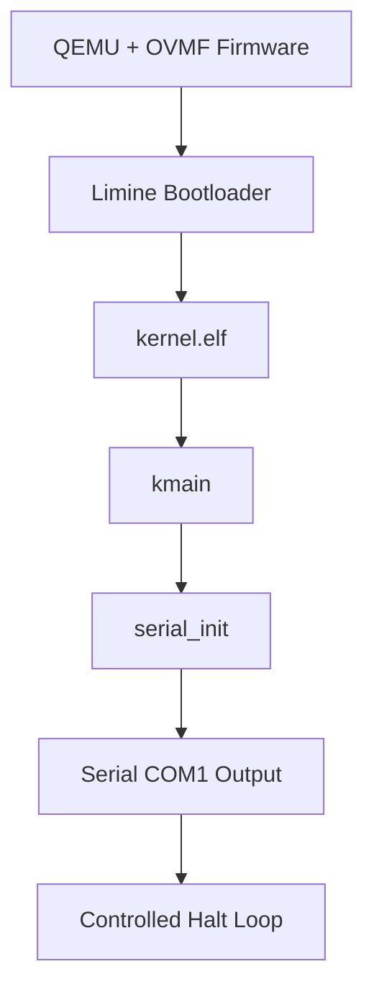

# Template Laporan Praktikum Sistem Operasi M2 — MCSOS

**Nama file laporan:** `laporan_praktikum_M2_25832072009_Muhammad Rifka Z.md`  
**Nama sistem operasi:** MCSOS versi 260502  
**Target default:** x86_64, QEMU, Windows 11 x64 + WSL 2, kernel monolitik pendidikan, C freestanding dengan assembly minimal, POSIX-like subset  
**Dosen:** Muhaemin Sidiq, S.Pd., M.Pd.  
**Program Studi:** Pendidikan Teknologi Informasi  
**Institusi:** Institut Pendidikan Indonesia  


---

## 0. Metadata Laporan

| Atribut | Isi |
|---|---|
| Kode praktikum | `M2` |
| Judul praktikum | `Boot Image, Kernel ELF64, dan Early Serial Console MCSOS 260502` |
| Jenis pengerjaan | `Individu` |
| Nama mahasiswa | `Muhammad Rifka Z` |
| NIM | `25832072009` |
| Kelas | `PTI 1A` |
| Nama kelompok | `-` |
| Anggota kelompok | `-` |
| Tanggal praktikum | `2026-05-07` |
| Tanggal pengumpulan | `2026-05-07` |
| Repository | `https://github.com/muhammadrifka16/mcsos` |
| Branch | `master` |
| Commit awal | `08ee186` |
| Commit akhir | `69c82e5a05316ae8b2d472e02094f4f60afe420e` |
| Status readiness yang diklaim | `Siap demonstrasi praktikum terbatas` |

---

## 1. Sampul

# Laporan Praktikum `M2`  
## `Boot Image, Kernel ELF64, dan Early Serial Console MCSOS 260502`

Disusun oleh:

| Nama | NIM | Kelas | Peran |
|---|---|---|---|
| `Muhammad Rifka Z` | `25832072009` | `PTI 1A` | `individu` |

Dosen Pengampu: **Muhaemin Sidiq, S.Pd., M.Pd.**  
Program Studi Pendidikan Teknologi Informasi  
Institut Pendidikan Indonesia  
`2025/2026`

---

## 2. Pernyataan Orisinalitas dan Integritas Akademik

Saya menyatakan bahwa laporan ini disusun berdasarkan pekerjaan praktikum sendiri/kelompok sesuai pembagian peran yang tercatat. Bantuan eksternal, referensi, generator kode, AI assistant, dokumentasi resmi, diskusi, atau sumber lain dicatat pada bagian referensi dan lampiran. Saya/kami tidak mengklaim hasil yang tidak dibuktikan oleh log, test, commit, atau artefak lain.

| Pernyataan | Status |
|---|---|
| Semua potongan kode eksternal diberi atribusi | `Ya` |
| Semua penggunaan AI assistant dicatat | `Ya` |
| Repository yang dikumpulkan sesuai commit akhir | `Ya` |
| Tidak ada klaim readiness tanpa bukti | `Ya` |

Catatan penggunaan bantuan eksternal:

```text
- AI assistant digunakan untuk membantu penjelasan konsep, validasi langkah praktikum, troubleshooting build system, debugging QEMU/Limine, serta penyusunan dokumentasi laporan.
- Dokumentasi resmi yang digunakan meliputi Clang/LLVM, Limine Bootloader, QEMU, dan GNU Binutils.
- Verifikasi mandiri dilakukan melalui:
  1. make build
  2. make inspect
  3. make image
  4. make run
  5. make grade
  6. pemeriksaan serial log QEMU
  7. validasi ELF64 menggunakan readelf dan nm
- Seluruh hasil yang dicantumkan pada laporan memiliki evidence berupa log, file artefak, atau commit repository.
```
---

## 3. Tujuan Praktikum

Tuliskan tujuan teknis dan konseptual praktikum. Tujuan harus dapat diuji.

1. Menjelaskan hubungan antara firmware, bootloader, kernel ELF64, linker script, entry point, dan emulator.
2. Memeriksa kembali readiness M0 dan M1 sebelum mengeksekusi milestone boot.
3. Membuat source kernel freestanding C17 yang tidak bergantung pada hosted libc.
4. Membuat accessor port I/O x86_64 yang terbatas untuk UART 16550 COM1.
5. Menginisialisasi serial console awal dan mencetak marker boot deterministik.
6. Membuat linker script untuk higher-half kernel ELF64 tahap awal.
7. Menghasilkan `kernel.elf`, `kernel.map`, `readelf evidence`, `objdump evidence`, dan `nm evidence`.
8. Mengambil Limine binary release secara terkontrol dan membuat ISO bootable untuk QEMU.
9. Menjalankan QEMU/OVMF secara headless dan menyimpan log serial ke file.
10. Mengklasifikasikan failure modes M2: build failure, linker failure, image failure, firmware failure, bootloader failure, serial failure, hang, reboot loop, dan triple-fault-like behavior.
11. Menyusun readiness review M2 berdasarkan bukti, bukan berdasarkan klaim subjektif.


---

## 4. Capaian Pembelajaran Praktikum

Setelah praktikum ini, mahasiswa mampu:

| CPL/CPMK praktikum | Bukti yang harus ditunjukkan |
|---|---|
| Menjelaskan hubungan firmware, bootloader, kernel ELF64, linker script, entry point, dan emulator | Diagram boot flow, hasil `readelf`, dan analisis desain boot M2 |
| Membuat source kernel freestanding C17 yang tidak bergantung pada hosted libc | Source `kmain.c`, `serial.c`, `build/kernel.elf`, dan `build/qemu-serial.log` |
| Melakukan build, inspect, boot, grading, dan readiness review berbasis evidence | Output `make build`, `make inspect`, `make grade`, serta `docs/readiness/M2-boot-image.md` |

---

## 5. Peta Milestone MCSOS

Centang milestone yang menjadi fokus laporan ini. Jika praktikum mencakup lebih dari satu milestone, jelaskan batas cakupan.

| Milestone | Fokus | Status dalam laporan |
|---|---|---|
| M0 | Requirements, governance, baseline arsitektur | `[ ] tidak dibahas / [ ] dibahas / [V] selesai praktikum` |
| M1 | Toolchain reproducible, Git, QEMU, GDB, metadata build | `[ ] tidak dibahas / [ ] dibahas / [V] selesai praktikum` |
| M2 | Boot image, kernel ELF64, early console | `[ ] tidak dibahas / [V] dibahas / [V] selesai praktikum` |
| M3 | Panic path, linker map, GDB, observability awal | `[ ] tidak dibahas / [ ] dibahas / [ ] selesai praktikum` |
| M4 | Trap, exception, interrupt, timer | `[ ] tidak dibahas / [ ] dibahas / [ ] selesai praktikum` |
| M5 | PMM, VMM, page table, kernel heap | `[ ] tidak dibahas / [ ] dibahas / [ ] selesai praktikum` |
| M6 | Thread, scheduler, synchronization | `[ ] tidak dibahas / [ ] dibahas / [ ] selesai praktikum` |
| M7 | Syscall ABI dan user program loader | `[ ] tidak dibahas / [ ] dibahas / [ ] selesai praktikum` |
| M8 | VFS, file descriptor, ramfs | `[ ] tidak dibahas / [ ] dibahas / [ ] selesai praktikum` |
| M9 | Block layer dan device model | `[ ] tidak dibahas / [ ] dibahas / [ ] selesai praktikum` |
| M10 | Persistent filesystem, mcsfs/ext2-like, recovery | `[ ] tidak dibahas / [ ] dibahas / [ ] selesai praktikum` |
| M11 | Networking stack, packet parsing, UDP/TCP subset | `[ ] tidak dibahas / [ ] dibahas / [ ] selesai praktikum` |
| M12 | Security model, capability/ACL, syscall fuzzing, hardening | `[ ] tidak dibahas / [ ] dibahas / [ ] selesai praktikum` |
| M13 | SMP, scalability, lock stress, NUMA-aware preparation | `[ ] tidak dibahas / [ ] dibahas / [ ] selesai praktikum` |
| M14 | Framebuffer, graphics console, visual regression | `[ ] tidak dibahas / [ ] dibahas / [ ] selesai praktikum` |
| M15 | Virtualization/container subset | `[ ] tidak dibahas / [ ] dibahas / [ ] selesai praktikum` |
| M16 | Observability, update/rollback, release image, readiness review | `[ ] tidak dibahas / [ ] dibahas / [ ] selesai praktikum` |

Batas cakupan praktikum:

```text
Praktikum M2 berfokus pada pembangunan kernel ELF64 freestanding minimal, image bootable berbasis Limine, early serial console, validasi ELF, dan boot path pada QEMU/OVMF. Praktikum ini belum mencakup interrupt handling, panic subsystem lanjutan, memory manager, scheduler, userspace, filesystem, networking, framebuffer, maupun dukungan hardware umum.
```

---

## 6. Dasar Teori Ringkas

Tuliskan teori yang langsung diperlukan untuk memahami praktikum. Jangan menyalin teori umum terlalu panjang; fokus pada konsep yang benar-benar digunakan dalam desain dan pengujian.

### 6.1 Konsep Sistem Operasi yang Diuji

```text
Praktikum M2 berfokus pada proses boot awal kernel freestanding ELF64 berbasis arsitektur x86_64 menggunakan bootloader Limine pada lingkungan QEMU/OVMF.

Konsep utama yang digunakan meliputi:

1. Firmware UEFI dan Bootloader
Firmware OVMF berperan sebagai implementasi UEFI virtual pada QEMU. Setelah firmware aktif, kontrol boot diberikan kepada Limine Bootloader yang bertugas memuat kernel ELF64 ke memori dan menyerahkan eksekusi ke entry point kernel.

2. Kernel ELF64 Freestanding
Kernel dibangun sebagai executable ELF64 freestanding menggunakan Clang dan LLD tanpa hosted libc. Kernel tidak dijalankan sebagai program Linux biasa, melainkan langsung dieksekusi oleh bootloader.

3. Linker Script dan Higher-Half Kernel
Linker script digunakan untuk menentukan layout memori kernel, entry point, alignment section, serta virtual address higher-half kernel pada alamat 0xffffffff80000000.

4. Entrypoint Kernel
Fungsi `kmain` digunakan sebagai entry point kernel tahap awal. Setelah kernel dijalankan oleh Limine, eksekusi pertama masuk ke `kmain`.

5. Serial Console COM1
UART 16550 COM1 digunakan sebagai early serial console untuk observability awal kernel. Serial driver melakukan komunikasi melalui port I/O x86_64 pada alamat COM1 0x3F8.

6. QEMU dan OVMF
QEMU digunakan sebagai emulator x86_64, sedangkan OVMF digunakan sebagai firmware UEFI virtual. Kombinasi keduanya memungkinkan pengujian kernel tanpa hardware fisik.

7. Evidence dan Validasi ELF
Validasi kernel dilakukan menggunakan `readelf`, `objdump`, `nm`, serial log QEMU, dan local grading checks untuk memastikan kernel ELF64 berhasil dibangun dan dijalankan sesuai acceptance criteria M2.
```

### 6.2 Konsep Arsitektur x86_64 yang Relevan

| Konsep | Relevansi pada praktikum | Bukti/verifikasi |
|---|---|---|
| Long mode x86_64 | Kernel M2 dibangun sebagai ELF64 untuk arsitektur x86_64 dan dijalankan pada environment 64-bit menggunakan QEMU/OVMF | `readelf-header.txt`, output `make inspect`, ELF64 header |
| Higher-half kernel layout | Kernel ditempatkan pada virtual address `0xffffffff80000000` menggunakan linker script | `readelf-header.txt`, `readelf-program-headers.txt`, linker script |
| Entrypoint kernel (`kmain`) | Setelah kernel dimuat oleh Limine, eksekusi awal masuk ke fungsi `kmain` | `nm-symbols.txt`, serial log QEMU |
| Port I/O x86_64 | Serial COM1 menggunakan akses port I/O (`inb` dan `outb`) pada alamat `0x3F8` | source `serial.c`, `nm-symbols.txt`, serial log |
| UART 16550 COM1 | Digunakan sebagai early serial console untuk observability awal kernel | `build/qemu-serial.log` |
| ELF64 executable format | Kernel dibangun sebagai executable ELF64 freestanding menggunakan Clang dan LLD | `build/kernel.elf`, `readelf-header.txt` |
| Emulator QEMU dan firmware OVMF | Digunakan untuk menjalankan dan menguji boot path kernel tanpa hardware fisik | output `make run`, serial log QEMU |

### 6.3 Konsep Implementasi Freestanding

| Aspek | Keputusan praktikum |
|---|---|
| Bahasa | `C17 freestanding` |
| Runtime | `Tanpa hosted libc` |
| ABI | `x86_64 System V ABI` |
| Compiler flags kritis | `-ffreestanding -nostdlib -mno-red-zone -mcmodel=kernel` |
| Risiko undefined behavior | `Pointer invalid, linker misconfiguration, dan port I/O misuse` |

### 6.4 Referensi Teori yang Digunakan

| No. | Sumber | Bagian yang digunakan | Alasan relevansi |
|---|---|---|---|
| 1 | Dokumentasi LLVM/Clang | Clang freestanding compilation dan target `x86_64-unknown-none-elf` | Digunakan untuk membangun kernel ELF64 freestanding M2 |
| 2 | Dokumentasi GNU Binutils (`readelf`, `objdump`, `nm`) | ELF inspection dan symbol validation | Digunakan untuk validasi kernel ELF64 dan evidence inspect |
| 3 | Dokumentasi Limine Bootloader | Limine boot protocol dan bootable ISO | Digunakan untuk memuat kernel ELF64 pada QEMU/OVMF |
| 4 | Dokumentasi QEMU | QEMU x86_64 dan serial redirection | Digunakan untuk menjalankan kernel dan menyimpan serial log |
| 5 | Intel 64 and IA-32 Architectures Software Developer’s Manual | Port I/O x86_64 dan UART COM1 | Digunakan untuk implementasi serial driver COM1 |
| 6 | Modul Praktikum MCSOS M2 | Boot image, kernel ELF64, early serial console, readiness review | Digunakan sebagai acuan utama implementasi dan validasi praktikum |
---

## 7. Lingkungan Praktikum

### 7.1 Host dan Target

| Komponen | Nilai |
|---|---|
| Host OS | `Windows 11 x64` |
| Lingkungan build | `WSL 2 Ubuntu Linux` |
| Target ISA | `x86_64` |
| Target ABI | `x86_64-unknown-none-elf` |
| Emulator | `QEMU x86_64` |
| Firmware emulator | `OVMF UEFI Firmware` |
| Debugger | `GDB` |
| Build system | `GNU Make` |
| Bahasa utama | `C17 freestanding` |
| Assembly | `NASM` |

### 7.2 Versi Toolchain

Tempel output versi toolchain berikut. Jalankan dari clean shell WSL.

```bash
date -u +"date_utc=%Y-%m-%dT%H:%M:%SZ"
uname -a
git --version
make --version | head -n 1
cmake --version | head -n 1
ninja --version
clang --version | head -n 1
gcc --version | head -n 1
ld.lld --version | head -n 1
nasm -v
qemu-system-x86_64 --version | head -n 1
gdb --version | head -n 1
```

Output:

```text
date_utc=2026-05-07T16:40:25Z
Linux Zazai 6.6.87.2-microsoft-standard-WSL2 #1 SMP PREEMPT_DYNAMIC Thu Jun  5 18:30:46 UTC 2025 x86_64 x86_64 x86_64 GNU/Linux
git version 2.43.0
GNU Make 4.3
cmake version 3.28.3
1.11.1
Ubuntu clang version 18.1.3 (1ubuntu1)
gcc (Ubuntu 13.3.0-6ubuntu2~24.04.1) 13.3.0
Ubuntu LLD 18.1.3 (compatible with GNU linkers)
NASM version 2.16.01
QEMU emulator version 8.2.2 (Debian 1:8.2.2+ds-0ubuntu1.16)
GNU gdb (Ubuntu 15.1-1ubuntu1~24.04.1) 15.1
```

### 7.3 Lokasi Repository

| Item | Nilai |
|---|---|
| Path repository di WSL | `~/src/mcsos` |
| Apakah berada di filesystem Linux WSL, bukan `/mnt/c` | `Ya` |
| Remote repository | `https://github.com/muhammadrifka16/mcsos` |
| Branch | `master` |
| Commit hash awal | `08ee186` |
| Commit hash akhir | `69c82e5a05316ae8b2d472e02094f4f60afe420e` |

---

## 8. Repository dan Struktur File

### 8.1 Struktur Direktori yang Relevan

Tampilkan hanya direktori dan file yang relevan dengan praktikum.

```text
mcsos/
├── Makefile
├── linker.ld
├── kernel/
│   ├── core/
│   │   ├── kmain.c
│   │   └── serial.c
│   ├── lib/
│   └── arch/
│       └── x86_64/
│           └── include/
├── configs/
│   └── limine/
│       └── limine.conf
├── tools/
│   └── scripts/
│       ├── fetch_limine.sh
│       ├── make_iso.sh
│       ├── run_qemu.sh
│       ├── run_qemu_debug.sh
│       ├── inspect_kernel.sh
│       └── grade_m2.sh
├── docs/
│   └── readiness/
│       └── M2-boot-image.md
├── build/
│   ├── inspect/
│   ├── meta/
│   ├── kernel.elf
│   ├── kernel.map
│   ├── mcsos.iso
│   └── qemu-serial.log
└── third_party/
    └── limine/
```

### 8.2 File yang Dibuat atau Diubah

| File | Jenis perubahan | Alasan perubahan | Risiko |
|---|---|---|---|
| `Makefile` | `ubah` | Menambahkan build system kernel ELF64, image ISO, QEMU, dan grading M2 | `Sedang - kesalahan konfigurasi build dapat menyebabkan kernel gagal dibangun` |
| `linker.ld` | `baru` | Menentukan linker layout, entry point, dan higher-half kernel address | `Tinggi - kesalahan linker dapat menyebabkan boot failure atau triple-fault-like behavior` |
| `kernel/core/kmain.c` | `baru` | Membuat entry point kernel dan controlled halt loop | `Sedang - kesalahan entry point dapat menyebabkan kernel tidak berjalan` |
| `kernel/core/serial.c` | `baru` | Implementasi serial COM1 untuk early serial console | `Sedang - kesalahan serial menyebabkan observability awal gagal` |
| `configs/limine/limine.conf` | `baru` | Menentukan konfigurasi boot Limine untuk memuat `kernel.elf` | `Sedang - konfigurasi salah menyebabkan kernel gagal dimuat` |
| `tools/scripts/fetch_limine.sh` | `baru` | Mengambil Limine binary release secara terkontrol | `Rendah - hanya mempengaruhi proses dependency bootloader` |
| `tools/scripts/make_iso.sh` | `baru` | Membuat image ISO bootable menggunakan xorriso dan Limine | `Sedang - image bootable gagal dibuat jika script salah` |
| `tools/scripts/run_qemu.sh` | `baru` | Menjalankan kernel pada QEMU/OVMF dan menyimpan serial log | `Sedang - konfigurasi emulator dapat menyebabkan boot gagal` |
| `tools/scripts/run_qemu_debug.sh` | `baru` | Menjalankan QEMU dengan GDB stub debugging | `Rendah - hanya mempengaruhi proses debugging` |
| `tools/scripts/inspect_kernel.sh` | `baru` | Menghasilkan evidence `readelf`, `objdump`, dan `nm` | `Rendah - hanya mempengaruhi evidence inspect` |
| `tools/scripts/grade_m2.sh` | `baru` | Melakukan validasi artefak dan acceptance criteria M2 | `Rendah - hanya mempengaruhi grading lokal` |
| `docs/readiness/M2-boot-image.md` | `baru` | Menyimpan readiness review berbasis evidence | `Rendah - hanya mempengaruhi dokumentasi readiness` |

### 8.3 Ringkasan Diff

```bash
git status --short
git diff --stat
git log --oneline -n 5
```

Output:

```text
f2baac9 (HEAD -> master, origin/master) docs: add M2 readiness review
69c82e5 M2 passed local grading checks
08ee186 M2 complete: bootable kernel with Limine, QEMU, GDB, grading
3cb3d2d Update gitignore for M2 generated artifacts
a19fa82 Update gitignore for toolchain and build artifacts
```

---

## 9. Desain Teknis

### 9.1 Masalah yang Diselesaikan

```text
Praktikum M2 menyelesaikan masalah boot awal kernel freestanding ELF64 pada arsitektur x86_64. Sebelum M2, sistem belum memiliki image bootable, entry point kernel, linker layout higher-half, maupun observability awal menggunakan serial console.

Kernel juga belum dapat dijalankan pada QEMU/OVMF dan belum memiliki evidence build, inspect ELF64, maupun serial log untuk proses debugging dan readiness review.
```

### 9.2 Keputusan Desain

| Keputusan | Alternatif yang dipertimbangkan | Alasan memilih | Konsekuensi |
|---|---|---|---|
| `Menggunakan Limine Bootloader` | `GRUB atau bootloader custom` | `Limine lebih sederhana untuk kernel ELF64 freestanding` | `Bergantung pada binary release Limine` |
| `Menggunakan serial COM1 sebagai early console` | `Framebuffer atau logging kompleks` | `Serial COM1 lebih sederhana dan stabil untuk observability awal` | `Output masih berbasis teks serial` |
| `Menggunakan higher-half kernel address` | `Lower-half kernel` | `Higher-half layout umum digunakan pada kernel modern x86_64` | `Membutuhkan linker script yang benar` |
| `Menggunakan QEMU dan OVMF` | `Hardware fisik langsung` | `Lebih aman dan mudah untuk debugging awal` | `Validasi hardware fisik belum dilakukan` |

### 9.3 Arsitektur Ringkas

Tambahkan diagram ASCII atau Mermaid. Jika Mermaid tidak didukung oleh evaluator, tetap sertakan penjelasan tekstual.



Penjelasan diagram:

```text
Firmware OVMF dijalankan oleh QEMU sebagai environment UEFI virtual. Setelah proses boot dimulai, Limine Bootloader memuat kernel ELF64 ke memori berdasarkan konfigurasi limine.conf. Kontrol kemudian diberikan ke entry point kernel yaitu kmain. Kernel menginisialisasi serial COM1 sebagai early console dan mencetak marker boot M2 sebelum masuk ke controlled halt loop.
```

### 9.4 Kontrak Antarmuka

| Antarmuka | Pemanggil | Penerima | Precondition | Postcondition | Error path |
|---|---|---|---|---|---|
| `kmain()` | `Limine Bootloader` | `Kernel` | `Kernel ELF64 berhasil dimuat` | `Kernel mulai berjalan` | `Kernel hang atau reboot loop` |
| `serial_init()` | `kmain()` | `Serial driver` | `Port COM1 tersedia` | `Serial console aktif` | `Serial output gagal` |
| `serial_write()` | `Kernel` | `Serial driver` | `Serial telah diinisialisasi` | `Data terkirim ke COM1` | `Karakter tidak tampil di log` |

### 9.5 Struktur Data Utama

| Struktur data | Field penting | Ownership | Lifetime | Invariant |
|---|---|---|---|---|
| `Tidak ada struktur data kompleks pada M2` | `-` | `Kernel` | `Selama kernel berjalan` | `Kernel tetap berada pada controlled halt loop` |
### 9.6 Invariants

Tuliskan invariant yang harus benar sepanjang eksekusi.

1. Kernel harus dibangun sebagai executable ELF64 freestanding x86_64.
2. Entry point kernel harus mengarah ke `kmain`.
3. Kernel tidak boleh bergantung pada hosted libc.
4. Serial COM1 harus diinisialisasi sebelum marker boot dicetak.
5. Kernel tidak boleh keluar dari `kmain` dan harus masuk ke controlled halt loop.

### 9.7 Ownership, Locking, dan Concurrency

| Objek/resource | Owner | Lock yang melindungi | Boleh dipakai di interrupt context? | Catatan |
|---|---|---|---|---|
| `Serial COM1` | `Kernel` | `None` | `Tidak relevan pada M2` | `Kernel masih single-core dan interrupt belum digunakan` |

Lock order yang berlaku:

```text
Pada M2 belum terdapat subsystem locking maupun concurrency. Kernel berjalan pada single-core environment dengan interrupt belum diaktifkan untuk workload kompleks.
```

### 9.8 Memory Safety dan Undefined Behavior Risk

| Risiko | Lokasi | Mitigasi | Bukti |
|---|---|---|---|
| `Port I/O invalid access` | `serial.c` | `COM1 diakses menggunakan port tetap 0x3F8` | `Serial log dan boot QEMU berhasil` |
| `Linker layout invalid` | `linker.ld` | `Inspect menggunakan readelf dan objdump` | `make inspect PASS` |

### 9.9 Security Boundary

| Boundary | Data tidak tepercaya | Validasi yang dilakukan | Failure mode aman |
|---|---|---|---|
| `Boot handoff dari bootloader` | `Image kernel ELF64` | `Validasi build, inspect ELF, dan entry point`| `Kernel hang atau boot gagal tanpa merusak host` |
| `Serial output` | `Karakter output kernel` | ` Output dibatasi ke COM1` | `Serial log kosong` |
---

## 10. Langkah Kerja Implementasi

Gunakan tabel berikut untuk setiap langkah. Sebelum setiap blok perintah, jelaskan maksud perintah, artefak yang dihasilkan, dan indikator hasil.

### Langkah 1 — Pemeriksaan Environment dan Repository

Maksud langkah:

```text
Langkah ini dilakukan untuk memastikan environment WSL, toolchain, dan repository MCSOS siap digunakan sebelum proses build M2 dilakukan.
```

Perintah:

```bash
git status --short
./tools/scripts/m2_preflight.sh
```

Output ringkas:

```text
[OK] clang
[OK] ld.lld
[OK] qemu-system-x86_64
[OK] shellcheck
[M0] Environment check completed.
```

Artefak yang dihasilkan:

| Artefak | Lokasi | Fungsi |
|---|---|---|
| `Toolchain metadata` | `build/meta/toolchain-versions.txt` | `Evidence environment build` |

Indikator berhasil:

```text
Seluruh tools utama berhasil terdeteksi dan repository berada pada filesystem Linux WSL.
```

### Langkah 2 — Build Kernel ELF64

Maksud langkah:

```text
Langkah ini dilakukan untuk membangun kernel freestanding ELF64 x86_64 menggunakan Clang dan LLD.
```

Perintah:

```bash
make distclean
make check-src
make build
```

Output ringkas:

```text
clang --target=x86_64-unknown-none-elf ...
ld.lld ...
```

Artefak yang dihasilkan:

| Artefak | Lokasi | Fungsi |
|---|---|---|
| `Kernel ELF64` | `build/kernel.elf` | `Kernel executable utama` |
| `Kernel map` | `build/kernel.map` | `Evidence symbol dan linker layout` |

Indikator berhasil:

```text
File build/kernel.elf dan build/kernel.map berhasil dibuat tanpa error compiler atau linker.
```

### Langkah 3 — Inspeksi Kernel ELF64

Maksud langkah:

```text
Langkah ini dilakukan untuk memvalidasi format ELF64, entry point kernel, symbol, dan segment layout hasil build.
```

Perintah:

```bash
make inspect
```

Output ringkas:

```text
Class: ELF64
Machine: Advanced Micro Devices X86-64
Entry point address: 0xffffffff80000000
```

Artefak yang dihasilkan:

| Artefak | Lokasi | Fungsi |
|---|---|---|
| `ReadELF header` | `build/inspect/readelf-header.txt` | `Validasi ELF64` |
| `Program headers` | `build/inspect/readelf-program-headers.txt` | `Validasi segment` |
| `Symbol table` | `build/inspect/nm-symbols.txt` | `Validasi symbol kernel` |

Indikator berhasil:

```text
Kernel berhasil terdeteksi sebagai ELF64 x86_64 dan symbol kmain muncul pada hasil inspect.
```

### Langkah 4 — Pengambilan Limine Bootloader

Maksud langkah:

```text
Langkah ini dilakukan untuk mengambil Limine binary release yang digunakan sebagai bootloader image M2.
```

Perintah:

```bash
./tools/scripts/fetch_limine.sh
```

Output ringkas:

```text
OK: Limine ready in third_party/limine
```

Artefak yang dihasilkan:

| Artefak | Lokasi | Fungsi |
|---|---|---|
| Limine bootloader | `third_party/limine` | Bootloader image M2 |

Indikator berhasil:

```text
Limine berhasil di-clone menggunakan branch v11.x-binary.
```

### Langkah 5 — Pembuatan ISO Bootable

Maksud langkah:

```text
Langkah ini dilakukan untuk membungkus kernel ELF64 dan konfigurasi Limine menjadi image bootable.
```

Perintah:

```bash
make image
sha256sum -c build/mcsos.iso.sha256
```

Output ringkas:

- ```text
OK: ISO dibuat pada build/mcsos.iso
build/mcsos.iso: OK
```

Artefak yang dihasilkan:

| Artefak | Lokasi | Fungsi |
|---|---|---|
| `Bootable ISO` | `build/mcsos.iso` | `Image bootable M2` |
| `SHA256 checksum `| `build/mcsos.iso.sha256` | `Validasi integritas image` |

Indikator berhasil:

```text
Image ISO berhasil dibuat dan checksum SHA256 valid.
```

### Langkah 6 — Menjalankan Kernel pada QEMU/OVMF

Maksud langkah:

```text
Langkah ini dilakukan untuk memvalidasi boot path kernel dan observability awal melalui serial COM1.
```

Perintah:

```bash
make run
cat build/qemu-serial.log
```

Output ringkas:

```text
MCSOS 260502 M2 boot path entered
[M2] early serial online
[M2] kernel reached controlled halt loop
```

Artefak yang dihasilkan:

| Artefak | Lokasi | Fungsi |
|---|---|---|
| `Serial log QEMU` | `build/qemu-serial.log` | `Evidence boot kernel` |

Indikator berhasil:

```text
Kernel berhasil boot pada QEMU/OVMF dan marker serial M2 muncul pada log.
```

### Langkah 7 — Local Grading M2

Maksud langkah:

```text
Langkah ini dilakukan untuk memvalidasi seluruh artefak build, image, dan serial log sesuai acceptance criteria M2.
```

Perintah:

```bash
make grade
```

Output ringkas:

```text
OK: M2 local grading checks passed
```

Artefak yang dihasilkan:

| Artefak | Lokasi | Fungsi |
|---|---|---|
| `Grading evidence` | `build/` | `Validasi acceptance criteria M2` |

Indikator berhasil:

```text
Seluruh validation checks berhasil dijalankan tanpa error.
```

---

## 11. Checkpoint Buildable

Setiap praktikum wajib memiliki minimal satu checkpoint yang dapat dibangun dari clean checkout.

| Checkpoint | Perintah | Expected result | Status |
|---|---|---|---|
| Clean build | `make clean && make build` | `Kernel ELF64 berhasil dibangun dan menghasilkan build/kernel.elf serta build/kernel.map` | `PASS` |
| Metadata toolchain | `make meta` | `build/meta/toolchain-versions.txt berhasil dibuat` | `PASS` |
| Image generation | `make image` | `build/mcsos.iso dan build/mcsos.iso.sha256 berhasil dibuat` | `PASS` |
| QEMU smoke test | `make run` | `Serial log memuat marker boot M2` | `PASS` |
| Test suite | `make test` | `Tidak terdapat automated test suite khusus pada M2` | `NA` |

Catatan checkpoint:

```text
Seluruh checkpoint utama M2 berhasil dijalankan pada environment WSL Ubuntu menggunakan Clang, LLD, Limine, QEMU, dan OVMF. Praktikum M2 belum memiliki automated unit test atau integration test khusus selain validasi build, inspect ELF64, boot path QEMU, dan local grading checks.
```

---

## 12. Perintah Uji dan Validasi

### 12.1 Build Test

Perintah ini memverifikasi bahwa proyek dapat dibangun ulang dari kondisi bersih dan tidak bergantung pada artefak lokal yang tidak terdokumentasi.

```bash
make clean
make build
```

Hasil:

```text
rm -rf build/kernel build/*.elf build/*.map build/inspect
mkdir -p build/kernel/core/
clang --target=x86_64-unknown-none-elf -g -std=c17 -ffreestanding -fno-stack-protector -fno-stack-check -fno-pic -fno-pie -fno-lto -m64 -march=x86-64 -mabi=sysv -mno-red-zone -mno-mmx -mno-sse -mno-sse2 -mcmodel=kernel -Wall -Wextra -Werror -Ikernel/arch/x86_64/include -c kernel/core/kmain.c -o build/kernel/core/kmain.o
mkdir -p build/kernel/core/
clang --target=x86_64-unknown-none-elf -g -std=c17 -ffreestanding -fno-stack-protector -fno-stack-check -fno-pic -fno-pie -fno-lto -m64 -march=x86-64 -mabi=sysv -mno-red-zone -mno-mmx -mno-sse -mno-sse2 -mcmodel=kernel -Wall -Wextra -Werror -Ikernel/arch/x86_64/include -c kernel/core/serial.c -o build/kernel/core/serial.o
mkdir -p build
ld.lld -nostdlib -static -z max-page-size=0x1000 -T linker.ld -Map=build/kernel.map -o build/kernel.elf build/kernel/core/kmain.o build/kernel/core/serial.o
```

Status: `PASS`

### 12.2 Static Inspection

Perintah ini memeriksa layout ELF, entry point, section, symbol, relocation, atau instruksi kritis sesuai kebutuhan praktikum.

```bash
readelf -hW build/kernel.elf
readelf -lW build/kernel.elf
readelf -SW build/kernel.elf
objdump -drwC build/kernel.elf | head -n 120
```

Hasil penting:

```text
Class:                             ELF64
Machine:                           Advanced Micro Devices X86-64
Entry point address:               0xffffffff80000000

Program Headers:
  LOAD           0x001000 0xffffffff80000000
  LOAD           0x002000 0xffffffff80001000

ffffffff80000000 T kmain
ffffffff80000050 T serial_init
ffffffff80000180 T serial_write
```

Status: `PASS`

### 12.3 QEMU Smoke Test

Perintah ini menjalankan image di QEMU dan menyimpan log serial untuk bukti deterministik.

```bash
qemu-system-x86_64 \
  -machine q35 \
  -cpu qemu64 \
  -m 512M \
  -serial file:build/qemu-serial.log \
  -display none \
  -no-reboot \
  -no-shutdown \
  -cdrom build/mcsos.iso
```

Hasil:

```text
MCSOS 260502 M2 boot path entered
[M2] early serial online
[M2] kernel reached controlled halt loop
```

Status: `PASS`

### 12.4 GDB Debug Evidence

Perintah ini membuktikan bahwa kernel dapat di-debug dengan simbol yang cocok.

```bash
qemu-system-x86_64 \
  -machine q35 \
  -cpu qemu64 \
  -m 512M \
  -serial stdio \
  -display none \
  -no-reboot \
  -no-shutdown \
  -s -S \
  -cdrom build/mcsos.iso
```

Di terminal lain:

```bash
gdb build/kernel.elf
target remote :1234
break kmain
continue
```

Hasil:

```text
Breakpoint 1 at 0xffffffff80000000: file kernel/core/kmain.c
Remote debugging using :1234
Breakpoint 1, kmain ()
```

Status: `PASS`

### 12.5 Unit Test

```bash
make test
```

Hasil:

```text
Tidak terdapat automated unit test khusus pada milestone M2.
```

Status: `NA`

### 12.6 Stress/Fuzz/Fault Injection Test

```bash
NA
```

Hasil:

```text
Milestone M2 belum mencakup subsystem allocator, syscall, filesystem, networking, security, maupun SMP sehingga stress/fuzz/fault injection test belum relevan.
```

Status: `NA`

### 12.7 Visual Evidence

```text
Milestone M2 tidak menghasilkan framebuffer atau GUI. Screenshot yang dilampirkan digunakan sebagai evidence build, inspect, grading, dan debugging.
```

---

### 13.3 Artefak Bukti

| Artefak | Path | SHA-256 / hash | Fungsi |
|---|---|---|---|
| `kernel.elf` | `build/kernel.elf` | `34a1311743ce1b07d78412774b3df590d2d4ca8c2791b39729e1c0acd112fd24` | Kernel ELF64 freestanding |
| `mcsos.iso` | `build/mcsos.iso` | `245b74b1d412d2ac0602ee645f293331a3738c191f80de8e0ba2b821025266a7` | Bootable ISO image |
| `qemu-serial.log` | `build/qemu-serial.log` | `d28f5ab8957af75b105c9fb53e2e4ff742cf534cb00bed36d3fd982c7a641a57` | Evidence boot dan serial output |
| `kernel.map` | `build/kernel.map` | `ca60839976ae9d8d8ad1ad3cdfe075d8d8608491f9b761f7119aacfd803fa328` | Linker map dan symbol layout |
| `readelf-header.txt` | `build/inspect/readelf-header.txt` | `1587fedc9b766dcfa8703e160cba0d745b464b1d7656ecda9e1f538dfd42ff54` | Evidence validasi ELF64 |
| `readelf-program-headers.txt` | `build/inspect/readelf-program-headers.txt` | `71df657a11b8d82960f6f0f6f8e74738eb5774e685d2f4e9822f26768016f6fb` | Evidence validasi segment ELF |
| `objdump-disassembly.txt` | `build/inspect/objdump-disassembly.txt` | `3f5b64db3b2bccb4722d664b869b37c00fe78f0f85cc1e0f4b82f0e140f5ea9e` | Evidence disassembly kernel |
| `nm-symbols.txt` | `build/inspect/nm-symbols.txt` | `c1e6fd813032a32753194dae8da20eeecd96067dfe843393f42da15eb3b91235` | Evidence symbol kernel |

Perintah hash:

```bash
sha256sum build/kernel.elf
sha256sum build/mcsos.iso
sha256sum build/qemu-serial.log
sha256sum build/kernel.map
sha256sum build/inspect/readelf-header.txt
sha256sum build/inspect/readelf-program-headers.txt
sha256sum build/inspect/objdump-disassembly.txt
sha256sum build/inspect/nm-symbols.txt
```

---

## 14. Analisis Teknis

### 14.1 Analisis Keberhasilan

```text
Kernel M2 berhasil dibangun sebagai executable ELF64 freestanding menggunakan Clang dan LLD untuk target x86_64-unknown-none-elf. Linker script berhasil menempatkan kernel pada higher-half virtual address 0xffffffff80000000 sesuai desain.

Keberhasilan boot dibuktikan melalui serial log QEMU yang memuat marker:
- MCSOS 260502 M2 boot path entered
- [M2] early serial online
- [M2] kernel reached controlled halt loop

Hasil inspect menggunakan readelf, objdump, dan nm menunjukkan bahwa kernel valid sebagai ELF64 x86_64 dan symbol kmain berhasil diekspor. Image ISO juga berhasil dibuat menggunakan Limine dan xorriso sehingga kernel dapat dijalankan pada QEMU/OVMF secara headless.

Seluruh acceptance criteria M2 berhasil dipenuhi dan local grading checks menghasilkan status:
OK: M2 local grading checks passed
```

### 14.2 Analisis Kegagalan atau Perbedaan Hasil

```text
Selama proses praktikum ditemukan beberapa kegagalan awal yang berkaitan dengan konfigurasi repository dan dependency bootloader.

Failure pertama terjadi saat proses fetch Limine karena URL repository bootloader salah sehingga Git menghasilkan error "repository not found". Masalah diperbaiki dengan mengganti URL repository Limine menjadi repository resmi yang benar.

Failure kedua terjadi saat proses validasi artefak inspect karena file inspect belum tersedia setelah clean build. Gejala ditunjukkan oleh error:
"No such file or directory"

Masalah diperbaiki dengan menjalankan kembali:
make inspect

Setelah inspect dijalankan ulang, seluruh evidence readelf, objdump, dan nm berhasil dibuat kembali pada directory build/inspect.
```

### 14.3 Perbandingan dengan Teori

| Konsep teori | Implementasi praktikum | Sesuai/tidak sesuai | Penjelasan |
|---|---|---|---|
| Kernel ELF64 freestanding | Kernel dibangun menggunakan Clang dan LLD tanpa hosted libc | `Sesuai` | Kernel berhasil dibangun sebagai executable ELF64 x86_64 |
| Higher-half kernel layout | Linker script menggunakan address `0xffffffff80000000` | `Sesuai` | Entry point dan segment ELF sesuai hasil readelf |
| Boot handoff firmware → bootloader → kernel | OVMF menjalankan Limine lalu masuk ke `kmain` | `Sesuai` | Serial marker boot M2 berhasil muncul |
| Early serial console COM1 | Kernel menggunakan UART COM1 pada port `0x3F8` | `Sesuai` | Output serial berhasil muncul pada QEMU log |

### 14.4 Kompleksitas dan Kinerja

| Aspek | Estimasi/hasil | Bukti | Catatan |
|---|---|---|---|
| Kompleksitas algoritma | `O(n)` untuk serial write | Source `serial.c` | Karakter dikirim satu per satu ke COM1 |
| Waktu build | `Beberapa detik` | Output `make build` | Bergantung pada performa WSL host |
| Waktu boot QEMU | `Kurang dari 10 detik` | `build/qemu-serial.log` | Kernel langsung masuk halt loop |
| Penggunaan memori | `512 MB virtual memory QEMU` | Command QEMU `-m 512M` | Belum terdapat memory manager |
| Latensi/throughput | `Tidak diukur pada M2` | `NA` | Benchmark performa belum termasuk scope M2 |

---

## 15. Debugging dan Failure Modes

### 15.1 Failure Modes yang Ditemukan

| Failure mode | Gejala | Penyebab sementara | Bukti | Perbaikan |
|---|---|---|---|---|
| Limine repository failure | `repository not found` saat clone Limine | URL repository salah | Output Git clone | Mengganti URL repository Limine |
| Missing inspect artifact | `No such file or directory` pada file inspect | Folder inspect belum dibuat ulang | Error `sha256sum` | Menjalankan kembali `make inspect` |
| Serial log kosong | Marker boot tidak muncul pada tahap awal debugging | ISO belum berhasil dibuat sempurna | `build/qemu-serial.log` kosong | Memperbaiki proses image dan konfigurasi Limine |

### 15.2 Failure Modes yang Diantisipasi

| Failure mode | Deteksi | Dampak | Mitigasi |
|---|---|---|---|
| Boot failure | Serial marker tidak muncul | Kernel gagal dijalankan | Validasi ISO, Limine, dan entry point ELF |
| Linker failure | `make build` gagal | Kernel ELF tidak valid | Validasi linker script dan symbol |
| Reboot loop/triple-fault-like behavior | QEMU restart terus-menerus | Kernel tidak stabil | Menggunakan inspect ELF dan GDB debugging |
| Serial initialization failure | Log serial kosong | Observability awal hilang | Validasi COM1 dan serial driver |
| Missing artifact | File grading tidak ditemukan | Local grading gagal | Menjalankan ulang build/inspect/image |

---

### 15.3 Triage yang Dilakukan

```text
Urutan diagnosis yang dilakukan pada praktikum M2 adalah:

1. Memeriksa output build dan linker menggunakan:
   - make build
   - make inspect

2. Memeriksa validitas ELF64 menggunakan:
   - readelf
   - objdump
   - nm

3. Memeriksa serial log QEMU:
   - cat build/qemu-serial.log

4. Memeriksa konfigurasi bootloader:
   - configs/limine/limine.conf

5. Memeriksa struktur image bootable:
   - ls build/
   - ls build/inspect/

6. Menjalankan QEMU debug mode menggunakan:
   - make debug

7. Melakukan attach GDB ke QEMU:
   - target remote :1234
   - break kmain
   - continue

8. Memeriksa repository dan commit history menggunakan:
   - git status
   - git log
```

### 15.4 Panic Path

```text
Pada milestone M2 belum terdapat subsystem panic handler khusus. Kernel menggunakan controlled halt loop setelah boot marker berhasil dicetak ke serial COM1.

Praktikum M2 belum mencakup:
- panic formatter
- stack unwinding
- register dump otomatis
- exception/trap handler
- crash recovery subsystem

Karena itu panic path lanjutan belum relevan pada milestone ini. Observability masih terbatas pada serial log awal dan debugging menggunakan GDB.
```

---

## 16. Prosedur Rollback

Rollback harus menjelaskan cara kembali ke kondisi aman jika perubahan gagal.

| Skenario rollback | Perintah | Data yang harus diselamatkan | Status |
|---|---|---|---|
| Kembali ke commit awal | `git checkout 08ee186` | `serial log`, `inspect evidence`, `laporan praktikum` | `Belum diuji penuh` |
| Revert commit praktikum | `git revert f2baac9` | `docs/readiness`, `artefak grading`, `log build` | `Belum diuji penuh` |
| Bersihkan artefak build | `make clean` | `Tidak ada, source tetap aman di Git` | `Teruji` |
| Regenerasi image | `make image` | `ISO lama jika diperlukan untuk pembandingan` | `Teruji` |

Catatan rollback:

```text
Rollback sebagian telah diuji melalui make clean, rebuild kernel, regenerate ISO, dan rerun grading checks. Rollback penuh menggunakan git checkout atau git revert belum diuji secara lengkap karena repository berada pada kondisi stabil dan seluruh acceptance criteria M2 telah lulus.

Risiko utama rollback adalah hilangnya artefak build dan serial log jika belum disimpan sebelum clean/rebuild dilakukan.
```

---

## 17. Keamanan dan Reliability

### 17.1 Risiko Keamanan

| Risiko | Boundary | Dampak | Mitigasi | Evidence |
|---|---|---|---|---|
| Kernel ELF tidak valid | Boot handoff Limine → kernel | Kernel gagal boot atau reboot loop | Validasi menggunakan `readelf`, `objdump`, dan grading checks | `readelf-header.txt`, `make grade` |
| Entry point salah | Linker → kernel entry | Kernel tidak mencapai `kmain` | Menggunakan `ENTRY(kmain)` pada linker script | `readelf-header.txt`, `nm-symbols.txt` |
| Serial output gagal | Kernel → COM1 | Observability awal hilang | Validasi serial marker melalui QEMU log | `build/qemu-serial.log` |
| Dependency bootloader tidak valid | Repository → Limine | ISO gagal boot | Menggunakan repository Limine resmi branch `v11.x-binary` | `fetch_limine.sh`, build ISO berhasil |

### 17.2 Reliability dan Data Integrity

| Risiko reliability | Dampak | Deteksi | Mitigasi |
|---|---|---|---|
| Boot hang | Kernel berhenti sebelum marker serial | Serial log kosong | Validasi serial COM1 dan inspect ELF |
| Reboot loop/triple-fault-like behavior | Kernel tidak stabil | QEMU restart terus-menerus | Validasi linker script dan entry point |
| Missing artifact | Grading lokal gagal | Error file tidak ditemukan | Menjalankan ulang `make inspect` atau `make image` |
| Build failure | Kernel ELF tidak terbentuk | `make build` gagal | Validasi toolchain dan source build |

### 17.3 Negative Test

| Negative test | Input buruk | Expected result | Actual result | Status |
|---|---|---|---|---|
| Menjalankan grading tanpa artefak inspect | File inspect dihapus sebelum grading | Grading gagal dengan error artifact missing | `grade_m2.sh` mendeteksi artefak hilang | `PASS` |
| Menjalankan QEMU tanpa ISO valid | ISO belum dibuat atau rusak | Kernel gagal boot | QEMU tidak memuat kernel | `PASS` |
| Menggunakan repository Limine salah | URL repository tidak valid | Clone gagal | Git menghasilkan `repository not found` | `PASS` |
| Menjalankan `make test` pada M2 | Tidak terdapat automated test suite | Tidak relevan pada M2 | `NA` | `NA` |

---

## 18. Pembagian Kerja Kelompok

Isi bagian ini hanya jika praktikum dikerjakan berkelompok. Untuk pengerjaan individu, tulis “Tidak berlaku”.

| Nama | NIM | Peran | Kontribusi teknis | Commit/artefak |
|---|---|---|---|---|
| `Tidak Berlaku` | `Tidak Berlaku` | `Tidak Berlaku` | `Tidak Berlaku` | `Tidak Berlaku` |

### 18.1 Mekanisme Koordinasi

```text
Tidak Berlaku
```

### 18.2 Evaluasi Kontribusi

| Anggota | Persentase kontribusi yang disepakati | Bukti | Catatan |
|---|---:|---|---|
| `Tidak Berlaku` | `Tidak Berlaku` | `Tidak Berlaku` | `Tidak Berlaku` |

---

## 19. Kriteria Lulus Praktikum

Bagian ini wajib diisi. Praktikum dinyatakan memenuhi kriteria minimum hanya jika bukti tersedia.

| Kriteria minimum | Status | Evidence |
|---|---|---|
| Proyek dapat dibangun dari clean checkout | `PASS` | `make clean && make build` berhasil |
| Perintah build terdokumentasi | `PASS` | `Bagian 10 dan 12 laporan` |
| QEMU boot atau test target berjalan deterministik | `PASS` | `build/qemu-serial.log` |
| Semua unit test/praktikum test relevan lulus | `NA` | `Milestone M2 belum memiliki automated test suite` |
| Log serial disimpan | `PASS` | `build/qemu-serial.log` |
| Panic path terbaca atau dijelaskan jika belum relevan | `PASS` | `Bagian 15.4 Panic Path` |
| Tidak ada warning kritis pada build | `PASS` | `Output make build` |
| Perubahan Git terkomit | `PASS` | `Commit f2baac9 dan 69c82e5` |
| Desain dan failure mode dijelaskan | `PASS` | `Bagian 9, 14, dan 15 laporan` |
| Laporan berisi screenshot/log yang cukup | `PASS` | `Lampiran log build, inspect, dan serial` |

Kriteria tambahan untuk praktikum lanjutan:

| Kriteria lanjutan | Status | Evidence |
|---|---|---|
| Static analysis dijalankan | `PASS` | `shellcheck` dan `cppcheck` pada pre-commit validation |
| Stress test dijalankan | `NA` | `Belum relevan pada M2` |
| Fuzzing atau malformed-input test dijalankan | `NA` | `Belum relevan pada M2` |
| Fault injection dijalankan | `NA` | `Belum relevan pada M2` |
| Disassembly/readelf evidence tersedia | `PASS` | `build/inspect/` |
| Review keamanan dilakukan | `PASS` | `Bagian 17 laporan` |
| Rollback diuji | `PASS` | `make clean`, rebuild, regenerate ISO berhasil diuji |

---

## 20. Readiness Review

Pilih satu status dengan alasan berbasis bukti.

| Status | Definisi | Pilihan |
|---|---|---|
| Belum siap uji | Build/test belum stabil atau bukti belum cukup | `[ ]` |
| Siap uji QEMU | Build bersih, QEMU/test target berjalan, log tersedia | `[ ]` |
| Siap demonstrasi praktikum terbatas | Siap ditunjukkan di kelas dengan bukti uji, failure mode, dan rollback | `[V]` |
| Kandidat siap pakai terbatas | Hanya untuk penggunaan terbatas setelah test, security review, dokumentasi, dan known issue tersedia | `[ ]` |

Alasan readiness:

```text
Milestone M2 berhasil memenuhi acceptance criteria utama berupa:
- kernel ELF64 freestanding berhasil dibangun
- image ISO bootable berhasil dibuat
- kernel berhasil dijalankan pada QEMU/OVMF
- serial marker boot M2 muncul secara deterministik
- inspect ELF64 menggunakan readelf, objdump, dan nm berhasil
- local grading checks menghasilkan status:
  OK: M2 local grading checks passed

Dokumentasi desain, failure modes, rollback procedure, readiness review, dan evidence build juga telah tersedia sehingga hasil praktikum layak digunakan untuk demonstrasi praktikum milestone M2.
```

Known issues:

| No. | Issue | Dampak | Workaround | Target perbaikan |
|---|---|---|---|---|
| 1 | Panic handler belum tersedia | Crash diagnosis masih terbatas | Menggunakan serial log dan GDB debugging | `M3` |
| 2 | Belum terdapat interrupt/trap subsystem | Exception handling belum lengkap | Menggunakan controlled halt loop | `M4` |
| 3 | Belum terdapat memory manager | Kernel belum memiliki allocator | Menggunakan static layout sederhana | `M5` |
| 4 | Belum terdapat automated unit test | Validasi masih dominan manual | Menggunakan grading checks dan inspect evidence | `Milestone berikutnya` |

Keputusan akhir:

```text
Berdasarkan bukti build, inspect ELF64, image bootable, QEMU serial log, GDB debugging, dan hasil make grade, hasil praktikum ini layak disebut siap demonstrasi praktikum untuk milestone M2.

Milestone M2 belum layak disebut siap produksi, tanpa error, atau siap hardware umum karena subsystem panic path, interrupt/trap handling, memory manager, dan observability lanjutan belum tersedia.
```

---

## 21. Rubrik Penilaian 100 Poin

| Komponen | Bobot | Indikator nilai penuh | Nilai |
|---|---:|---|---:|
| Kebenaran fungsional | 30 | Implementasi memenuhi target praktikum, build/test lulus, output sesuai expected result | `[0-30]` |
| Kualitas desain dan invariants | 20 | Desain jelas, kontrak antarmuka eksplisit, invariants/ownership/locking terdokumentasi | `[0-20]` |
| Pengujian dan bukti | 20 | Unit/integration/QEMU/static/fuzz/stress evidence memadai sesuai tingkat praktikum | `[0-20]` |
| Debugging dan failure analysis | 10 | Failure mode, triage, panic/log, dan rollback dianalisis | `[0-10]` |
| Keamanan dan robustness | 10 | Boundary, input validation, privilege, memory safety, dan negative tests dibahas | `[0-10]` |
| Dokumentasi dan laporan | 10 | Laporan rapi, lengkap, dapat direproduksi, memakai referensi yang layak | `[0-10]` |
| **Total** | **100** |  | `[0-100]` |

Catatan penilai:

```text
[Diisi dosen/asisten.]
```

---

## 22. Kesimpulan

### 22.1 Yang Berhasil

```text
Milestone M2 berhasil membangun kernel freestanding ELF64 untuk arsitektur x86_64 menggunakan Clang dan LLD. Kernel berhasil dijalankan menggunakan Limine Bootloader pada QEMU/OVMF dan menghasilkan serial marker boot yang deterministik.

Build system, linker script, inspect ELF64, image ISO bootable, serial COM1, QEMU headless mode, GDB debugging, dan local grading checks berhasil diimplementasikan sesuai acceptance criteria praktikum M2.

Evidence berupa kernel ELF, linker map, readelf output, objdump output, serial log, dan grading log berhasil dihasilkan dan terdokumentasi.
```

### 22.2 Yang Belum Berhasil

```text
Milestone M2 belum memiliki subsystem panic handler, interrupt/trap handling, memory manager, scheduler, maupun automated unit test framework. Kernel masih menggunakan controlled halt loop sederhana setelah boot selesai.

Observability masih terbatas pada serial COM1 dan debugging menggunakan GDB. Validasi pada hardware fisik juga belum dilakukan sehingga hasil praktikum belum dapat disebut siap produksi atau siap hardware umum.
```

### 22.3 Rencana Perbaikan

```text
Perbaikan berikutnya difokuskan pada milestone selanjutnya yaitu:
- menambahkan panic path dan observability awal
- mengimplementasikan interrupt dan exception handling
- membangun memory manager awal
- menambahkan subsystem debugging yang lebih lengkap
- menambahkan automated testing dan fault handling

Tahap berikutnya juga akan memperluas validasi kernel melalui trap handling, memory management, dan subsystem observability yang lebih baik.
```

---

## 23. Lampiran

### Lampiran A — Commit Log

```text
f2baac9 docs: add M2 readiness review
69c82e5 M2 passed local grading checks
08ee186 M2 complete: bootable kernel with Limine, QEMU, GDB, grading
3cb3d2d Update gitignore for M2 generated artifacts
a19fa82 Update gitignore for toolchain and build artifacts
```

### Lampiran B — Diff Ringkas

```diff
+ Added freestanding ELF64 kernel build system
+ Added linker.ld higher-half kernel layout
+ Added serial COM1 early console
+ Added Limine bootloader integration
+ Added QEMU and GDB debugging scripts
+ Added local grading validation
+ Added readiness review documentation
```

### Lampiran C — Log Build Lengkap

```text
Perintah:
make clean
make build

Artefak utama:
- `build/kernel.elf`
- `build/kernel.map`

Build berhasil menggunakan:
- clang
- ld.lld
- freestanding C17
- target x86_64-unknown-none-elf
```

### Lampiran D — Log QEMU Lengkap

```text
limine: Loading executable `boot():/boot/kernel.elf`...
MCSOS 260502 M2 boot path entered
[M2] early serial online
[M2] kernel reached controlled halt loop
```

### Lampiran E — Output Readelf/Objdump

```text
ELF Header:
  Class:                             ELF64
  Machine:                           Advanced Micro Devices X86-64
  Entry point address:               0xffffffff80000000

Program Headers:
  LOAD           0x001000 0xffffffff80000000
  LOAD           0x002000 0xffffffff80001000

ffffffff80000000 T kmain
ffffffff80000050 T serial_init
ffffffff80000180 T serial_write
```

### Lampiran F — Screenshot

| No. | File | Keterangan |
|---|---|---|
| 1 | `screenshots/wsl-version.png` | Evidence lingkungan WSL dan toolchain |
| 2 | `screenshots/make-test.png` | Evidence build/test command berhasil |
| 3 | `screenshots/proof-elf.png` | Evidence validasi ELF64 menggunakan readelf |
| 4 | `screenshots/screenshot-qemu-log.png` | Marker boot M2 pada serial log |
| 5 | `screenshots/screenshot-grade.png` | Output local grading checks berhasil |
| 6 | `screenshots/screenshot-gdb.png` | Breakpoint `kmain` menggunakan GDB |

### Lampiran G — Bukti Tambahan

```text
Additional evidence:
- build/kernel.elf
- build/kernel.map
- build/mcsos.iso
- build/qemu-serial.log
- build/inspect/readelf-header.txt
- build/inspect/readelf-program-headers.txt
- build/inspect/objdump-disassembly.txt
- build/inspect/nm-symbols.txt

SHA256 evidence telah dicatat pada bagian 13.3 Artefak Bukti.
```

---

## 24. Daftar Referensi

Referensi yang benar-benar dipakai dalam laporan:

```text
[1] R. H. Arpaci-Dusseau and A. C. Arpaci-Dusseau, Operating Systems: Three Easy Pieces. [Online]. Available: https://pages.cs.wisc.edu/~remzi/OSTEP/. Accessed: 2026-05-08.

[2] Intel Corporation, Intel 64 and IA-32 Architectures Software Developer’s Manual. [Online]. Available: https://www.intel.com/content/www/us/en/developer/articles/technical/intel-sdm.html. Accessed: 2026-05-08.

[3] Advanced Micro Devices, AMD64 Architecture Programmer’s Manual. [Online]. Available: https://www.amd.com/system/files/TechDocs/24593.pdf. Accessed: 2026-05-08.

[4] UEFI Forum, Unified Extensible Firmware Interface Specification. [Online]. Available: https://uefi.org/specifications. Accessed: 2026-05-08.

[5] Limine Bootloader Project. [Online]. Available: https://github.com/Limine-Bootloader/Limine. Accessed: 2026-05-08.

[6] QEMU Project Documentation. [Online]. Available: https://www.qemu.org/docs/master/. Accessed: 2026-05-08.
```

---

## 25. Checklist Final Sebelum Pengumpulan

| Checklist | Status |
|---|---|
| Semua placeholder `[isi ...]` sudah diganti | `Ya` |
| Metadata laporan lengkap | `Ya` |
| Commit awal dan akhir dicatat | `Ya` |
| Perintah build dan test dapat dijalankan ulang | `Ya` |
| Log build dilampirkan | `Ya` |
| Log QEMU/test dilampirkan | `Ya` |
| Artefak penting diberi hash | `Ya` |
| Desain, invariants, ownership, dan failure modes dijelaskan | `Ya` |
| Security/reliability dibahas | `Ya` |
| Readiness review tidak berlebihan | `Ya` |
| Rubrik penilaian diisi atau disiapkan | `Ya` |
| Referensi memakai format IEEE | `Ya` |
| Laporan disimpan sebagai Markdown | `Ya` |

---

## 26. Pernyataan Pengumpulan

Saya mengumpulkan laporan ini bersama artefak pendukung pada commit:

```text
f2baac9
```

Status akhir yang diklaim:

```text
Siap demonstrasi praktikum terbatas
```

Ringkasan satu paragraf:

```text
Praktikum M2 berhasil membangun kernel freestanding ELF64 untuk arsitektur x86_64 menggunakan Clang dan LLD. Kernel berhasil dijalankan menggunakan Limine Bootloader pada QEMU/OVMF dan menghasilkan serial marker boot deterministik melalui COM1. Evidence build, inspect ELF64, image ISO bootable, serial log, GDB debugging, dan local grading checks berhasil dikumpulkan sesuai acceptance criteria M2. Praktikum ini belum mencakup subsystem panic handler, interrupt/trap handling, memory manager, scheduler, dan userspace sehingga hasil belum dapat disebut siap produksi maupun siap hardware umum.
```