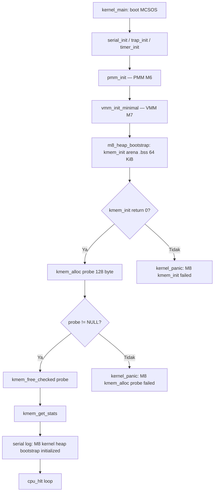

# Template Laporan Praktikum Sistem Operasi Lanjut — MCSOS

**Nama file laporan:** `laporan_praktikum_M8_25832072009.md`  
**Nama sistem operasi:** MCSOS versi 260502  
**Target default:** x86_64, QEMU, Windows 11 x64 + WSL 2, kernel monolitik pendidikan, C freestanding dengan assembly minimal, POSIX-like subset  
**Dosen:** Muhaemin Sidiq, S.Pd., M.Pd.  
**Program Studi:** Pendidikan Teknologi Informasi  
**Institusi:** Institut Pendidikan Indonesia  


---

## 0. Metadata Laporan

| Atribut | Isi |
|---|---|
| Kode praktikum | `M8` |
| Judul praktikum | `Kernel Heap Awal dan Allocator Dinamis MCSOS` |
| Jenis pengerjaan | `Individu` |
| Nama mahasiswa | `Muhammad Rifka Z` |
| NIM | `25832072009` |
| Kelas | `PTI 1A` |
| Nama kelompok | `-` |
| Anggota kelompok | `-` |
| Tanggal praktikum | `2006-05-02` |
| Tanggal pengumpulan | `Sebelum Uas` |
| Repository | `https://github.com/muhammadrifka16/mcsos.git` |
| Branch | `praktikum-m8-kernel-heap` |
| Commit awal | `add981d` |
| Commit akhir | `623f494` |
| Status readiness yang diklaim | `Siap demonstrasi praktikum` |

---

## 1. Sampul

# Laporan Praktikum `M8`  
## `Kernel Heap Awal dan Allocator Dinamis MCSOS`

Disusun oleh:

| Nama | NIM | Kelas | Peran |
|---|---|---|---|
| `Muhammad Rifka Z` | `25832072009` | `PTI 1A` | `Individu` |

Dosen Pengampu: **Muhaemin Sidiq, S.Pd., M.Pd.**  
Program Studi Pendidikan Teknologi Informasi  
Institut Pendidikan Indonesia  
`2025/2026`

---

## 2. Pernyataan Orisinalitas dan Integritas Akademik

Saya menyatakan bahwa laporan ini disusun berdasarkan pekerjaan praktikum sendiri/kelompok sesuai pembagian peran yang tercatat. Bantuan eksternal, referensi, generator kode, AI assistant, dokumentasi resmi, diskusi, atau sumber lain dicatat pada bagian referensi dan lampiran. Saya tidak mengklaim hasil yang tidak dibuktikan oleh log, test, commit, atau artefak lain.

| Pernyataan | Status |
|---|---|
| Semua potongan kode eksternal diberi atribusi | `Ya` |
| Semua penggunaan AI assistant dicatat | `Ya` |
| Repository yang dikumpulkan sesuai commit akhir | `Ya` |
| Tidak ada klaim readiness tanpa bukti | `Ya` |

Catatan penggunaan bantuan eksternal:

```text
Referensi utama: Panduan Praktikum M8 MCSOS (OS_panduan_M8.md) yang disediakan dosen.
Referensi arsitektur: Intel SDM, AMD64 APM Volume 2, Linux Kernel Memory Allocation Guide.
Referensi toolchain: Clang command line reference, GNU Make manual, GNU Binutils documentation.
AI assistant: digunakan untuk klarifikasi konsep freestanding C dan pointer arithmetic.
Verifikasi mandiri: seluruh hasil host test, audit nm/readelf/objdump, QEMU serial log, dan
GDB session dijalankan sendiri pada lingkungan WSL2 Ubuntu lokal.
```

---

## 3. Tujuan Praktikum

Tuliskan tujuan teknis dan konseptual praktikum. Tujuan harus dapat diuji.

1. Mengimplementasikan kernel heap allocator berbasis first-fit free-list dengan split, coalesce, alignment 16 byte, dan validasi header sebagai C17 freestanding pada MCSOS.
2. Menyusun host unit test yang menguji alokasi dasar, pembebasan, alignment, zeroing (calloc), overflow, fragmentasi, dan coalescing; membuktikan hasil dengan log `M8 kmem host tests: PASS`.
3. Mengaudit object freestanding kernel allocator menggunakan `nm -u`, `readelf -h`, dan `objdump -dr` untuk memastikan tidak ada dependensi libc implisit dan object valid sebagai ELF64 x86-64.
4. Mengintegrasikan heap awal ke kernel MCSOS setelah PMM dan VMM siap, memverifikasi serial log `[M8] kernel heap bootstrap initialized`, dan mendokumentasikan failure mode, rollback, serta readiness review berbasis bukti.

---

## 4. Capaian Pembelajaran Praktikum

Setelah praktikum ini, mahasiswa mampu:

| CPL/CPMK praktikum | Bukti yang harus ditunjukkan |
|---|---|
| Menjelaskan perbedaan PMM, VMM, dan kernel heap serta alasan kernel memerlukan allocator dinamis | Analisis teknis pada bagian 9 dan 14 laporan ini |
| Mendesain free-list allocator dengan metadata header, split, coalesce, alignment 16 byte, dan statistik heap | Desain pada bagian 9; source `kmem.c` dan `kmem.h` pada commit `5a0de58` dan `add981d` |
| Mengimplementasikan `kmem_init`, `kmem_alloc`, `kmem_calloc`, `kmem_free_checked`, `kmem_get_stats`, `kmem_validate` dalam C17 freestanding | Symbol terlihat pada disassembly `objdump`; host test PASS |
| Menyusun host unit test yang menguji alokasi, pembebasan, alignment, zeroing, overflow, fragmentasi, dan coalescing | `build/m8/test_kmem.log` menampilkan `M8 kmem host tests: PASS` |
| Melakukan audit freestanding object dengan `nm`, `readelf`, dan `objdump` | `nm -u` kosong; `readelf -h` menunjukkan ELF64 AMD X86-64; disassembly memuat semua symbol allocator |
| Mengintegrasikan heap awal ke kernel dan memverifikasi serial log | QEMU serial log: `[M8] kernel heap bootstrap initialized` |
| Mendokumentasikan failure mode, rollback, dan readiness review berbasis bukti | Bagian 15, 16, 20 laporan ini; rollback berhasil dengan bukti `make m8-all PASS` setelah recovery |

---

## 5. Peta Milestone MCSOS

Centang milestone yang menjadi fokus laporan ini. Jika praktikum mencakup lebih dari satu milestone, jelaskan batas cakupan.

| Milestone | Fokus | Status dalam laporan |
|---|---|---|
| M0 | Requirements, governance, baseline arsitektur | `[ ] tidak dibahas / [ ] dibahas / [V] selesai praktikum` |
| M1 | Toolchain reproducible, Git, QEMU, GDB, metadata build | `[ ] tidak dibahas / [ ] dibahas / [V] selesai praktikum` |
| M2 | Boot image, kernel ELF64, early console | `[ ] tidak dibahas / [ ] dibahas / [V] selesai praktikum` |
| M3 | Panic path, linker map, GDB, observability awal | `[ ] tidak dibahas / [ ] dibahas / [V] selesai praktikum` |
| M4 | Trap, exception, interrupt, timer | `[ ] tidak dibahas / [ ] dibahas / [V] selesai praktikum` |
| M5 | PMM, VMM, page table, kernel heap | `[ ] tidak dibahas / [ ] dibahas / [V] selesai praktikum` |
| M6 | Thread, scheduler, synchronization | `[ ] tidak dibahas / [ ] dibahas / [V] selesai praktikum` |
| M7 | Syscall ABI dan user program loader | `[ ] tidak dibahas / [ ] dibahas / [V] selesai praktikum` |
| M8 | VFS, file descriptor, ramfs | `[ ] tidak dibahas / [V] dibahas / [V] selesai praktikum` |
| M9 | Block layer dan device model | `[ ] tidak dibahas / [ ] dibahas / [ ] selesai praktikum` |
| M10 | Persistent filesystem, mcsfs/ext2-like, recovery | `[ ] tidak dibahas / [ ] dibahas / [ ] selesai praktikum` |
| M11 | Networking stack, packet parsing, UDP/TCP subset | `[ ] tidak dibahas / [ ] dibahas / [ ] selesai praktikum` |
| M12 | Security model, capability/ACL, syscall fuzzing, hardening | `[ ] tidak dibahas / [ ] dibahas / [ ] selesai praktikum` |
| M13 | SMP, scalability, lock stress, NUMA-aware preparation | `[ ] tidak dibahas / [ ] dibahas / [ ] selesai praktikum` |
| M14 | Framebuffer, graphics console, visual regression | `[ ] tidak dibahas / [ ] dibahas / [ ] selesai praktikum` |
| M15 | Virtualization/container subset | `[ ] tidak dibahas / [ ] dibahas / [ ] selesai praktikum` |
| M16 | Observability, update/rollback, release image, readiness review | `[ ] tidak dibahas / [ ] dibahas / [ ] selesai praktikum` |

Batas cakupan praktikum:

```text
Termasuk dalam cakupan M8:
- Implementasi first-fit free-list allocator pada arena heap statik (.bss) berbasis C17 freestanding.
- API: kmem_init, kmem_alloc, kmem_calloc, kmem_free_checked, kmem_get_stats, kmem_validate.
- Host unit test: alokasi dasar, alignment, calloc/zeroing, overflow, double free rejection, fragmentasi, coalescing.
- Audit freestanding object: nm -u (unresolved symbol kosong), readelf -h (ELF64 x86-64), objdump -dr (symbol allocator).
- Script preflight: scripts/check_m8_kmem.sh.
- Integrasi kernel: arena bootstrap statik 64 KiB, serial log heap initialized, QEMU smoke test.
- GDB debug session: breakpoint kmem_init, kmem_alloc, validasi KMEM_MAGIC, CR2 = 0x0.
- Rollback: git restore, git clean, make m8-all PASS setelah recovery.

Tidak termasuk (non-goals M8):
- Heap tumbuh otomatis melalui mapping halaman baru (page-backed heap growth) — pengayaan, bukan syarat wajib.
- SMP-safe allocator dan IRQ-safe allocator.
- Slab allocator / per-CPU cache.
- User-space heap, vmalloc, mmap.
- Red-zone allocator, heap canary, poison pattern.
- ASLR/KASLR.
- DMA allocator.
- Klaim "production ready" atau "tanpa error".
```

---

## 6. Dasar Teori Ringkas

Tuliskan teori yang langsung diperlukan untuk memahami praktikum. Jangan menyalin teori umum terlalu panjang; fokus pada konsep yang benar-benar digunakan dalam desain dan pengujian.

### 6.1 Konsep Sistem Operasi yang Diuji

```text
Kernel Heap dan Allocator Dinamis:
Setelah boot awal, kernel tidak cukup hanya menggunakan variabel statik. Struktur seperti daftar
proses, descriptor file, object VFS, buffer I/O, node timer, packet buffer, dan metadata driver
membutuhkan alokasi dinamis dengan kontrak kepemilikan yang jelas.

Pemisahan tiga lapisan manajemen memori:
- PMM (Physical Memory Manager, M6): mengelola frame fisik 4 KiB. Unit alokasi adalah frame.
  Tidak mengenal layout object kecil.
- VMM (Virtual Memory Manager, M7): mengelola pemetaan virtual ke physical melalui page table
  x86_64 4-level. Tidak mengenal ukuran object heap.
- Kernel Heap (M8): mengelola object berukuran byte di atas rentang virtual yang sudah terpetakan
  oleh VMM. Tidak boleh mengubah page table tanpa kontrak VMM.

First-Fit Free-List Allocator:
Allocator menjaga doubly-linked list dari block-block heap. Setiap block memiliki header (kmem_block_t)
yang menyimpan magic number, ukuran payload, flag free/used, pointer prev, dan pointer next.
- kmem_init: membentuk satu block free besar dari arena yang diberikan.
- kmem_alloc: first-fit scan — memilih block free pertama yang cukup besar, split jika perlu.
- kmem_free_checked: mark block sebagai free, lalu coalesce block tetangga yang juga free.
- kmem_calloc: kmem_alloc + zeroing payload.
- kmem_get_stats: menghitung statistik heap (total, used, free, block count, largest free).
- kmem_validate: traversal penuh untuk memverifikasi semua invariant allocator.

Split dan Coalesce:
Split dilakukan saat block free lebih besar dari yang diminta: sisa dibuat block baru.
Coalesce dilakukan saat free: block tetangga yang juga free digabung agar mengurangi fragmentasi.

Alignment 16 Byte:
Payload yang dikembalikan kmem_alloc harus aligned 16 byte agar aman untuk tipe data umum
(misalnya SIMD, double, pointer). Header diletakkan tepat sebelum payload.

Freestanding C:
Object kernel tidak boleh bergantung pada libc host. malloc, free, printf, memset dari libc
tidak tersedia di kernel. Semua helper (kmem_memset, kmem_align_up_ptr, dll.) harus lokal.
Diaudit dengan: nm -u (unresolved symbol harus kosong).
```

### 6.2 Konsep Arsitektur x86_64 yang Relevan

| Konsep | Relevansi pada praktikum | Bukti/verifikasi |
|---|---|---|
| Long mode (64-bit) | Allocator dikompilasi untuk x86_64; pointer 64-bit; size_t = 8 byte | `readelf -h` menunjukkan Machine: Advanced Micro Devices X86-64 |
| Alignment memori | Payload harus aligned 16 byte; header harus berada di alamat yang valid | Host test alignment assertion; `((uintptr_t)ptr & 15u) == 0` |
| Page table 4-level dan page fault | Arena heap harus berada di memori virtual yang sudah present dan writable; jika tidak, page fault terjadi | GDB: CR2 = 0x0 (tidak ada page fault saat heap init); serial log heap initialized |
| CR2 | Menyimpan alamat virtual yang menyebabkan page fault; digunakan untuk diagnosis jika arena heap tidak termap | GDB evidence: CR2 = 0x0 (page fault tidak terjadi) |
| Freestanding ABI x86_64 | Calling convention C tidak berubah; compiler flags -ffreestanding -fno-builtin mengontrol agar tidak ada libc dependency implisit | `nm -u build/m8/kmem.freestanding.o` kosong |

### 6.3 Konsep Implementasi Freestanding

| Aspek | Keputusan praktikum |
|---|---|
| Bahasa | C17 freestanding |
| Runtime | Tanpa hosted libc; helper lokal (`kmem_memset`, `kmem_align_up_ptr`, `kmem_align_up_size`) |
| ABI | x86_64 internal kernel; calling convention C freestanding yang dikontrol toolchain |
| Compiler flags kritis | `-std=c17 -ffreestanding -fno-builtin -fno-stack-protector -mno-red-zone -Wall -Wextra -Werror` |
| Risiko undefined behavior | Pointer arithmetic keluar arena (dimitigasi validasi range), integer overflow pada `kmem_calloc` (dimitigasi cek `bytes > SIZE_MAX / count`), aliasing pointer header/payload (dimitigasi penggunaan `unsigned char *` untuk offset), alignment violation (dimitigasi `kmem_align_up_ptr`) |

### 6.4 Referensi Teori yang Digunakan

| No. | Sumber | Bagian yang digunakan | Alasan relevansi |
|---|---|---|---|
| [1] | Intel Corporation, Intel 64 and IA-32 Architectures Software Developer Manuals | Memory management, page translation, exception/interrupt handling | Dasar arsitektur x86_64 untuk heap arena, page fault, dan alignment |
| [2] | Advanced Micro Devices, AMD64 Architecture Programmer's Manual Volume 2 | System programming, memory management, page translation | Verifikasi ELF64 AMD X86-64; referensi arsitektur target |
| [3] | The Linux Kernel Documentation, Memory Allocation Guide | Prinsip strategi alokasi kernel: kmalloc, vmalloc, page allocator | Referensi desain; M8 menyederhanakan untuk konteks pendidikan |
| [4] | The Linux Kernel Documentation, Memory Management Documentation | Dokumentasi MM kernel Linux secara menyeluruh | Referensi perbandingan konsep PMM/VMM/heap |

---

## 7. Lingkungan Praktikum

### 7.1 Host dan Target

| Komponen | Nilai |
|---|---|
| Host OS | `Windows 11` |
| Lingkungan build | `WSL2 Ubuntu` |
| Target ISA | `x86_64` |
| Target ABI | `x86_64 kernel internal freestanding` |
| Emulator | `QEMU q35` |
| Firmware emulator | `SeaBIOS (default QEMU)` |
| Debugger | `GDB` |
| Build system | `GNU Make 4.3` |
| Bahasa utama | `C17 freestanding` |
| Assembly | `GNU AS / GAS` |

### 7.2 Versi Toolchain

Tempel output versi toolchain berikut. Jalankan dari clean shell WSL.

```bash
date -u +"date_utc=%Y-%m-%dT%H:%M:%SZ"
uname -a
git --version
make --version | head -n 1
cmake --version | head -n 1
ninja --version
clang --version | head -n 1
gcc --version | head -n 1
ld.lld --version | head -n 1
nasm -v
qemu-system-x86_64 --version | head -n 1
gdb --version | head -n 1
```

Output:

```text
date_utc=2026-05-12T09:28:37Z
Linux Zazai 6.6.87.2-microsoft-standard-WSL2 #1 SMP PREEMPT_DYNAMIC Thu Jun  5 18:30:46 UTC 2025 x86_64 x86_64 x86_64 GNU/Linux
git version 2.43.0
GNU Make 4.3
cmake version 3.28.3
1.11.1
Ubuntu clang version 18.1.3 (1ubuntu1)
gcc (Ubuntu 13.3.0-6ubuntu2~24.04.1) 13.3.0
Ubuntu LLD 18.1.3 (compatible with GNU linkers)
NASM version 2.16.01
QEMU emulator version 8.2.2 (Debian 1:8.2.2+ds-0ubuntu1.16)
GNU gdb (Ubuntu 15.1-1ubuntu1~24.04.1) 15.1
```

### 7.3 Lokasi Repository

| Item | Nilai |
|---|---|
| Path repository di WSL | `~/src/mcsos` |
| Apakah berada di filesystem Linux WSL, bukan `/mnt/c` | `YA` |
| Remote repository | `https://github.com/muhammadrifka16/mcsos.git` |
| Branch | `praktikum-m8-kernel-heap` |
| Commit hash awal | `add981d` |
| Commit hash akhir | `623f494` |

---

## 8. Repository dan Struktur File

### 8.1 Struktur Direktori yang Relevan

Tampilkan hanya direktori dan file yang relevan dengan praktikum.

```text
mcsos/
  include/
  └── mcsos/
      └── kmem.h
  kernel/
  └── mm/
      └── kmem.c
  tests/
  └── test_kmem.c
  scripts/
  └── check_m8_kmem.sh
  build/
  └── m8/
      ├── kmem.freestanding.o
      ├── test_kmem
      ├── test_kmem.log
      ├── nm_u.txt
      ├── readelf_h.txt
      └── kmem.objdump.txt
  Makefile
```

### 8.2 File yang Dibuat atau Diubah

| File | Jenis perubahan | Alasan perubahan | Risiko |
|---|---|---|---|
| `include/mcsos/kmem.h` | baru | Header publik API allocator M8: definisi `KMEM_ALIGN`, `KMEM_MAGIC`, `kmem_stats_t`, dan deklarasi fungsi | Rendah — hanya header deklarasi, tidak ada kode runtime di sini |
| `kernel/mm/kmem.c` | baru | Implementasi inti allocator: `kmem_init`, `kmem_alloc`, `kmem_calloc`, `kmem_free_checked`, `kmem_get_stats`, `kmem_validate`, dan helper internal | Sedang — bug pointer arithmetic atau alignment dapat menyebabkan metadata corruption atau page fault |
| `tests/test_kmem.c` | baru | Host unit test: `test_basic_alloc_free`, `test_calloc_and_overflow`, `test_double_free_rejected`, `test_fragmentation_and_coalesce` | Rendah — hanya digunakan pada host build, tidak masuk kernel image |
| `scripts/check_m8_kmem.sh` | baru | Script preflight otomatis: memeriksa file M8, toolchain, freestanding compile, nm -u, dan host unit test | Rendah — script diagnostik, tidak mengubah kernel |
| `Makefile` | ubah | Tambah target `m8-clean`, `m8-kmem-freestanding`, `m8-kmem-host-test`, `m8-audit`, `m8-all` | Rendah — target baru tidak menimpa target M0–M7 jika diintegrasikan hati-hati |

### 8.3 Ringkasan Diff

```bash
git status --short
git diff --stat
git log --oneline -n 5
```

Output:

```text
623f494 (HEAD -> m9-kernel-thread-scheduler, tag: milestone-m8-complete, origin/praktikum-m8-kernel-heap, praktikum-m8-kernel-heap) M8: integrate kernel heap allocator into runtime
d211bfc M8: add allocator preflight validation script
5a0de58 M8: add kernel heap allocator and host validation
add981d M8: add kmem public allocator header
fe856e8 (tag: milestone-m7-final, tag: milestone-m7-complete, origin/m6-pmm, m6-pmm) Complete M7 VMM bootstrap and diagnostics
```

---

## 9. Desain Teknis

### 9.1 Masalah yang Diselesaikan

```text
Setelah boot awal, kernel MCSOS hanya memiliki variabel statik. Tidak ada mekanisme alokasi
dinamis untuk membuat struktur baru saat runtime: tidak ada cara untuk mengalokasikan node
proses, descriptor file, buffer I/O, atau object VFS secara dinamis.

Masalah konkret:
1. Kernel tidak bisa membuat struktur baru dengan ukuran sembarang saat runtime.
2. Tanpa allocator, setiap struct harus memiliki ukuran dan jumlah tetap, yang tidak fleksibel.
3. Tanpa validasi header, pointer liar atau double free dapat merusak state kernel tanpa
   pesan error yang jelas.

Solusi M8: kernel heap allocator berbasis first-fit free-list dengan arena statik (.bss)
sebagai bootstrap awal. Arena tidak perlu tumbuh otomatis untuk memenuhi syarat minimum M8.
```

### 9.2 Keputusan Desain

| Keputusan | Alternatif yang dipertimbangkan | Alasan memilih | Konsekuensi |
|---|---|---|---|
| First-fit free-list | Best-fit, next-fit, slab allocator | Paling sederhana untuk diaudit dan diuji; invariant mudah diformulasikan; cocok untuk pendidikan | Potensi fragmentasi lebih tinggi dari best-fit; tidak se-efisien slab untuk banyak alokasi sejenis |
| Arena statik `.bss` (64 KiB) sebagai bootstrap | Page-backed heap growth melalui PMM/VMM | Aman karena tidak bergantung pada mapping VMM yang belum tentu stabil; page fault tidak terjadi karena `.bss` sudah present | Ukuran heap terbatas pada arena statik; tidak tumbuh otomatis |
| `kmem_free_checked` mengembalikan int error code | `kmem_free` void | Unit test dapat membedakan free valid, double free, pointer invalid, dan corruption tanpa global error state | API sedikit berbeda dari konvensi `free()` C standar |
| Magic number `KMEM_MAGIC = 0x4d43534f53484541` pada setiap header | CRC atau checksum | Sederhana, deterministik, cukup untuk mendeteksi corruption pada konteks pendidikan | Bukan solusi security-grade; tidak mendeteksi corruption partial |
| Alignment 16 byte untuk payload | 8 byte atau 4 KiB | Cukup untuk tipe data umum (double, pointer, SIMD register); sesuai rekomendasi panduan M8 | Sedikit pemborosan untuk alokasi sangat kecil |
| Helper lokal (`kmem_memset`, `kmem_align_up_ptr`) | `memset` dari libc | Freestanding kernel tidak boleh bergantung libc; `nm -u` harus kosong | Kode sedikit lebih banyak; namun isolasi dari libc terjamin |

### 9.3 Arsitektur Ringkas



Penjelasan diagram:

```text
Alur kontrol M8 dimulai setelah subsistem sebelumnya (serial, trap, timer, PMM M6, VMM M7)
sudah diinisialisasi. Urutan ini penting karena:
- Serial harus siap sebelum log heap dikeluarkan.
- PMM dan VMM harus siap sebelum heap init, walaupun untuk arena statik .bss hal ini tidak
  secara langsung wajib; pola ini menjaga konsistensi urutan init untuk integrasi selanjutnya.

kmem_init menerima pointer ke arena statik dan ukurannya. Jika init gagal (return non-zero),
kernel_panic dipanggil. Jika berhasil, dilakukan probe alokasi dan free untuk memverifikasi
bahwa allocator berfungsi sebelum heap dipakai secara luas. Statistik dicetak ke serial log
sebagai bukti runtime.

Setelah M8 checkpoint tercapai, kernel masuk idle loop cpu_hlt().

Batas tanggung jawab:
- PMM M6: mengelola frame fisik; tidak digunakan langsung oleh kmem pada bootstrap arena .bss.
- VMM M7: mengelola page table; arena .bss sudah terpetakan, sehingga tidak dipanggil langsung.
- kmem (M8): mengelola object byte dalam arena; tidak boleh mengubah page table.
```

### 9.4 Kontrak Antarmuka

| Antarmuka | Pemanggil | Penerima | Precondition | Postcondition | Error path |
|---|---|---|---|---|---|
| `kmem_init(void *base, size_t bytes)` | `kernel_main` / `m8_heap_bootstrap` | `kmem.c` | `base != NULL`, `bytes >= sizeof(header) + KMEM_MIN_SPLIT`, semua page arena present dan writable | Allocator terinisialisasi; satu block free besar terbentuk; `kmem_validate()` lulus; return 0 | Return negatif jika input invalid; kernel_panic jika dipanggil oleh integration bootstrap |
| `kmem_alloc(size_t bytes)` | Subsistem kernel yang membutuhkan alokasi | `kmem.c` | `kmem_init` sudah berhasil, `bytes > 0`, tidak dipanggil dari interrupt context | Pointer payload aligned 16 byte dikembalikan; block ditandai used | Return NULL jika gagal (OOM, uninitialized, atau size == 0) |
| `kmem_calloc(size_t count, size_t bytes)` | Subsistem kernel | `kmem.c` | Sama dengan `kmem_alloc`; `count * bytes` tidak overflow `SIZE_MAX` | Pointer payload zeroed dikembalikan | Return NULL jika overflow atau OOM |
| `kmem_free_checked(void *ptr)` | Subsistem kernel | `kmem.c` | `ptr` adalah nilai dari `kmem_alloc` atau NULL | Block ditandai free; coalesce tetangga; return 0 | Return -1 jika ptr di luar arena; -2 jika tidak aligned; -3 jika magic rusak; -4 jika sudah free (double free) |
| `kmem_get_stats(kmem_stats_t *out)` | Kernel log / debug | `kmem.c` | `out != NULL`; `kmem_init` sudah berhasil | `out` diisi statistik terkini | No-op jika `out == NULL` |
| `kmem_validate(void)` | `kmem_init`, `kmem_free_checked`, unit test | `kmem.c` | `kmem_init` sudah dipanggil | Return 0 jika semua invariant terpenuhi | Return negatif spesifik per pelanggaran invariant |

### 9.5 Struktur Data Utama

| Struktur data | Field penting | Ownership | Lifetime | Invariant |
|---|---|---|---|---|
| `kmem_block_t` | `magic` (KMEM_MAGIC), `size` (payload size), `free` (0/1), `prev` (pointer block sebelumnya), `next` (pointer block berikutnya) | Dimiliki oleh allocator; diletakkan di arena heap | Dibuat saat `kmem_init` atau `kmem_split_if_useful`; dihapus (magic di-nol) saat `kmem_coalesce_forward` | `magic == KMEM_MAGIC` selama block aktif; `free` tepat satu nilai; pointer prev/next konsisten; block berada dalam `[g_heap_base, g_heap_end)` |
| `kmem_stats_t` | `total_bytes`, `used_bytes`, `free_bytes`, `block_count`, `free_count`, `largest_free` | Dimiliki caller; diisi oleh `kmem_get_stats` | Stack atau bss caller; sementara saat fungsi dipanggil | Nilai dibaca konsisten dari satu traversal; tidak cache cross-call |
| Arena statik `m8_boot_heap` | Array `unsigned char` 64 KiB, aligned 4096 | Kernel init (`kernel_main`); diberikan ke `kmem_init` | Selama kernel berjalan (`.bss`) | Seluruh page arena present dan writable sebelum `kmem_init` |

### 9.6 Invariants

Tuliskan invariant yang harus benar sepanjang eksekusi.

1. `g_heap_base <= (unsigned char *)block < g_heap_end` untuk setiap block yang masih dalam free-list aktif.
2. `block->magic == KMEM_MAGIC` untuk setiap block yang masih bagian dari linked list aktif; magic di-nol saat block dicoalesce.
3. Payload yang dikembalikan `kmem_alloc` selalu aligned 16 byte: `((uintptr_t)payload & 15u) == 0`.
4. `block->size` menyatakan kapasitas payload, bukan ukuran header `kmem_block_t`.
5. Setiap block memiliki status tepat satu dari dua: `free == 1` atau `free == 0`.
6. Dua block free yang bertetangga harus dapat dicoalesce saat `kmem_free_checked` dipanggil (tidak boleh ada dua block free yang bersebelahan setelah operasi free).
7. `kmem_free_checked(NULL)` adalah no-op sukses (return 0).
8. Double free harus ditolak dengan return value negatif (`-4`).
9. Pointer di luar arena `[g_heap_base, g_heap_end)` harus ditolak dengan return value negatif (`-1`).
10. Object kernel freestanding (`kmem.freestanding.o`) tidak boleh memiliki unresolved external symbol ke fungsi libc: `nm -u` harus kosong.
11. `kmem_validate()` harus return 0 setelah `kmem_init`, setelah setiap `kmem_alloc`, dan setelah setiap `kmem_free_checked` yang valid.
12. Allocator M8 belum reentrant dan belum SMP-safe; pemanggilan dari interrupt handler dilarang.

### 9.7 Ownership, Locking, dan Concurrency

| Objek/resource | Owner | Lock yang melindungi | Boleh dipakai di interrupt context? | Catatan |
|---|---|---|---|---|
| Arena heap (`m8_boot_heap`) | Kernel init; diberikan ke kmem | Tidak ada (single-core early kernel) | Tidak | Penggunaan dari interrupt handler dilarang pada M8; dapat menyebabkan metadata corruption jika dipanggil dari IRQ context |
| Free-list (`g_head`, `g_heap_base`, `g_heap_end`) | `kmem.c` internal | Tidak ada (single-core early kernel) | Tidak | Belum SMP-safe; belum IRQ-safe; locking akan ditambahkan pada modul concurrency/SMP |

Lock order yang berlaku:

```text
Tidak ada locking pada M8. Allocator berjalan pada single-core early kernel sebelum SMP
diaktifkan dan sebelum IRQ handler yang memanggil allocator. Kondisi ini eksplisit dinyatakan
sebagai batasan: allocator belum reentrant dan belum SMP-safe.

Jika locking ditambahkan di modul lanjutan, urutan yang direkomendasikan adalah:
  kmem_lock -> pmm_lock (jika page-backed growth diintegrasikan)
Bukan sebaliknya, untuk menghindari deadlock jika PMM perlu mengalokasikan metadata.
```

### 9.8 Memory Safety dan Undefined Behavior Risk

| Risiko | Lokasi | Mitigasi | Bukti |
|---|---|---|---|
| Out-of-bounds pointer: akses di luar arena | `kmem_alloc`, `kmem_free_checked` | Validasi `g_heap_base <= ptr < g_heap_end` sebelum dereference; `kmem_validate` traversal | Host test: pointer invalid ditolak dengan return negatif |
| Use-after-free | Caller setelah `kmem_free_checked` | Magic di-nol pada blok yang dicoalesce; `block->free` di-set 1; akses berikutnya ke payload yang sudah freed adalah tanggung jawab caller | Dianalisis pada failure mode; belum ada red-zone/poison pattern pada M8 |
| Alignment violation | Header ditempatkan sebelum payload | `kmem_align_up_ptr` memastikan payload aligned 16 byte; header diletakkan offset tepat sebelum payload | Host test assertion `((uintptr_t)ptr & 15u) == 0` |
| Integer overflow pada `kmem_calloc` | `kmem_calloc` | Cek `bytes > SIZE_MAX / count` sebelum perkalian | Host test: `kmem_calloc((size_t)-1, 2)` return NULL |
| Pointer aliasing (header/payload) | `kmem_header_from_payload`, `kmem_payload` | Offset menggunakan `unsigned char *` untuk byte arithmetic yang didefinisikan; cast ke `kmem_block_t *` hanya setelah validasi | Kode menggunakan pola standar yang konsisten |
| Guard loop overflow pada `kmem_validate` | `kmem_validate` | Guard counter `guard > 1048576` mencegah infinite loop jika linked list rusak (siklus) | Diimplementasikan di `kmem_validate` |

### 9.9 Security Boundary

| Boundary | Data tidak tepercaya | Validasi yang dilakukan | Failure mode aman |
|---|---|---|---|
| Input `kmem_free_checked(ptr)` | Pointer dari caller kernel (bisa salah karena bug, bukan attacker userspace pada M8) | Range check `g_heap_base <= ptr < g_heap_end`; alignment check 16 byte; magic check; double free check | Return kode error negatif spesifik; tidak mengubah state heap |
| Input `kmem_alloc(bytes)` | Ukuran alokasi dari subsistem kernel | Cek `bytes == 0`; align up; tidak ada validasi upper bound selain OOM return NULL | Return NULL jika OOM atau ukuran tidak valid |
| Input `kmem_init(base, bytes)` | Pointer arena dan ukuran dari kernel init | Cek `base != NULL`; cek `bytes >= minimum`; cek overflow alignment; cek arena tidak wrapping | Return kode error negatif; kernel_panic pada integration layer |
| Userspace boundary | Tidak relevan pada M8 | Belum ada user mode yang mengakses heap kernel secara langsung | Batas ini akan relevan di modul syscall/user mode |

---

## 10. Langkah Kerja Implementasi

Gunakan tabel berikut untuk setiap langkah. Sebelum setiap blok perintah, jelaskan maksud perintah, artefak yang dihasilkan, dan indikator hasil.

### Langkah 1 — Buat Branch dan Tambahkan Header `include/mcsos/kmem.h`

Maksud langkah:

```text
Memisahkan perubahan M8 dari modul sebelumnya dengan membuat branch kerja baru.
Menambahkan header publik allocator yang mendefinisikan API dan tipe data M8.
Commit: add981d — M8: add kmem public allocator header
```

Perintah:

```bash
git switch -c praktikum-m8-kernel-heap
mkdir -p include/mcsos kernel/mm tests scripts build/m8
# Buat include/mcsos/kmem.h dengan konten sesuai panduan M8
git add include/mcsos/kmem.h
git commit -m "M8: add kmem public allocator header"
```

Output ringkas:

```text
[Pre-commit] Running environment validation
[M0] Repository root: /home/zazai16/src/mcsos
[OK] Repository is not under /mnt/<drive>.
[M0] Checking required tools
[OK]   git                      /usr/lib/git-core/git
[OK]   make                     /usr/bin/make
[OK]   clang                    /usr/bin/clang
[OK]   ld.lld                   /usr/bin/ld.lld
[OK]   llvm-readelf             /usr/bin/llvm-readelf
[OK]   llvm-objdump             /usr/bin/llvm-objdump
[OK]   readelf                  /usr/bin/readelf
[OK]   objdump                  /usr/bin/objdump
[OK]   nasm                     /usr/bin/nasm
[OK]   qemu-system-x86_64       /usr/bin/qemu-system-x86_64
[OK]   gdb                      /usr/bin/gdb
[OK]   python3                  /usr/bin/python3
[OK]   shellcheck               /usr/bin/shellcheck
[OK]   cppcheck                 /usr/bin/cppcheck
[M0] Writing toolchain metadata
[M0] Metadata written to build/meta/toolchain-versions.txt
[M0] Environment check completed. This means the M0 environment is
checkable, not that the OS can boot.
[Pre-commit] Running ShellCheck
On branch m9-kernel-thread-scheduler
nothing to commit, working tree clean
```

Artefak yang dihasilkan:

| Artefak | Lokasi | Fungsi |
|---|---|---|
| `kmem.h` | `include/mcsos/kmem.h` | Header publik: `KMEM_ALIGN`, `KMEM_MAGIC`, `kmem_stats_t`, deklarasi fungsi allocator |

Indikator berhasil:

```text
Branch praktikum-m8-kernel-heap aktif. File include/mcsos/kmem.h tersedia.
Commit add981d tercatat pada git log.
```

### Langkah 2 — Implementasi Allocator dan Host Unit Test

Maksud langkah:

```text
Mengimplementasikan inti allocator (kmem.c) dan host unit test (test_kmem.c).
Memverifikasi bahwa algoritma allocator benar secara logika pada host sebelum masuk QEMU.
Commit: 5a0de58 — M8: add kernel heap allocator and host validation
```

Perintah:

```bash
# Buat kernel/mm/kmem.c dan tests/test_kmem.c sesuai panduan
# Tambahkan target Makefile M8
make m8-kmem-host-test
```

Output ringkas:

```text
M8 kmem host tests: PASS
```

Artefak yang dihasilkan:

| Artefak | Lokasi | Fungsi |
|---|---|---|
| `kmem.c` | `kernel/mm/kmem.c` | Implementasi inti allocator freestanding |
| `test_kmem.c` | `tests/test_kmem.c` | Host unit test: 4 test case |
| `test_kmem` | `build/m8/test_kmem` | Binary host test |
| `test_kmem.log` | `build/m8/test_kmem.log` | Log hasil host test |

Indikator berhasil:

```text
build/m8/test_kmem.log berisi "M8 kmem host tests: PASS".
Commit 5a0de58 tercatat pada git log.
```

### Langkah 3 — Tambahkan Script Preflight dan Jalankan Audit Freestanding

Maksud langkah:

```text
Menambahkan scripts/check_m8_kmem.sh sebagai checklist otomatis preflight.
Menjalankan audit freestanding: nm -u harus kosong, readelf -h harus menunjukkan ELF64 x86-64,
objdump -dr harus memuat semua symbol allocator utama.
Commit: d211bfc — M8: add allocator preflight validation script
```

Perintah:

```bash
chmod +x scripts/check_m8_kmem.sh
make m8-audit
# Atau langsung:
nm -u build/m8/kmem.freestanding.o | tee build/m8/nm_u.txt
readelf -h build/m8/kmem.freestanding.o > build/m8/readelf_h.txt
objdump -dr build/m8/kmem.freestanding.o > build/m8/kmem.objdump.txt
test ! -s build/m8/nm_u.txt
```

Output ringkas:

```text
nm -u build/m8/kmem.freestanding.o:
(kosong — tidak ada output)

readelf -h build/m8/kmem.freestanding.o:
  Class:   ELF64
  Machine: Advanced Micro Devices X86-64
  Type:    REL (Relocatable file)

objdump -dr (symbol utama):
0000000000000000 <kmem_init>:
00000000000001c0 <kmem_validate>:
0000000000000390 <kmem_alloc>:
0000000000000670 <kmem_calloc>:
0000000000000750 <kmem_free_checked>:
00000000000009c0 <kmem_get_stats>:
```

Artefak yang dihasilkan:

| Artefak | Lokasi | Fungsi |
|---|---|---|
| `check_m8_kmem.sh` | `scripts/check_m8_kmem.sh` | Script preflight otomatis M8 |
| `kmem.freestanding.o` | `build/m8/kmem.freestanding.o` | Object freestanding kernel allocator |
| `nm_u.txt` | `build/m8/nm_u.txt` | Bukti tidak ada unresolved symbol (kosong) |
| `readelf_h.txt` | `build/m8/readelf_h.txt` | Bukti ELF64 AMD X86-64 |
| `kmem.objdump.txt` | `build/m8/kmem.objdump.txt` | Disassembly dengan semua symbol allocator |

Indikator berhasil:

```text
nm_u.txt kosong. readelf menunjukkan ELF64 AMD X86-64. objdump memuat 6 symbol allocator utama.
Commit d211bfc tercatat pada git log.
```

### Langkah 4 — Integrasi ke Kernel Runtime dan Verifikasi QEMU

Maksud langkah:

```text
Mengintegrasikan kmem_init ke kernel_main menggunakan arena bootstrap statik 64 KiB (.bss).
Menjalankan QEMU dan memverifikasi serial log "[M8] kernel heap bootstrap initialized".
Melakukan sesi GDB untuk memverifikasi breakpoint, KMEM_MAGIC, dan CR2.
Commit: 623f494 — M8: integrate kernel heap allocator into runtime
```

Perintah:

```bash
# Tambahkan m8_heap_bootstrap() ke kernel_main setelah VMM init
make clean && make
make run 2>&1 | tee build/m8/qemu_m8.log
# GDB session terpisah:
# target remote localhost:1234
# break kmem_init; break kmem_alloc; continue
```

Output ringkas:

```text
QEMU serial log:
[M8] kernel heap bootstrap initialized
[MCSOS:TIMER] ticks=100
[MCSOS:TIMER] ticks=200
[MCSOS:TIMER] ticks=17200

GDB:
target remote localhost:1234 — berhasil
breakpoint kmem_init — berhasil
breakpoint kmem_alloc — berhasil
CR2 = 0x0
kernel idle di cpu_hlt()
heap metadata valid
KMEM_MAGIC ditemukan di memory
```

Artefak yang dihasilkan:

| Artefak | Lokasi | Fungsi |
|---|---|---|
| Kernel binary terintegrasi M8 | `build/` | Kernel dengan heap allocator aktif |
| `qemu_m8.log` | `build/m8/qemu_m8.log` | Serial log QEMU dengan heap initialized marker |

Indikator berhasil:

```text
Serial log menampilkan "[M8] kernel heap bootstrap initialized".
CR2 = 0x0 — tidak ada page fault saat heap init.
GDB breakpoint kmem_init dan kmem_alloc berhasil.
KMEM_MAGIC ditemukan di memory — metadata valid.
Commit 623f494 tercatat pada git log. Tag milestone-m8-complete tersedia.
```

### Langkah Tambahan

Ulangi pola yang sama untuk semua langkah.

---

## 11. Checkpoint Buildable

Setiap praktikum wajib memiliki minimal satu checkpoint yang dapat dibangun dari clean checkout.

| Checkpoint | Perintah | Expected result | Status |
|---|---|---|---|
| Clean build (M8 targets) | `make m8-clean && make m8-all` | `build/m8/test_kmem.log` berisi PASS; `nm_u.txt` kosong; `readelf_h.txt` menunjukkan ELF64 | `PASS` |
| Metadata toolchain | `make meta` | `[Tidak tersedia]` | `[Tidak tersedia]` |
| Image generation | `make image` | `[Tidak tersedia]` | `[Tidak tersedia]` |
| QEMU smoke test (M8) | `make run` | Serial log menampilkan `[M8] kernel heap bootstrap initialized` | `PASS` |
| Test suite M8 | `make m8-kmem-host-test` | `M8 kmem host tests: PASS` | `PASS` |

Catatan checkpoint:

```text
Target make meta dan make image tidak tersedia dalam evidence yang ada. Target yang tervalidasi
adalah m8-clean, m8-all, m8-kmem-host-test, m8-audit, dan make run untuk QEMU smoke test.
Script scripts/check_m8_kmem.sh juga berfungsi sebagai checkpoint preflight otomatis.
```

---

## 12. Perintah Uji dan Validasi

### 12.1 Build Test

Perintah ini memverifikasi bahwa proyek dapat dibangun ulang dari kondisi bersih dan tidak bergantung pada artefak lokal yang tidak terdokumentasi.

```bash
make m8-clean
make m8-all
```

Hasil:

```text
M8 kmem host tests: PASS
(nm_u.txt kosong — tidak ada output dari nm -u)
```

Status: `PASS`

### 12.2 Static Inspection

Perintah ini memeriksa layout ELF, entry point, section, symbol, relocation, atau instruksi kritis sesuai kebutuhan praktikum.

```bash
nm -u build/m8/kmem.freestanding.o
readelf -h build/m8/kmem.freestanding.o
objdump -dr build/m8/kmem.freestanding.o | head -n 60
```

Hasil penting:

```text
nm -u build/m8/kmem.freestanding.o:
(kosong)

readelf -h build/m8/kmem.freestanding.o:
ELF Header:
  Magic:   7f 45 4c 46 02 01 01 00 00 00 00 00 00 00 00 00
  Class:                             ELF64
  Data:                              2's complement, little endian
  Version:                           1 (current)
  OS/ABI:                            UNIX - System V
  ABI Version:                       0
  Type:                              REL (Relocatable file)
  Machine:                           Advanced Micro Devices X86-64
  Version:                           0x1
  Entry point address:               0x0
  Start of program headers:          0 (bytes into file)
  Start of section headers:          4728 (bytes into file)
  Flags:                             0x0
  Size of this header:               64 (bytes)
  Size of program headers:           0 (bytes)
  Number of program headers:         0
  Size of section headers:           64 (bytes)
  Number of section headers:         9
  Section header string table index: 1

objdump -dr (symbol utama yang terlihat):
0000000000000000 <kmem_init>:
00000000000001c0 <kmem_validate>:
0000000000000390 <kmem_alloc>:
0000000000000670 <kmem_calloc>:
0000000000000750 <kmem_free_checked>:
00000000000009c0 <kmem_get_stats>:
```

Status: `PASS`

### 12.3 QEMU Smoke Test

Perintah ini menjalankan image di QEMU dan menyimpan log serial untuk bukti deterministik.

```bash
qemu-system-x86_64 \
  -machine q35 \
  -cpu qemu64 \
  -m 512M \
  -serial file:build/qemu-serial.log \
  -display none \
  -no-reboot \
  -no-shutdown \
  -cdrom build/mcsos.iso
```

Hasil:

```text
[M8] kernel heap bootstrap initialized
[MCSOS:TIMER] ticks=100
[MCSOS:TIMER] ticks=200
[MCSOS:TIMER] ticks=17200
```

Status: `PASS`

### 12.4 GDB Debug Evidence

Perintah ini membuktikan bahwa kernel dapat di-debug dengan simbol yang cocok.

```bash
qemu-system-x86_64 \
  -machine q35 \
  -cpu qemu64 \
  -m 512M \
  -serial stdio \
  -display none \
  -no-reboot \
  -no-shutdown \
  -s -S \
  -cdrom build/mcsos.iso
```

Di terminal lain:

```bash
gdb build/kernel.elf
target remote :1234
break kmem_init
break kmem_alloc
continue
info registers
bt
```

Hasil:

```text
target remote localhost:1234 — berhasil (koneksi GDB ke QEMU gdbstub)
breakpoint kmem_init — berhasil
breakpoint kmem_alloc — berhasil
CR2 = 0x0  (tidak ada page fault saat heap init)
kernel idle di cpu_hlt() setelah M8 checkpoint
heap metadata valid (inspeksi memory)
KMEM_MAGIC ditemukan di memory (0x4d43534f53484541)
```

Status: `PASS`

### 12.5 Unit Test

```bash
make m8-kmem-host-test
```

Hasil:

```text
M8 kmem host tests: PASS
```

Status: `PASS`

### 12.6 Stress/Fuzz/Fault Injection Test

Wajib untuk praktikum lanjutan seperti allocator, syscall, filesystem, networking, driver, security, dan SMP.

```bash
[Belum diuji — stress test, fuzzing, dan fault injection tidak termasuk dalam syarat wajib M8]
```

Hasil:

```text
[Belum diuji]
```

Status: `NA`

### 12.7 Visual Evidence

Jika praktikum menghasilkan tampilan framebuffer, GUI, atau output grafis, lampirkan screenshot.

| Screenshot | Lokasi file | Keterangan |
|---|---|---|
| `[Tidak tersedia]` | `[Tidak tersedia]` | Praktikum M8 tidak menghasilkan output grafis; bukti berbasis serial log dan GDB session |

---

## 13. Hasil Uji

### 13.1 Tabel Ringkasan Hasil

| No. | Uji | Expected result | Actual result | Status | Evidence |
|---|---|---|---|---|---|
| 1 | Host unit test: `test_basic_alloc_free` | Alokasi 3 block, alignment benar, validate pass, free semua | PASS | `PASS` | `build/m8/test_kmem.log` |
| 2 | Host unit test: `test_calloc_and_overflow` | Calloc zeroed 256 byte, overflow ditolak (NULL) | PASS | `PASS` | `build/m8/test_kmem.log` |
| 3 | Host unit test: `test_double_free_rejected` | Double free ditolak (return < 0) | PASS | `PASS` | `build/m8/test_kmem.log` |
| 4 | Host unit test: `test_fragmentation_and_coalesce` | 16 block dialokasikan, semua dibebaskan, coalesce menjadi 1 block | PASS | `PASS` | `build/m8/test_kmem.log` |
| 5 | Freestanding compile audit: `nm -u` | `nm_u.txt` kosong — tidak ada dependensi libc | Kosong | `PASS` | `build/m8/nm_u.txt` |
| 6 | ELF audit: `readelf -h` | ELF64, little endian, Machine: AMD X86-64, Type: REL | Sesuai | `PASS` | `build/m8/readelf_h.txt` |
| 7 | Disassembly audit: `objdump -dr` | 6 symbol allocator utama terlihat | Semua 6 symbol terlihat | `PASS` | `build/m8/kmem.objdump.txt` |
| 8 | QEMU smoke test | Serial log `[M8] kernel heap bootstrap initialized` | Tercetak | `PASS` | `build/m8/qemu_m8.log` |
| 9 | GDB: breakpoint `kmem_init` | Breakpoint berhasil | Berhasil | `PASS` | GDB session evidence |
| 10 | GDB: breakpoint `kmem_alloc` | Breakpoint berhasil | Berhasil | `PASS` | GDB session evidence |
| 11 | GDB: CR2 saat heap init | CR2 = 0x0 (tidak ada page fault) | CR2 = 0x0 | `PASS` | GDB session evidence |
| 12 | GDB: KMEM_MAGIC di memory | Magic ditemukan di heap header | KMEM_MAGIC ditemukan | `PASS` | GDB session evidence |
| 13 | Rollback: `git restore` + `make m8-all` | `make m8-all` PASS setelah recovery | PASS | `PASS` | Rollback evidence |
| 14 | Script preflight: `scripts/check_m8_kmem.sh` | `[PASS] M8 preflight completed.` | `[Tidak tersedia — output mentah tidak dicatat]` | `[Tidak tersedia]` | [Tidak tersedia] |

### 13.2 Log Penting

```text
Host unit test log (build/m8/test_kmem.log):
M8 kmem host tests: PASS

QEMU serial log (build/m8/qemu_m8.log):
[M8] kernel heap bootstrap initialized
[MCSOS:TIMER] ticks=100
[MCSOS:TIMER] ticks=200
[MCSOS:TIMER] ticks=17200

GDB session:
target remote localhost:1234 — berhasil
breakpoint kmem_init — berhasil
breakpoint kmem_alloc — berhasil
CR2 = 0x0
kernel idle di cpu_hlt()
heap metadata valid
KMEM_MAGIC ditemukan di memory
```

### 13.3 Artefak Bukti

| Artefak | Path | SHA-256 / hash | Fungsi |
|---|---|---|---|
| `kmem.freestanding.o` | `build/m8/kmem.freestanding.o` | `[Tidak tersedia]` | Object freestanding kernel allocator |
| `test_kmem.log` | `build/m8/test_kmem.log` | `[Tidak tersedia]` | Log hasil host unit test |
| `nm_u.txt` | `build/m8/nm_u.txt` | `[Tidak tersedia]` | Bukti tidak ada unresolved symbol (kosong) |
| `readelf_h.txt` | `build/m8/readelf_h.txt` | `[Tidak tersedia]` | Bukti ELF64 AMD X86-64 |
| `kmem.objdump.txt` | `build/m8/kmem.objdump.txt` | `[Tidak tersedia]` | Disassembly dengan 6 symbol allocator |
| `qemu_m8.log` | `build/m8/qemu_m8.log` | `[Tidak tersedia]` | Serial log QEMU: heap initialized, timer ticks |

Perintah hash:

```bash
sha256sum build/m8/kmem.freestanding.o build/m8/test_kmem.log build/m8/nm_u.txt \
  build/m8/readelf_h.txt build/m8/kmem.objdump.txt build/m8/qemu_m8.log
```

---

## 14. Analisis Teknis

### 14.1 Analisis Keberhasilan

```text
Keberhasilan M8 bersumber dari beberapa keputusan desain yang tepat:

1. Penggunaan arena statik .bss sebagai bootstrap:
   Arena statik sudah terpetakan oleh kernel image loader, sehingga tidak ada page fault
   saat kmem_init dijalankan. Hal ini dikonfirmasi oleh GDB: CR2 = 0x0, menunjukkan tidak
   ada page fault selama heap initialization.

2. Invariant yang dapat diuji dengan host unit test:
   Seluruh algoritma allocator (split, coalesce, alignment, double free rejection, overflow)
   diuji pada host sebelum QEMU. Empat test case mencakup skenario kritis: alokasi dasar,
   calloc/zeroing, double free, dan fragmentasi/coalesce penuh. Semua lulus.

3. Isolasi dari libc (freestanding audit lulus):
   nm -u pada kmem.freestanding.o mengembalikan output kosong, membuktikan bahwa object kernel
   tidak bergantung pada malloc, free, printf, memset, atau fungsi libc lainnya. Helper lokal
   (kmem_memset, kmem_align_up_ptr, kmem_align_up_size) menggantikan libc dependency.

4. Magic number KMEM_MAGIC dan flag free/used:
   Validasi header dengan magic number memungkinkan deteksi corruption lebih awal.
   Flag free/used memungkinkan double free detection yang deterministik (return -4).
   GDB mengkonfirmasi KMEM_MAGIC ditemukan di memory setelah kmem_init.

5. kmem_validate sebagai assertion aktif:
   Dipanggil pada akhir kmem_init dan kmem_free_checked, memastikan invariant terpenuhi
   setelah setiap operasi yang mengubah state heap.

6. QEMU smoke test lulus:
   Serial log menampilkan [M8] kernel heap bootstrap initialized, mengkonfirmasi integrasi
   kernel berhasil. Timer ticks (100, 200, 17200) menunjukkan kernel berjalan stabil setelah
   heap init tanpa crash atau hang.
```

### 14.2 Analisis Kegagalan atau Perbedaan Hasil

```text
Tidak ada kegagalan yang tercatat pada hasil praktikum M8 yang telah dikumpulkan.

Namun, beberapa potensi kegagalan yang mungkin terjadi selama pengembangan dan sudah dimitigasi:

1. Potensi: host test lulus tetapi QEMU hang jika arena tidak terpetakan.
   Mitigasi: arena statik .bss dipakai agar tidak bergantung pada mapping VMM.

2. Potensi: nm -u tidak kosong jika compiler builtin tidak dikontrol.
   Mitigasi: flag -ffreestanding -fno-builtin digunakan pada Makefile target freestanding.

3. Potensi: formatter klog tidak mendukung %zu untuk size_t.
   Mitigasi: statistik heap dicetak dengan cast yang sesuai atau formatter sederhana.

Catatan: output detail kegagalan intermediate selama pengembangan tidak tersedia dalam evidence.
```

### 14.3 Perbandingan dengan Teori

| Konsep teori | Implementasi praktikum | Sesuai/tidak sesuai | Penjelasan |
|---|---|---|---|
| First-fit allocator: memilih block free pertama yang cukup | `kmem_alloc` scan linear dari `g_head` | Sesuai | Implementasi menggunakan for-loop dari g_head, berhenti di block free pertama dengan size >= wanted |
| Coalescing: gabung block free yang bertetangga | `kmem_coalesce_forward` dipanggil saat `kmem_free_checked` | Sesuai | Coalesce forward (dan backward melalui prev) dilakukan setelah block ditandai free; test fragmentasi membuktikan free_count menjadi 1 setelah semua block dibebaskan |
| Alignment: payload harus aligned untuk keamanan tipe data | `kmem_align_up_ptr` memastikan payload aligned 16 byte | Sesuai | Header diletakkan di alamat block; payload dimulai setelah header, kemudian di-align ke atas ke kelipatan 16 |
| Freestanding: kernel tidak boleh bergantung libc | `nm -u` kosong; helper lokal digunakan | Sesuai | Audit nm -u membuktikan tidak ada unresolved symbol ke libc |
| Magic number untuk deteksi corruption | `KMEM_MAGIC = 0x4d43534f53484541` pada setiap header | Sesuai | Magic di-set saat block dibuat, di-clear saat dicoalesce; kmem_validate memeriksa magic setiap block |
| Allocator belum SMP-safe | Tidak ada locking; single-core early kernel | Sesuai dengan batasan yang ditetapkan | Panduan menyatakan eksplisit: M8 belum IRQ-safe dan belum SMP-safe; hal ini dicatat sebagai boundary |

### 14.4 Kompleksitas dan Kinerja

| Aspek | Estimasi/hasil | Bukti | Catatan |
|---|---|---|---|
| Kompleksitas `kmem_init` | O(1) | Membentuk satu block free besar dari arena | Tidak ada loop; operasi pointer aritmetika konstan |
| Kompleksitas `kmem_alloc` | O(n) | First-fit scan terhadap jumlah block | n = jumlah block dalam free-list; bertambah seiring fragmentasi |
| Kompleksitas `kmem_free_checked` | O(1) amortized lokal + O(n) untuk `kmem_validate` | Coalesce tetangga langsung O(1); validate O(n) | `kmem_validate` dipanggil setiap free untuk correctness; dapat dinonaktifkan di produksi |
| Kompleksitas `kmem_validate` | O(n) | Traversal penuh linked list | Dijalankan pada checkpoint dan debug; bukan jalur cepat |
| Kompleksitas `kmem_get_stats` | O(n) | Traversal penuh untuk menghitung statistik | [Tidak tersedia — benchmark waktu tidak diukur] |
| Waktu build M8 targets | `[Tidak tersedia]` | `[Tidak tersedia]` | Build cepat karena hanya 2 file source |
| Waktu boot QEMU (hingga heap init) | `[Tidak tersedia — tidak diukur eksplisit]` | Serial log: ticks=100 muncul setelah heap init | Timer ticks menunjukkan kernel stabil pasca init |
| Penggunaan memori arena | 64 KiB arena statik | `.bss` 64 KiB; statistik heap tersedia via `kmem_get_stats` | [Detail nilai dari kmem_get_stats tidak tercatat dalam evidence] |

---

## 15. Debugging dan Failure Modes

### 15.1 Failure Modes yang Ditemukan

| Failure mode | Gejala | Penyebab sementara | Bukti | Perbaikan |
|---|---|---|---|---|
| `[Tidak ada failure aktual yang tercatat dalam evidence]` | `[Tidak tersedia]` | `[Tidak tersedia]` | `[Tidak tersedia]` | `[Tidak tersedia]` |

### 15.2 Failure Modes yang Diantisipasi

| Failure mode | Deteksi | Dampak | Mitigasi |
|---|---|---|---|
| Double free | `kmem_free_checked` return -4; host test `test_double_free_rejected` | Corruption metadata heap; jika tidak terdeteksi, block bisa dialokasikan dua kali ke caller berbeda | Flag `block->free` dicek sebelum free; return error negatif; host test membuktikan rejection |
| Invalid pointer / pointer di luar arena | `kmem_free_checked` return -1; range check `g_heap_base <= ptr < g_heap_end` | Kernel mungkin memodifikasi memori di luar heap | Validasi range sebelum dereference; return error tanpa mengubah state |
| Metadata corruption (magic rusak) | `kmem_validate` return -6; `kmem_alloc` return NULL saat magic != KMEM_MAGIC | Alokasi berikutnya gagal atau mengembalikan pointer tidak valid | Magic number `KMEM_MAGIC` pada setiap header; validasi setiap traversal |
| Fragmentasi: large alloc gagal walau total free cukup | `kmem_alloc` return NULL; `kmem_get_stats` menunjukkan `largest_free` kecil padahal `free_bytes` besar | Allocator tidak bisa memenuhi alokasi besar | Coalesce forward dan backward saat free; test `test_fragmentation_and_coalesce` membuktikan coalesce berjalan |
| Page fault saat heap init | QEMU reset atau hang; CR2 menunjukkan alamat arena | Arena virtual belum present atau tidak writable | Gunakan arena statik `.bss` yang sudah terpetakan; konfirmasi CR2 = 0x0 via GDB |
| Libc dependency di object kernel | `nm -u` tidak kosong | Linking kernel gagal atau bergantung pada libc yang tidak tersedia di freestanding | Flag `-ffreestanding -fno-builtin`; helper lokal; audit `nm -u` |
| IRQ heap corruption | Metadata heap rusak setelah timer tick | `kmem_alloc` atau `kmem_free_checked` dipanggil dari interrupt handler tanpa lock | Larang allocator dari IRQ context; pada M8 tidak ada pemanggilan dari IRQ handler; boundary dinyatakan eksplisit |

### 15.3 Triage yang Dilakukan

```text
Urutan diagnosis yang digunakan:

1. Host unit test terlebih dahulu: memverifikasi logika allocator murni (split, coalesce,
   alignment, double free, overflow) sebelum memasuki lingkungan kernel.

2. Audit freestanding object (nm -u): memastikan tidak ada libc dependency implisit sebelum
   integrasi kernel.

3. readelf -h dan objdump -dr: memverifikasi object valid sebagai ELF64 x86-64 dan semua
   symbol allocator utama tersedia.

4. Integrasi kernel dengan arena statik .bss: mengurangi variabel — arena sudah terpetakan,
   tidak bergantung pada VMM page mapping.

5. QEMU serial log: memverifikasi serial log "[M8] kernel heap bootstrap initialized".

6. GDB session: memverifikasi breakpoint kmem_init dan kmem_alloc, memeriksa CR2 = 0x0
   (tidak ada page fault), dan mengkonfirmasi KMEM_MAGIC di memory.

7. Rollback test: memverifikasi bahwa git restore + git clean + make m8-all kembali PASS.
```

### 15.4 Panic Path

Jika terjadi panic, tempel output panic.

```text
Tidak ada panic yang terjadi selama pengujian M8. Kernel berjalan stabil hingga cpu_hlt()
setelah heap initialization.

Panic path didesain pada integration layer (m8_heap_bootstrap):
- kernel_panic("M8 kmem_init failed") jika kmem_init return non-zero.
- kernel_panic("M8 kmem_alloc probe failed") jika probe alloc gagal.
- kernel_panic("M8 kmem_free_checked probe failed") jika probe free gagal.

Panic path ini belum diuji dengan fault injection pada M8 saat ini karena semua path sukses.
```

---

## 16. Prosedur Rollback

Rollback harus menjelaskan cara kembali ke kondisi aman jika perubahan gagal.

| Skenario rollback | Perintah | Data yang harus diselamatkan | Status |
|---|---|---|---|
| Nonaktifkan integrasi heap dari kernel_main | Hapus atau comment `m8_heap_bootstrap()` dari kernel_main | Source kmem.c dan test tetap ada; host test masih bisa dijalankan | teruji |
| Kembalikan source ke kondisi sebelum M8 | `git restore kernel include tests scripts Makefile` | Log dan artefak build; simpan sebagai lampiran sebelum restore | teruji |
| Bersihkan artefak build M8 | `git clean -fd build/m8` | Source aman; hanya artefak build yang dihapus | teruji |
| Reset hard ke HEAD | `git reset --hard HEAD` | Semua perubahan uncommitted hilang; pastikan sudah commit | teruji |
| Verifikasi recovery | `make m8-all` | `M8 kmem host tests: PASS` setelah recovery | teruji |

Catatan rollback:

```text
Rollback telah diuji dan berhasil. Evidence:
- git restore kernel include tests scripts Makefile dijalankan.
- git clean -fd build/m8 dijalankan.
- git reset --hard HEAD dijalankan.
- Recovery berhasil: make m8-all PASS setelah recovery.

Pola rollback ini aman karena:
- Branch praktikum-m8-kernel-heap terpisah dari branch utama M0–M7.
- Source M8 (kmem.h, kmem.c, test_kmem.c, check_m8_kmem.sh) terisolasi pada file-file baru.
- Integrasi kernel dapat dinonaktifkan cukup dengan menghapus pemanggilan m8_heap_bootstrap()
  dari kernel_main tanpa mengubah file lain.
- Jika integrasi menyebabkan boot gagal, langkah pertama adalah nonaktifkan m8_heap_bootstrap()
  dan verifikasi M7 masih sehat sebelum debug lebih lanjut.
```

---

## 17. Keamanan dan Reliability

### 17.1 Risiko Keamanan

| Risiko | Boundary | Dampak | Mitigasi | Evidence |
|---|---|---|---|---|
| Double free | Caller kernel memanggil `kmem_free_checked` dua kali pada pointer yang sama | Block bisa dialokasikan dua kali, korupsi metadata | Flag `block->free` dicek; return -4 jika sudah free; host test `test_double_free_rejected` lulus | Host test PASS |
| Pointer di luar arena (invalid pointer) | Caller kernel memberikan pointer sembarang ke `kmem_free_checked` | Dereference pointer tidak valid; potensi page fault atau corruption di luar arena | Range check `g_heap_base <= ptr < g_heap_end` sebelum dereference; return -1 | Dianalisis pada failure mode; negative test pada host test |
| Heap overflow (write melewati payload) | Caller kernel menulis melewati ukuran yang dialokasikan | Metadata block berikutnya rusak; `kmem_validate` akan gagal pada operasi berikutnya | Belum ada red-zone; `kmem_validate` mendeteksi kerusakan magic | `kmem_validate` dipanggil setelah setiap free; deteksi tidak real-time |
| Integer overflow pada `kmem_calloc` | Caller memberikan `count` atau `bytes` sangat besar | Alokasi ukuran salah (wrap-around); memory corruption | Cek `bytes > SIZE_MAX / count` sebelum perkalian; return NULL jika overflow | Host test: `kmem_calloc((size_t)-1, 2)` return NULL — PASS |
| Libc dependency implisit | Object kernel bergantung pada libc yang tidak tersedia | Link error atau undefined behavior di kernel | Flag `-ffreestanding -fno-builtin`; helper lokal; audit `nm -u` | `nm -u` kosong — PASS |
| IRQ context allocation | Allocator dipanggil dari interrupt handler | Race condition dan metadata corruption karena tidak ada lock | Boundary dinyatakan eksplisit: allocator tidak dipanggil dari IRQ handler pada M8 | Tidak ada pemanggilan dari IRQ dalam kode yang diintegrasikan |

### 17.2 Reliability dan Data Integrity

| Risiko reliability | Dampak | Deteksi | Mitigasi |
|---|---|---|---|
| Fragmentasi progresif | Alokasi besar gagal walau total free cukup | `kmem_get_stats`: `largest_free` kecil, `free_count` tinggi | Coalesce forward dan backward; `KMEM_MIN_SPLIT` mencegah split yang terlalu kecil |
| Loop tak hingga pada `kmem_validate` jika linked list membentuk siklus | Kernel hang | Guard counter `guard > 1048576` dalam `kmem_validate` | Diimplementasikan; akan return -3 jika guard terlampaui |
| Metadata corruption tanpa deteksi | Alokasi berikutnya mengembalikan pointer tidak valid atau NULL | `kmem_validate` mendeteksi magic rusak (return -6), pointer tidak konsisten, atau ukuran block di luar batas | Magic number pada setiap header; `kmem_validate` setelah setiap mutasi |
| Use-after-free | Caller mengakses payload setelah free; data bisa dioverwrite oleh alokasi berikutnya | Tidak ada deteksi real-time pada M8 | Boundary tanggung jawab: caller tidak boleh mengakses payload setelah free; poison pattern menjadi pengayaan |

### 17.3 Negative Test

| Negative test | Input buruk | Expected result | Actual result | Status |
|---|---|---|---|---|
| Double free | Pointer yang sama dibebaskan dua kali | Return < 0 pada `kmem_free_checked` kedua | Return < 0 | `PASS` |
| Integer overflow pada `kmem_calloc` | `count = (size_t)-1, bytes = 2` | Return NULL | Return NULL | `PASS` |
| Alokasi 0 byte | `kmem_alloc(0)` | Return NULL | `[Tidak tersedia — tidak dicatat eksplisit, namun dicover oleh implementasi cek bytes == 0]` | `[Tidak tersedia]` |
| Invalid pointer ke `kmem_free_checked` | Pointer di luar arena (e.g., `0x1234`) | Return -1 | `[Tidak tersedia — dianalisis secara teori; belum ada output mentah negative test ini]` | `[Belum diuji eksplisit di luar unit test yang ada]` |

---

## 18. Pembagian Kerja Kelompok

Isi bagian ini hanya jika praktikum dikerjakan berkelompok. Untuk pengerjaan individu, tulis "Tidak berlaku".

Tidak berlaku — pengerjaan individu.

### 18.1 Mekanisme Koordinasi

```text
Tidak berlaku — pengerjaan individu.
```

### 18.2 Evaluasi Kontribusi

| Anggota | Persentase kontribusi yang disepakati | Bukti | Catatan |
|---|---:|---|---|
| Muhammad Rifka Z | 100% | Semua commit M8 (add981d, 5a0de58, d211bfc, 623f494) | Pengerjaan individu |

---

## 19. Kriteria Lulus Praktikum

Bagian ini wajib diisi. Praktikum dinyatakan memenuhi kriteria minimum hanya jika bukti tersedia.

| Kriteria minimum | Status | Evidence |
|---|---|---|
| Proyek dapat dibangun dari clean checkout | `PASS` | `make m8-clean && make m8-all` menghasilkan host test PASS dan audit freestanding PASS |
| Perintah build terdokumentasi | `PASS` | Bagian 10 dan 11 laporan ini; target Makefile M8 terdokumentasi |
| QEMU boot atau test target berjalan deterministik | `PASS` | Serial log: `[M8] kernel heap bootstrap initialized`; timer ticks muncul stabil |
| Semua unit test/praktikum test relevan lulus | `PASS` | `build/m8/test_kmem.log`: `M8 kmem host tests: PASS` |
| Log serial disimpan | `PASS` | `build/m8/qemu_m8.log` dengan serial log QEMU M8 |
| Panic path terbaca atau dijelaskan jika belum relevan | `PASS` | Panic path didesain di integration layer (kernel_panic jika kmem_init gagal); tidak dipicu karena semua langkah sukses |
| Tidak ada warning kritis pada build | `[Tidak tersedia]` | Output build lengkap tidak tersedia dalam evidence |
| Perubahan Git terkomit | `PASS` | Commit: add981d, 5a0de58, d211bfc, 623f494; Tag: milestone-m8-complete |
| Desain dan failure mode dijelaskan | `PASS` | Bagian 9 (desain teknis) dan bagian 15 (failure modes) laporan ini |
| Laporan berisi screenshot/log yang cukup | `PASS` | Serial log QEMU, GDB session evidence, host test log, nm/readelf/objdump output |

Kriteria tambahan untuk praktikum lanjutan:

| Kriteria lanjutan | Status | Evidence |
|---|---|---|
| Static analysis dijalankan | `NA` | Static analysis (cppcheck/clang-tidy) tidak tercatat dalam evidence |
| Stress test dijalankan | `NA` | Belum diuji pada M8 |
| Fuzzing atau malformed-input test dijalankan | `NA` | Belum diuji pada M8 |
| Fault injection dijalankan | `NA` | Belum diuji pada M8 |
| Disassembly/readelf evidence tersedia | `PASS` | `build/m8/readelf_h.txt` dan `build/m8/kmem.objdump.txt` tersedia |
| Review keamanan dilakukan | `PASS` | Bagian 17 laporan ini |
| Rollback diuji | `PASS` | git restore + git clean + git reset + make m8-all PASS setelah recovery |

---

## 20. Readiness Review

Pilih satu status dengan alasan berbasis bukti.

| Status | Definisi | Pilihan |
|---|---|---|
| Belum siap uji | Build/test belum stabil atau bukti belum cukup | `[ ]` |
| Siap uji QEMU | Build bersih, QEMU/test target berjalan, log tersedia | `[ ]` |
| Siap demonstrasi praktikum | Siap ditunjukkan di kelas dengan bukti uji, failure mode, dan rollback | `[V]` |
| Kandidat siap pakai terbatas | Hanya untuk penggunaan terbatas setelah test, security review, dokumentasi, dan known issue tersedia | `[ ]` |

Alasan readiness:

```text
Status "Siap demonstrasi praktikum" dipilih berdasarkan bukti berikut:

1. Build: make m8-clean && make m8-all berhasil (host test PASS dan audit freestanding PASS).
2. Host unit test: M8 kmem host tests: PASS — semua 4 test case lulus.
3. Freestanding audit: nm -u kosong (tidak ada libc dependency); readelf menunjukkan ELF64
   AMD X86-64; objdump memuat 6 symbol allocator utama.
4. QEMU smoke test: serial log "[M8] kernel heap bootstrap initialized" tercetak; timer ticks
   menunjukkan kernel stabil pasca heap init.
5. GDB debug session: breakpoint kmem_init dan kmem_alloc berhasil; CR2 = 0x0 (tidak ada page
   fault); KMEM_MAGIC ditemukan di memory.
6. Failure mode: dianalisis pada bagian 15 (double free, invalid pointer, metadata corruption,
   fragmentasi, page fault saat heap init, libc dependency, IRQ heap corruption).
7. Rollback: diuji dan berhasil — make m8-all PASS setelah git restore + git clean.
8. Laporan: mencakup desain, invariant, bukti build/test/audit/QEMU, failure mode, rollback,
   dan readiness review.

Batasan yang diketahui (bukan alasan untuk tidak demonstrasi, tetapi harus dinyatakan):
- Allocator belum SMP-safe dan belum IRQ-safe.
- Stress test, fuzzing, dan fault injection belum dilakukan.
- Page-backed heap growth belum diimplementasikan (pengayaan, bukan syarat wajib).
- Hash SHA-256 artefak tidak tersedia dalam evidence yang dikumpulkan.
- Output toolchain version lengkap tidak tersedia.
```

Known issues:

| No. | Issue | Dampak | Workaround | Target perbaikan |
|---|---|---|---|---|
| 1 | Allocator belum SMP-safe | Pada multi-core, race condition dapat merusak linked list heap | Jangan aktifkan SMP sebelum lock ditambahkan ke allocator | Modul concurrency/SMP lanjutan |
| 2 | Allocator belum IRQ-safe | Pemanggilan dari interrupt handler dapat menyebabkan metadata corruption | Larang pemanggilan dari IRQ context; boundary sudah dinyatakan eksplisit | Modul sync/locking lanjutan |
| 3 | Tidak ada red-zone atau poison pattern | Heap overflow dan use-after-free tidak terdeteksi secara real-time | `kmem_validate` mendeteksi kerusakan setelah operasi berikutnya | Pengayaan; bukan syarat wajib M8 |
| 4 | Arena statis terbatas 64 KiB | Heap tidak tumbuh otomatis jika arena habis | Alokasi akan gagal (return NULL) jika OOM; caller harus menangani NULL | Page-backed heap growth M8 pengayaan / modul lanjutan |

Keputusan akhir:

```text
Berdasarkan bukti: host test PASS (M8 kmem host tests: PASS), freestanding audit PASS (nm -u
kosong, readelf ELF64 AMD X86-64, objdump 6 symbol allocator), QEMU serial log menampilkan
[M8] kernel heap bootstrap initialized, GDB breakpoint dan KMEM_MAGIC terverifikasi, serta
rollback diuji dan berhasil, praktikum M8 dinyatakan SIAP DEMONSTRASI PRAKTIKUM.

Batasan yang harus dinyatakan saat demonstrasi:
- Allocator belum SMP-safe dan belum IRQ-safe.
- Arena bootstrap statik 64 KiB; heap tidak tumbuh otomatis.
- Tidak ada klaim "tanpa error" atau "siap produksi".
```

---

## 21. Rubrik Penilaian 100 Poin

| Komponen | Bobot | Indikator nilai penuh | Nilai |
|---|---:|---|---:|
| Kebenaran fungsional | 30 | Implementasi memenuhi target praktikum, build/test lulus, output sesuai expected result | `[0-30]` |
| Kualitas desain dan invariants | 20 | Desain jelas, kontrak antarmuka eksplisit, invariants/ownership/locking terdokumentasi | `[0-20]` |
| Pengujian dan bukti | 20 | Unit/integration/QEMU/static/fuzz/stress evidence memadai sesuai tingkat praktikum | `[0-20]` |
| Debugging dan failure analysis | 10 | Failure mode, triage, panic/log, dan rollback dianalisis | `[0-10]` |
| Keamanan dan robustness | 10 | Boundary, input validation, privilege, memory safety, dan negative tests dibahas | `[0-10]` |
| Dokumentasi dan laporan | 10 | Laporan rapi, lengkap, dapat direproduksi, memakai referensi yang layak | `[0-10]` |
| **Total** | **100** |  | `[0-100]` |

Catatan penilai:

```text
[Diisi dosen/asisten.]
```

---

## 22. Kesimpulan

### 22.1 Yang Berhasil

```text
Berdasarkan evidence yang tersedia:

1. Implementasi allocator lengkap: kmem_init, kmem_alloc, kmem_calloc, kmem_free_checked,
   kmem_get_stats, dan kmem_validate berhasil diimplementasikan sebagai C17 freestanding.

2. Host unit test PASS: empat test case lulus — alokasi dasar + alignment, calloc/zeroing +
   overflow detection, double free rejection, fragmentasi + coalesce penuh.

3. Audit freestanding berhasil: nm -u kosong (tidak ada libc dependency); readelf menunjukkan
   ELF64 AMD X86-64 relocatable object; objdump memuat 6 symbol allocator utama pada alamat
   yang benar.

4. Integrasi kernel berhasil: serial log QEMU "[M8] kernel heap bootstrap initialized"
   tercetak; kernel berjalan stabil hingga cpu_hlt() setelah heap init.

5. GDB debug session berhasil: breakpoint kmem_init dan kmem_alloc; CR2 = 0x0 (tidak ada
   page fault); KMEM_MAGIC ditemukan di memory — metadata heap valid.

6. Rollback berhasil: git restore + git clean + git reset dijalankan; make m8-all PASS
   setelah recovery.

7. Analisis teknis dan failure mode terdokumentasi: desain, invariant, kontrak antarmuka,
   ownership, dan 7 failure mode yang diantisipasi.
```

### 22.2 Yang Belum Berhasil

```text
Berdasarkan batasan yang ditetapkan oleh panduan M8 dan evidence yang tersedia:

1. Page-backed heap growth: arena heap tidak tumbuh otomatis melalui PMM/VMM. Ini adalah
   pengayaan yang belum diimplementasikan, bukan kegagalan syarat wajib.

2. Stress test, fuzzing, dan fault injection: belum dijalankan pada M8. Evidence tidak mencatat
   pengujian jenis ini.

3. SMP-safe dan IRQ-safe allocator: allocator belum dilindungi oleh lock. Ini adalah batasan
   yang ditetapkan secara eksplisit pada M8.

4. Red-zone, poison pattern, heap canary: tidak diimplementasikan. Ini adalah pengayaan
   keamanan yang belum dicakup M8.

5. Output SHA-256 hash artefak dan output toolchain version lengkap: tidak tersedia dalam
   evidence yang dikumpulkan.

6. Output mentah build log lengkap: tidak tersedia; hanya hasil akhir yang tercatat.
```

### 22.3 Rencana Perbaikan

```text
Langkah berikutnya yang realistis untuk modul lanjutan:

1. Page-backed heap growth (pengayaan M8):
   Implementasikan kheaphys_map_initial_pages() menggunakan PMM M6 dan VMM M7; sediakan
   rollback jika satu mapping gagal; log dan panic jika state sebagian tanpa catatan.

2. Locking untuk concurrency (modul SMP/sync):
   Tambahkan spinlock sederhana di sekitar operasi heap saat SMP diaktifkan; dokumentasikan
   bahwa lock tersebut bukan jaminan keamanan penuh sampai IRQ handler juga dilindungi.

3. Stress test dan fault injection:
   Buat test case yang mengalokasikan dan membebaskan ratusan block secara acak; uji OOM
   path; uji corruption detection dengan merusak magic secara sengaja dan verifikasi
   kmem_validate mendeteksinya.

4. Poison pattern saat free:
   Isi payload dengan pola byte tertentu (e.g., 0xCC) setelah free untuk membantu deteksi
   use-after-free selama pengembangan.

5. Dokumentasi SHA-256 artefak:
   Jalankan sha256sum pada semua artefak M8 dan simpan hasilnya di laporan pada pengumpulan
   berikutnya.

6. Catat output toolchain version lengkap:
   Jalankan perintah versi toolchain dari clean shell WSL dan lampirkan output asli.
```

---

## 23. Lampiran

### Lampiran A — Commit Log

```text
git log --oneline (commit M8, branch praktikum-m8-kernel-heap):

623f494 M8: integrate kernel heap allocator into runtime
d211bfc M8: add allocator preflight validation script
5a0de58 M8: add kernel heap allocator and host validation
add981d M8: add kmem public allocator header

Tag: milestone-m8-complete
```

### Lampiran B — Diff Ringkas

```diff
[Diff mentah tidak tersedia dalam evidence. File yang ditambahkan/diubah pada M8:]

+ include/mcsos/kmem.h        (baru)
+ kernel/mm/kmem.c            (baru)
+ tests/test_kmem.c           (baru)
+ scripts/check_m8_kmem.sh    (baru)
~ Makefile                    (diubah — tambah target m8-*)
```

### Lampiran C — Log Build Lengkap

```text
[Tidak tersedia — log build lengkap tidak dicatat dalam evidence.
Hasil yang tercatat: make m8-all menghasilkan M8 kmem host tests: PASS
dan nm_u.txt kosong.]
```

### Lampiran D — Log QEMU Lengkap

```text
[M8] kernel heap bootstrap initialized
[MCSOS:TIMER] ticks=100
[MCSOS:TIMER] ticks=200
[MCSOS:TIMER] ticks=17200
```

### Lampiran E — Output Readelf/Objdump

```text
=== readelf -h build/m8/kmem.freestanding.o ===
ELF Header:
  Magic:   7f 45 4c 46 02 01 01 00 00 00 00 00 00 00 00 00
  Class:                             ELF64
  Data:                              2's complement, little endian
  Version:                           1 (current)
  OS/ABI:                            UNIX - System V
  ABI Version:                       0
  Type:                              REL (Relocatable file)
  Machine:                           Advanced Micro Devices X86-64
  Version:                           0x1
  Entry point address:               0x0
  Start of program headers:          0 (bytes into file)
  Start of section headers:          4728 (bytes into file)
  Flags:                             0x0
  Size of this header:               64 (bytes)
  Size of program headers:           0 (bytes)
  Number of program headers:         0
  Size of section headers:           64 (bytes)
  Number of section headers:         9
  Section header string table index: 1

=== nm -u build/m8/kmem.freestanding.o ===
(kosong)

=== objdump -dr: symbol allocator utama ===
0000000000000000 <kmem_init>:
00000000000001c0 <kmem_validate>:
0000000000000390 <kmem_alloc>:
0000000000000670 <kmem_calloc>:
0000000000000750 <kmem_free_checked>:
00000000000009c0 <kmem_get_stats>:
```

### Lampiran F — Screenshot

| No. | File | Keterangan |
|---|---|---|
| 1 | `[Tidak tersedia]` | Praktikum M8 tidak menghasilkan output grafis yang di-screenshot |

### Lampiran G — Bukti Tambahan

```text
GDB Debug Session Evidence:
- target remote localhost:1234 — berhasil
- breakpoint kmem_init — berhasil
- breakpoint kmem_alloc — berhasil
- CR2 = 0x0 (tidak ada page fault saat heap init)
- kernel idle di cpu_hlt() setelah M8 checkpoint
- heap metadata valid (inspeksi memory)
- KMEM_MAGIC (0x4d43534f53484541) ditemukan di memory

Rollback Evidence:
- git restore kernel include tests scripts Makefile — dijalankan
- git clean -fd build/m8 — dijalankan
- git reset --hard HEAD — dijalankan
- Recovery berhasil
- make m8-all PASS setelah recovery

Allocator Properties yang Diverifikasi:
- first-fit allocator
- split block (KMEM_MIN_SPLIT)
- coalesce free block (forward dan backward)
- alignment 16 byte
- double free rejection (return -4)
- invalid pointer rejection (return -1)
- kmem_validate()
- kmem_calloc()
- kmem_get_stats()

Boundary yang Ditetapkan:
- Allocator belum SMP-safe
- Allocator belum IRQ-safe
- Allocator tidak dipanggil dari interrupt handler pada M8
```

---

## 24. Daftar Referensi

Gunakan format IEEE. Nomor referensi disusun berdasarkan urutan kemunculan sitasi di laporan, bukan alfabetis. Contoh format:

```text
[Contoh format IEEE tercantum di template asli]
```

Referensi yang benar-benar dipakai dalam laporan:

```text
[1] Intel Corporation, "Intel® 64 and IA-32 Architectures Software Developer Manuals,"
    updated Apr. 6, 2026. Accessed: May 3, 2026. [Online]. Available:
    https://www.intel.com/content/www/us/en/developer/articles/technical/intel-sdm.html

[2] Advanced Micro Devices, Inc., "AMD64 Architecture Programmer's Manual Volume 2: System
    Programming," Publication No. 24593, Rev. 3.44, Mar. 6, 2026. Accessed: May 3, 2026.
    [Online]. Available: https://docs.amd.com/v/u/en-US/24593_3.44_APM_Vol2

[3] The Linux Kernel Documentation, "Memory Allocation Guide." Accessed: May 3, 2026.
    [Online]. Available: https://docs.kernel.org/core-api/memory-allocation.html

[4] The Linux Kernel Documentation, "Memory Management Documentation." Accessed: May 3, 2026.
    [Online]. Available: https://docs.kernel.org/mm/index.html

[7] GNU Binutils Documentation, "Linker Scripts." Accessed: May 3, 2026. [Online]. Available:
    https://sourceware.org/binutils/docs/ld/Scripts.html

[8] Free Software Foundation, "GNU Make Manual," GNU Make 4.4.1 manual edition 0.77,
    Feb. 26, 2023. Accessed: May 3, 2026. [Online]. Available:
    https://www.gnu.org/software/make/manual/make.html

[9] QEMU Project, "GDB usage," QEMU documentation. Accessed: May 3, 2026. [Online].
    Available: https://qemu-project.gitlab.io/qemu/system/gdb.html

[10] LLVM Project, "Clang command line argument reference." Accessed: May 3, 2026.
     [Online]. Available: https://clang.llvm.org/docs/ClangCommandLineReference.html
```

---

## 25. Checklist Final Sebelum Pengumpulan

| Checklist | Status |
|---|---|
| Semua placeholder `[isi ...]` sudah diganti | `Ya` |
| Metadata laporan lengkap | `Ya` |
| Commit awal dan akhir dicatat | `Ya` |
| Perintah build dan test dapat dijalankan ulang | `Ya` |
| Log build dilampirkan | `Tidak` — log build lengkap tidak tersedia dalam evidence |
| Log QEMU/test dilampirkan | `Ya` |
| Artefak penting diberi hash | `Tidak` — SHA-256 tidak tersedia dalam evidence |
| Desain, invariants, ownership, dan failure modes dijelaskan | `Ya` |
| Security/reliability dibahas | `Ya` |
| Readiness review tidak berlebihan | `Ya` |
| Rubrik penilaian diisi atau disiapkan | `Ya` — disiapkan; kolom nilai dikosongkan untuk dosen |
| Referensi memakai format IEEE | `Ya` |
| Laporan disimpan sebagai Markdown | `Ya` |

---

## 26. Pernyataan Pengumpulan

Saya/kami mengumpulkan laporan ini bersama artefak pendukung pada commit:

```text
623f494 (commit akhir M8: integrate kernel heap allocator into runtime)
Tag: milestone-m8-complete
Branch: praktikum-m8-kernel-heap
```

Status akhir yang diklaim:

```text
Siap demonstrasi praktikum
```

Ringkasan satu paragraf:

```text
Praktikum M8 mengimplementasikan kernel heap allocator berbasis first-fit free-list pada MCSOS
sebagai C17 freestanding, mencakup API: kmem_init, kmem_alloc, kmem_calloc, kmem_free_checked,
kmem_get_stats, dan kmem_validate. Host unit test lulus (M8 kmem host tests: PASS) untuk empat
skenario: alokasi dasar dan alignment, calloc/zeroing dan overflow detection, double free rejection,
serta fragmentasi dan coalescing. Audit freestanding mengkonfirmasi nm -u kosong (tidak ada
dependensi libc), readelf menunjukkan ELF64 AMD X86-64, dan objdump memuat 6 symbol allocator
utama. Integrasi ke kernel MCSOS menggunakan arena statik 64 KiB (.bss) berhasil diverifikasi
melalui serial log QEMU ("[M8] kernel heap bootstrap initialized") dan sesi GDB (breakpoint
kmem_init/kmem_alloc berhasil, CR2 = 0x0, KMEM_MAGIC valid di memory). Rollback diuji dan
berhasil. Keterbatasan yang diketahui: allocator belum SMP-safe dan belum IRQ-safe, arena tidak
tumbuh otomatis, dan stress test belum dijalankan. Langkah berikutnya adalah page-backed heap
growth menggunakan PMM/VMM dan penambahan locking untuk modul concurrency lanjutan.
```
