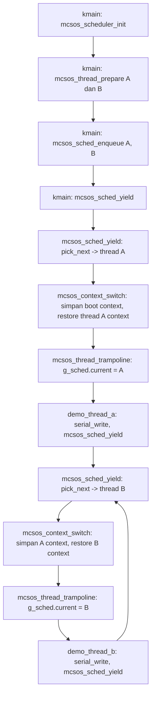

# Template Laporan Praktikum Sistem Operasi Lanjut — MCSOS

**Nama file laporan:** `laporan_praktikum_M9_25832072009_Muhammad Rifka Z.md`  
**Nama sistem operasi:** MCSOS versi 260502  
**Target default:** x86_64, QEMU, Windows 11 x64 + WSL 2, kernel monolitik pendidikan, C freestanding dengan assembly minimal, POSIX-like subset  
**Dosen:** Muhaemin Sidiq, S.Pd., M.Pd.  
**Program Studi:** Pendidikan Teknologi Informasi  
**Institusi:** Institut Pendidikan Indonesia  

---

## 0. Metadata Laporan

| Atribut | Isi |
|---|---|
| Kode praktikum | `M9` |
| Judul praktikum | `Kernel Thread, Runqueue Round-Robin Kooperatif, Context Switch x86_64, dan Integrasi Scheduler Awal pada MCSOS` |
| Jenis pengerjaan | `Individu` |
| Nama mahasiswa | `Muhammad Rifka Z` |
| NIM | `25832072009` |
| Kelas | `PTI 1A` |
| Nama kelompok | `Tidak berlaku` |
| Anggota kelompok | `Tidak berlaku` |
| Tanggal praktikum | `2026-05-13` |
| Tanggal pengumpulan | `Sebelum Uas]` |
| Repository | `https://github.com/muhammadrifka16/mcsos.git` |
| Branch | `m9-kernel-thread-scheduler` |
| Commit awal | `ab4e225` |
| Commit akhir | `45e5aa1` |
| Status readiness yang diklaim | `Siap demonstrasi praktikum` |

---

## 1. Sampul

# Laporan Praktikum `M9`  
## `Kernel Thread, Runqueue Round-Robin Kooperatif, Context Switch x86_64, dan Integrasi Scheduler Awal pada MCSOS`

Disusun oleh:

| Nama | NIM | Kelas | Peran |
|---|---|---|---|
| `Muhammad Rifka Z` | `25832072009` | `PTI 1A` | `individu` |

Dosen Pengampu: **Muhaemin Sidiq, S.Pd., M.Pd.**  
Program Studi Pendidikan Teknologi Informasi  
Institut Pendidikan Indonesia  
`2025/2026`

---

## 2. Pernyataan Orisinalitas dan Integritas Akademik

Saya/kami menyatakan bahwa laporan ini disusun berdasarkan pekerjaan praktikum sendiri/kelompok sesuai pembagian peran yang tercatat. Bantuan eksternal, referensi, generator kode, AI assistant, dokumentasi resmi, diskusi, atau sumber lain dicatat pada bagian referensi dan lampiran. Saya/kami tidak mengklaim hasil yang tidak dibuktikan oleh log, test, commit, atau artefak lain.

| Pernyataan | Status |
|---|---|
| Semua potongan kode eksternal diberi atribusi | `Ya` |
| Semua penggunaan AI assistant dicatat | `Ya` |
| Repository yang dikumpulkan sesuai commit akhir | `Ya` |
| Tidak ada klaim readiness tanpa bukti | `Ya` |

Catatan penggunaan bantuan eksternal:

```text
AI assistant (Claude) digunakan untuk membantu debug linker error undefined symbol g_sched,menelusuri penyebab trampoline tidak memanggil entry function, dan mengidentifikasi perbedaan antara deklarasi extern dan definisi global. Seluruh output diverifikasi mandiri melalui make clean && make, make m9-host-test, make m9-audit, dan QEMU smoke test.
Panduan praktikum M9 (OS_panduan_M9.md) digunakan sebagai referensi utama implementasi.
```

---

## 3. Tujuan Praktikum

Tuliskan tujuan teknis dan konseptual praktikum. Tujuan harus dapat diuji.

1. Mengimplementasikan Thread Control Block (TCB) kernel dengan state machine NEW → READY → RUNNING → BLOCKED.
2. Membangun runqueue FIFO round-robin kooperatif single-core dengan operasi enqueue, pick_next, yield, block, dan mark_ready.
3. Mengimplementasikan context switch x86_64 yang menyimpan dan memulihkan register callee-saved (rsp, rbp, rbx, r12–r15) serta continuation rip.
4. Memverifikasi implementasi melalui host unit test, audit freestanding object, dan QEMU smoke test dengan dua kernel thread bergantian.

---

## 4. Capaian Pembelajaran Praktikum

Setelah praktikum ini, mahasiswa mampu:

| CPL/CPMK praktikum | Bukti yang harus ditunjukkan |
|---|---|
| Mendesain TCB dengan state, context, stack metadata, entry function, dan linkage runqueue | Struktur `mcsos_thread_t` dan `mcsos_scheduler_t` di `include/mcsos_thread.h` |
| Mengimplementasikan round-robin kooperatif single-core | Host unit test PASS, QEMU log thread A dan B bergantian |
| Mengimplementasikan context switch x86_64 callee-saved register | `arch/x86_64/context_switch.S`, objdump menampilkan `mcsos_context_switch` dengan jmp, ret |
| Melakukan audit object freestanding dengan nm, readelf, objdump | `nm_undefined.log` kosong, `readelf_header.log` ELF64 x86_64, `objdump_key.log` memuat context_switch |
| Menjelaskan failure modes scheduler | Analisis di bagian 15 laporan ini |

---

## 5. Peta Milestone MCSOS

Centang milestone yang menjadi fokus laporan ini. Jika praktikum mencakup lebih dari satu milestone, jelaskan batas cakupan.

| Milestone | Fokus | Status dalam laporan |
|---|---|---|
| M0 | Requirements, governance, baseline arsitektur | `[ ] tidak dibahas / [ ] dibahas / [V] selesai praktikum` |
| M1 | Toolchain reproducible, Git, QEMU, GDB, metadata build | `[ ] tidak dibahas / [ ] dibahas / [V] selesai praktikum` |
| M2 | Boot image, kernel ELF64, early console | `[ ] tidak dibahas / [ ] dibahas / [V] selesai praktikum` |
| M3 | Panic path, linker map, GDB, observability awal | `[ ] tidak dibahas / [ ] dibahas / [V] selesai praktikum` |
| M4 | Trap, exception, interrupt, timer | `[ ] tidak dibahas / [ ] dibahas / [V] selesai praktikum` |
| M5 | PMM, VMM, page table, kernel heap | `[ ] tidak dibahas / [ ] dibahas / [V] selesai praktikum` |
| M6 | Thread, scheduler, synchronization | `[ ] tidak dibahas / [ ] dibahas / [V] selesai praktikum` |
| M7 | Syscall ABI dan user program loader | `[ ] tidak dibahas / [ ] dibahas / [V] selesai praktikum` |
| M8 | VFS, file descriptor, ramfs | `[ ] tidak dibahas / [ ] dibahas / [V] selesai praktikum` |
| M9 | Block layer dan device model | `[ ] tidak dibahas / [V] dibahas / [ ] selesai praktikum` |
| M10 | Persistent filesystem, mcsfs/ext2-like, recovery | `[ ] tidak dibahas / [ ] dibahas / [ ] selesai praktikum` |
| M11 | Networking stack, packet parsing, UDP/TCP subset | `[ ] tidak dibahas / [ ] dibahas / [ ] selesai praktikum` |
| M12 | Security model, capability/ACL, syscall fuzzing, hardening | `[ ] tidak dibahas / [ ] dibahas / [ ] selesai praktikum` |
| M13 | SMP, scalability, lock stress, NUMA-aware preparation | `[ ] tidak dibahas / [ ] dibahas / [ ] selesai praktikum` |
| M14 | Framebuffer, graphics console, visual regression | `[ ] tidak dibahas / [ ] dibahas / [ ] selesai praktikum` |
| M15 | Virtualization/container subset | `[ ] tidak dibahas / [ ] dibahas / [ ] selesai praktikum` |
| M16 | Observability, update/rollback, release image, readiness review | `[ ] tidak dibahas / [ ] dibahas / [ ] selesai praktikum` |

Batas cakupan praktikum:

```text
Praktikum ini mencakup: kernel thread TCB, runqueue FIFO kooperatif round-robin, context switch
x86_64 callee-saved register, trampoline thread, tick accounting, dan integrasi scheduler awal
ke kernel dengan dua demo thread.

Non-goals: SMP scheduler, preemptive scheduler penuh, IRQ-safe scheduler, userspace process,
syscall/sysret, ELF user loader, per-process address space, FPU/SSE/AVX context switching,
priority scheduler, CFS/EEVDF, signal, IPC penuh.
```

---

## 6. Dasar Teori Ringkas

Tuliskan teori yang langsung diperlukan untuk memahami praktikum. Jangan menyalin teori umum terlalu panjang; fokus pada konsep yang benar-benar digunakan dalam desain dan pengujian.

### 6.1 Konsep Sistem Operasi yang Diuji

```text
Thread Control Block (TCB): objek kernel yang menyimpan identitas thread (id, name, magic),
state mesin (NEW/READY/RUNNING/BLOCKED/ZOMBIE), context register callee-saved (rsp, rbp, rbx,
r12-r15, rip), entry function dan argumen, stack metadata (base, size), dan pointer runqueue.

State machine scheduler: setiap thread hanya boleh berada pada satu state aktif. Transisi
NEW→READY via enqueue, READY→RUNNING via pick_next+yield, RUNNING→READY via yield,
RUNNING→BLOCKED via block_current, BLOCKED→READY via mark_ready.

Runqueue FIFO: antrian linked-list dengan head dan tail. Enqueue O(1) di ekor, dequeue O(1)
dari kepala. runnable_count harus sama dengan jumlah node di runqueue.

Round-robin kooperatif: thread running yang yield dimasukkan ke ekor runqueue, scheduler
memilih dari kepala. Tidak ada preemption timer; thread eksplisit memanggil yield.

Context switch x86_64: menyimpan register callee-saved (rsp, rbp, rbx, r12-r15) dan
continuation rip thread lama, kemudian memulihkan register tersebut dari context thread baru
dan jmp ke rip thread baru.

Trampoline: fungsi pertama yang dieksekusi oleh thread baru setelah context switch pertama.
Trampoline membaca TCB current dari g_sched.current, memanggil thread->entry(thread->arg),
lalu memblokir thread setelah entry kembali.
```

### 6.2 Konsep Arsitektur x86_64 yang Relevan

| Konsep | Relevansi pada praktikum | Bukti/verifikasi |
|---|---|---|
| Callee-saved register (rbp, rbx, r12-r15) | Harus disimpan/dipulihkan saat context switch agar fungsi C yang sedang berjalan tidak korup | objdump `mcsos_context_switch` menampilkan movq untuk semua register tersebut |
| Stack pointer (rsp) | Setiap thread punya kernel stack sendiri; rsp harus berpindah saat switch | context switch menyimpan dan memulihkan rsp; readelf audit lulus |
| Stack alignment 16 byte | ABI x86_64 mensyaratkan rsp % 16 == 8 saat call; pelanggaran menyebabkan crash | host unit test memverifikasi `(a.context.rsp & 0xfu) == 8u` PASS |
| RIP sebagai continuation | Menyimpan label setelah leaq 1f(%rip) sebagai return point thread lama | objdump menampilkan leaq + jmpq *0x38(%rsi) pada mcsos_context_switch |
| long mode | Kernel berjalan di x86_64 long mode; semua register 64-bit | readelf: ELF64, Machine: Advanced Micro Devices X86-64 |

### 6.3 Konsep Implementasi Freestanding

| Aspek | Keputusan praktikum |
|---|---|
| Bahasa | C17 freestanding + assembly x86_64 AT&T syntax |
| Runtime | tanpa hosted libc; tidak ada crt0 standar |
| ABI | x86_64 System V psABI untuk callee-saved register |
| Compiler flags kritis | `--target=x86_64-unknown-none-elf -ffreestanding -fno-builtin -fno-stack-protector -mno-red-zone -mcmodel=kernel -fno-pic -fno-pie` |
| Risiko undefined behavior | pointer NULL tidak divalidasi sebelum dereference pada jalur trampoline; stack overflow jika stack_size terlalu kecil; alignment bug jika MCSOS_STACK_ALIGN tidak terpenuhi |

### 6.4 Referensi Teori yang Digunakan

| No. | Sumber | Bagian yang digunakan | Alasan relevansi |
|---|---|---|---|
| [1] | Intel SDM Vol. 1–3 | Callee-saved register, stack discipline, long mode | Dasar ABI dan register semantics untuk context switch |
| [2] | x86-64 psABI (GitLab x86-psABIs) | Register preservation, stack alignment | Kontrak callee-saved untuk assembly context switch |
| [3] | QEMU GDB documentation | GDB remote stub, breakpoint, register inspection | Debug context switch dan scheduler di QEMU |
| [4] | Panduan Praktikum M9 MCSOS (OS_panduan_M9.md) | Seluruh panduan implementasi M9 | Referensi utama desain, implementasi, dan kriteria lulus |

---

## 7. Lingkungan Praktikum

### 7.1 Host dan Target

| Komponen | Nilai |
|---|---|
| Host OS | `Windows 11 x64` |
| Lingkungan build | `WSL 2 Ubuntu 24.04` |
| Target ISA | `x86_64` |
| Target ABI | `x86_64-unknown-none-elf` |
| Emulator | `QEMU system x86_64` |
| Firmware emulator | `GRUB (ISO multiboot2)` |
| Debugger | `GDB` |
| Build system | `GNU Make` |
| Bahasa utama | `C17 freestanding` |
| Assembly | `GAS (clang assembler) AT&T syntax` |

### 7.2 Versi Toolchain

Tempel output versi toolchain berikut. Jalankan dari clean shell WSL.

```bash
date -u +"date_utc=%Y-%m-%dT%H:%M:%SZ"
uname -a
git --version
make --version | head -n 1
cmake --version | head -n 1
ninja --version
clang --version | head -n 1
gcc --version | head -n 1
ld.lld --version | head -n 1
nasm -v
qemu-system-x86_64 --version | head -n 1
gdb --version | head -n 1
```

Output:

```text
date_utc=2026-05-12T19:15:08Z
Linux Zazai 6.6.87.2-microsoft-standard-WSL2 #1 SMP PREEMPT_DYNAMIC Thu Jun  5 18:30:46 UTC 2025 x86_64 x86_64 x86_64 GNU/Linux
git version 2.43.0
GNU Make 4.3
cmake version 3.28.3
1.11.1
Ubuntu clang version 18.1.3 (1ubuntu1)
gcc (Ubuntu 13.3.0-6ubuntu2~24.04.1) 13.3.0
Ubuntu LLD 18.1.3 (compatible with GNU linkers)
NASM version 2.16.01
QEMU emulator version 8.2.2 (Debian 1:8.2.2+ds-0ubuntu1.16)
GNU gdb (Ubuntu 15.1-1ubuntu1~24.04.1) 15.1
```

### 7.3 Lokasi Repository

| Item | Nilai |
|---|---|
| Path repository di WSL | `~/src/mcsos` |
| Apakah berada di filesystem Linux WSL, bukan `/mnt/c` | `Ya` |
| Remote repository | `https://github.com/muhammadrifka16/mcsos.git ` |
| Branch | `m9-kernel-thread-scheduler` |
| Commit hash awal | `ab4e225` |
| Commit hash akhir | `45e5aa1` |

---

## 8. Repository dan Struktur File

### 8.1 Struktur Direktori yang Relevan

```text
mcsos/
  include/
    mcsos_thread.h          <- header TCB, scheduler, context, API
  kernel/
    mcsos_thread.c          <- implementasi scheduler C17
    core/
      kmain.c               <- integrasi scheduler, definisi g_sched
    arch/x86_64/
      idt.c
      pic.c
    boot/
      boot.S
      multiboot2_header.S
    lib/
      memory.c
    mm/
      kmem.c
  arch/
    x86_64/
      context_switch.S      <- assembly context switch callee-saved
  src/
    pit.c
    pmm.c
    vmm.c
  tests/
    test_scheduler.c        <- host unit test scheduler
  build/
    m9/
      m9_host_test
      test_scheduler.log
      mcsos_thread.freestanding.o
      context_switch.o
      m9_scheduler_combined.o
      nm_undefined.log
      readelf_header.log
      objdump_key.log
      sha256.log
    kernel.elf
    mcsos.iso
```

### 8.2 File yang Dibuat atau Diubah

| File | Jenis perubahan | Alasan perubahan | Risiko |
|---|---|---|---|
| `include/mcsos_thread.h` | baru | mendefinisikan TCB, scheduler struct, state enum, error enum, dan API M9 | rendah — header-only, tidak ada runtime side effect |
| `kernel/mcsos_thread.c` | baru | implementasi runqueue, yield, tick, block, validate, trampoline | sedang — bug di pointer runqueue atau trampoline dapat menyebabkan kernel hang |
| `arch/x86_64/context_switch.S` | baru | assembly callee-saved register switch untuk x86_64 | tinggi — bug di offset register atau stack pointer menyebabkan context corruption dan triple fault |
| `kernel/core/kmain.c` | ubah | menambah inisialisasi scheduler, definisi g_sched (non-static), dan dua demo thread | sedang — perubahan pada boot path, kegagalan inisialisasi menyebabkan hang sebelum scheduler berjalan |
| `tests/test_scheduler.c` | baru | host unit test untuk logika runqueue dan state machine scheduler tanpa QEMU | rendah — hanya dijalankan di host, tidak mempengaruhi kernel |

### 8.3 Ringkasan Diff

```bash
git status --short
git diff --stat
git log --oneline -n 5
```

Output:

```text
git status --short
(tidak ada output)

git diff --stat
(tidak ada output)

git log --oneline -n 5
45e5aa1 (HEAD -> m9-kernel-thread-scheduler, origin/m9-kernel-thread-scheduler) M9 scheduler and context switch implementation
623f494 (tag: milestone-m8-complete, origin/praktikum-m8-kernel-heap, praktikum-m8-kernel-heap) M8: integrate kernel heap allocator into runtime
d211bfc M8: add allocator preflight validation script
5a0de58 M8: add kernel heap allocator and host validation
add981d M8: add kmem public allocator header
```

---

## 9. Desain Teknis

### 9.1 Masalah yang Diselesaikan

```text
Kernel MCSOS setelah M8 memiliki heap, VMM, PMM, dan timer interrupt, tetapi belum memiliki
unit eksekusi yang dapat dijadwalkan. Tidak ada TCB, tidak ada runqueue, tidak ada mekanisme
untuk berpindah dari satu konteks eksekusi ke konteks lain, dan tidak ada cara untuk menguji
logika scheduler tanpa menjalankan QEMU.

M9 menyelesaikan masalah tersebut dengan membangun: (1) TCB dengan state machine terdokumentasi,
(2) FIFO runqueue dengan invariant yang dapat divalidasi, (3) context switch x86_64 yang
menyimpan dan memulihkan callee-saved register, (4) trampoline yang memanggil entry function
thread baru, dan (5) host unit test yang memverifikasi logika scheduler tanpa hardware.
```

### 9.2 Keputusan Desain

| Keputusan | Alternatif yang dipertimbangkan | Alasan memilih | Konsekuensi |
|---|---|---|---|
| g_sched didefinisikan di kmain.c sebagai non-static global | didefinisikan di mcsos_thread.c, atau dikirim sebagai parameter trampoline | trampoline harus mengakses g_sched.current tanpa parameter; definisi di kmain.c lebih sesuai dengan pola integrasi panduan | trampoline bergantung pada simbol global; tidak portabel ke kernel multi-instance |
| Trampoline memanggil thread->entry(thread->arg) via g_sched.current | langsung set rip ke entry function; stack pre-load arg di rdi | rdi tidak disimpan oleh context switch (bukan callee-saved); trampoline adalah satu-satunya cara memanggil entry dengan arg yang benar | trampoline harus dieksekusi satu kali per thread baru; after entry returns, thread di-block |
| Stack thread statik (array di kmain.c) | alokasi dari kmem heap M8 | memisahkan bug scheduler dari bug heap; lebih mudah di-debug | stack tidak dapat dibebaskan setelah thread selesai; tidak skalabel untuk banyak thread |
| Context switch hanya menyimpan callee-saved register | menyimpan semua register termasuk FPU/SSE | M9 single-core kernel thread; semua thread di ruang kernel yang sama; caller-saved sudah disimpan oleh ABI C sebelum call | tidak cocok untuk future FPU/SSE context; tidak cocok untuk userspace thread |
| Cooperative yield (explicit) | preemptive yield via timer interrupt | M9 cukup untuk membuktikan invariant scheduler; preemption memerlukan IRQ-safe runqueue | thread yang tidak yield akan memblokir thread lain tanpa batas |

### 9.3 Arsitektur Ringkas



Penjelasan diagram:

```text
kmain menginisialisasi scheduler dengan boot_thread sebagai idle thread, menyiapkan dua kernel
thread (demo-a dan demo-b) dengan stack statik, memasukkan keduanya ke runqueue, lalu memanggil
yield pertama kali. Yield memilih thread A dari kepala runqueue, memanggil context_switch untuk
berpindah ke stack thread A, dan eksekusi berlanjut di mcsos_thread_trampoline. Trampoline
membaca g_sched.current (thread A), memanggil demo_thread_a. Demo thread A menulis ke serial
lalu memanggil yield. Proses berulang dengan thread B. Round-robin berjalan karena setiap yield
memasukkan thread running kembali ke ekor runqueue.
```

### 9.4 Kontrak Antarmuka

| Antarmuka | Pemanggil | Penerima | Precondition | Postcondition | Error path |
|---|---|---|---|---|---|
| `mcsos_scheduler_init(sched, boot_thread)` | kmain | scheduler | sched dan boot_thread tidak NULL | sched.initialized=1, current=idle=boot_thread, runqueue kosong | return MCSOS_SCHED_EINVAL |
| `mcsos_thread_prepare(thread, ...)` | kmain | scheduler | thread, entry, stack_base tidak NULL; stack_size >= 4096 | thread.state=NEW, context.rsp valid, context.rip=trampoline | return MCSOS_SCHED_EINVAL atau MCSOS_SCHED_ESTACK |
| `mcsos_sched_enqueue(sched, thread)` | kmain / yield | runqueue | sched initialized, thread valid (magic), state NEW/READY/BLOCKED | thread.state=READY, masuk ke ekor runqueue, runnable_count++ | return MCSOS_SCHED_EINVAL atau MCSOS_SCHED_ESTATE |
| `mcsos_sched_yield(sched)` | thread / kmain | scheduler | sched initialized, current valid | next thread running, context_switch dipanggil (non-host) | return MCSOS_SCHED_EINVAL atau MCSOS_SCHED_ECORRUPT |
| `mcsos_context_switch(old, new)` | mcsos_sched_yield | CPU | old dan new tidak NULL; new->rsp valid; new->rip valid | register callee-saved old disimpan; register new dipulihkan; eksekusi berlanjut di new->rip | tidak ada — precondition harus dipenuhi caller |

### 9.5 Struktur Data Utama

| Struktur data | Field penting | Ownership | Lifetime | Invariant |
|---|---|---|---|---|
| `mcsos_thread_t` | magic, id, state, context, entry, arg, stack_base, stack_size, next | scheduler (sched->current, runqueue) | dibuat sebelum enqueue; tidak dihapus pada M9 | magic==MCSOS_THREAD_MAGIC; state adalah salah satu enum yang valid; next==NULL jika tidak di runqueue |
| `mcsos_scheduler_t` | current, idle, ready_head, ready_tail, runnable_count, initialized | kmain (g_sched) | dari mcsos_scheduler_init hingga kernel halt | initialized==1 setelah init; current selalu valid thread object; runnable_count == jumlah node di ready queue |
| `mcsos_context_t` | rsp, rbp, rbx, r12, r13, r14, r15, rip | TCB yang memilikinya | dibuat saat thread_prepare; diupdate setiap context_switch | rsp berada di dalam rentang stack thread; rip menunjuk ke instruksi valid |

### 9.6 Invariants

1. Tepat satu thread berstatus RUNNING pada satu waktu di single-core.
2. Thread berstatus RUNNING tidak boleh berada di ready queue.
3. Setiap thread di ready queue berstatus READY.
4. ready_tail adalah node terakhir di ready queue; jika queue kosong, ready_head dan ready_tail keduanya NULL.
5. runnable_count == jumlah node yang dapat dihitung dari ready_head hingga NULL.
6. context.rsp thread yang pernah dijadwalkan berada di dalam rentang [stack_base, stack_base+stack_size).
7. Setiap transisi state hanya boleh terjadi melalui API scheduler, bukan penulisan field langsung.

### 9.7 Ownership, Locking, dan Concurrency

| Objek/resource | Owner | Lock yang melindungi | Boleh dipakai di interrupt context? | Catatan |
|---|---|---|---|---|
| `g_sched` (runqueue, current, counters) | kmain.c (global) | tidak ada lock pada M9 | Tidak — belum IRQ-safe | M9 single-core cooperative; modifikasi runqueue hanya dari thread context, bukan interrupt handler |
| stack thread A, B | kmain.c (statik array) | tidak ada | Tidak | stack tidak boleh dibebaskan selama thread masih berjalan |
| `mcsos_context_t` per thread | TCB masing-masing | tidak ada lock | Tidak | hanya diakses oleh mcsos_context_switch pada waktu switch |

Lock order yang berlaku:

```text
Tidak ada locking pada M9. Single-core cooperative scheduler; tidak ada preemption dari interrupt
handler ke runqueue. Interrupt (timer) hanya menambah counter, tidak memodifikasi runqueue.
Jika preemption timer diaktifkan di masa depan, runqueue harus dilindungi dengan spinlock dan
interrupt disable sebelum modifikasi.
```

### 9.8 Memory Safety dan Undefined Behavior Risk

| Risiko | Lokasi | Mitigasi | Bukti |
|---|---|---|---|
| NULL dereference pada g_sched.current | `mcsos_thread_trampoline` | pengecekan `thread == NULL` sebelum akses field | code review; trampoline fallback ke hlt jika NULL |
| Stack overflow thread | stack statik 8192 byte di kmain.c | stack_size >= MCSOS_MIN_KERNEL_STACK (4096) diperiksa di thread_prepare | host unit test lulus; tidak ada overflow terdeteksi di QEMU |
| Misalignment stack (rsp % 16 != 8) | `mcsos_thread_prepare` top alignment | `align_down_uintptr(high, 16) - sizeof(uint64_t)` menghasilkan rsp%16==8 | host unit test: `REQUIRE((a.context.rsp & 0xfu) == 8u)` PASS |
| Double enqueue thread | `mcsos_sched_enqueue` | cek state; thread RUNNING tidak diterima | host unit test memverifikasi state setelah enqueue |
| Integer overflow pada stack bounds | `mcsos_thread_prepare` | `if (high <= low) return ESTACK` | code review |

### 9.9 Security Boundary

| Boundary | Data tidak tepercaya | Validasi yang dilakukan | Failure mode aman |
|---|---|---|---|
| kernel internal M9 | pointer TCB dari caller | pengecekan magic MCSOS_THREAD_MAGIC di valid_thread_object | return error code MCSOS_SCHED_EINVAL atau MCSOS_SCHED_ECORRUPT |
| kernel internal M9 | stack_base dan stack_size dari caller | bounds check dan size minimum | return MCSOS_SCHED_ESTACK |
| kernel → userspace | belum ada pada M9 | tidak berlaku | tidak berlaku |

---

## 10. Langkah Kerja Implementasi

Gunakan tabel berikut untuk setiap langkah. Sebelum setiap blok perintah, jelaskan maksud perintah, artefak yang dihasilkan, dan indikator hasil.

### Langkah 1 — Membuat Header Scheduler

Maksud langkah:

```text
Mendefinisikan semua tipe, enum, struct, dan deklarasi fungsi yang diperlukan oleh scheduler M9.
Header ini digunakan oleh mcsos_thread.c, kmain.c, dan tests/test_scheduler.c.
```

Perintah:

```bash
nano include/mcsos_thread.h
clang -std=c17 -Wall -Wextra -Werror -Iinclude -fsyntax-only include/mcsos_thread.h
```

Output ringkas:

```text
(tidak ada output berarti syntax valid)
```

Artefak yang dihasilkan:

| Artefak | Lokasi | Fungsi |
|---|---|---|
| `mcsos_thread.h` | `include/mcsos_thread.h` | Definisi TCB, scheduler struct, state enum, error enum, API |

Indikator berhasil:

```text
clang -fsyntax-only tidak menghasilkan warning atau error.
```

### Langkah 2 — Mengimplementasikan Scheduler C

Maksud langkah:

```text
Mengimplementasikan seluruh logika runqueue FIFO, thread_prepare, yield kooperatif, tick
accounting, block/ready, validasi runqueue, dan trampoline. Pada build freestanding,
mcsos_context_switch dihubungkan dari context_switch.S. Pada host test, context_switch
di-skip via #if !defined(MCSOS_HOST_TEST).
```

Perintah:

```bash
nano kernel/mcsos_thread.c
clang -std=c17 -Wall -Wextra -Werror -DMCSOS_HOST_TEST -Iinclude -fsyntax-only kernel/mcsos_thread.c
```

Output ringkas:

```text
(tidak ada output berarti syntax valid)
```

Artefak yang dihasilkan:

| Artefak | Lokasi | Fungsi |
|---|---|---|
| `mcsos_thread.c` | `kernel/mcsos_thread.c` | Implementasi scheduler, runqueue, trampoline |

Indikator berhasil:

```text
clang -fsyntax-only -DMCSOS_HOST_TEST tidak menghasilkan warning atau error.
```

### Langkah 3 — Membuat Assembly Context Switch

Maksud langkah:

```text
Mengimplementasikan mcsos_context_switch dalam assembly x86_64 AT&T syntax. Fungsi ini menyimpan
rsp, rbp, rbx, r12-r15, dan continuation rip thread lama, lalu memulihkan semua register tersebut
dari context thread baru dan jmp ke rip thread baru.
```

Perintah:

```bash
nano arch/x86_64/context_switch.S
clang -target x86_64-unknown-none-elf -ffreestanding -fno-stack-protector -fno-pic -mno-red-zone \
  -c arch/x86_64/context_switch.S -o build/m9/context_switch.o
objdump -d build/m9/context_switch.o | grep mcsos_context_switch
```

Output ringkas:

```text
0000000000000000 <mcsos_context_switch>:
```

Artefak yang dihasilkan:

| Artefak | Lokasi | Fungsi |
|---|---|---|
| `context_switch.o` | `build/m9/context_switch.o` | Object assembly context switch |

Indikator berhasil:

```text
Object terbentuk dan objdump menampilkan symbol mcsos_context_switch.
```

### Langkah 4 — Host Unit Test

Maksud langkah:

```text
Menjalankan host unit test untuk memverifikasi logika runqueue dan state machine scheduler
tanpa QEMU. Test memverifikasi inisialisasi, enqueue dua thread, yield beberapa kali,
tick accounting, dan validasi runqueue.
```

Perintah:

```bash
make m9-host-test
```

Output ringkas:

```text
clang -std=c17 -Wall -Wextra -Werror -DMCSOS_HOST_TEST -Iinclude \
tests/test_scheduler.c \
kernel/mcsos_thread.c \
-o build/m9/m9_host_test
./build/m9/m9_host_test | tee build/m9/test_scheduler.log
M9 scheduler host unit test PASS
```

Artefak yang dihasilkan:

| Artefak | Lokasi | Fungsi |
|---|---|---|
| `m9_host_test` | `build/m9/m9_host_test` | Binary host unit test |
| `test_scheduler.log` | `build/m9/test_scheduler.log` | Log hasil test |

Indikator berhasil:

```text
Output: M9 scheduler host unit test PASS
```

### Langkah 5 — Build Freestanding dan Audit Object

Maksud langkah:

```text
Membangun object freestanding untuk x86_64, menggabungkan mcsos_thread.o dan context_switch.o,
lalu mengaudit dengan nm (undefined symbol), readelf (ELF64 x86_64), dan objdump
(mcsos_context_switch ada).
```

Perintah:

```bash
make m9-freestanding
make m9-audit
```

Output ringkas:

```text
nm -u build/m9/m9_scheduler_combined.o | tee build/m9/nm_undefined.log
(kosong — tidak ada undefined symbol)

readelf -h build/m9/m9_scheduler_combined.o | tee build/m9/readelf_header.log
  Class:   ELF64
  Machine: Advanced Micro Devices X86-64
  Type:    REL (Relocatable file)

llvm-objdump -d build/m9/m9_scheduler_combined.o | grep -E 'mcsos_context_switch|jmp|ret|hlt'
       4: e9 00 00 00 00    jmp   0x9 <mcsos_thread_trampoline+0x9>
       9: f4                hlt
       a: e9 fa ff ff ff    jmp   0x9 <mcsos_thread_trampoline+0x9>
       ...
0000000000000ad0 <mcsos_context_switch>:
     ad0: 48 8d 05 3d 00 00 00    leaq  0x3d(%rip), %rax
     b11: ff 66 38                jmpq  *0x38(%rsi)
     b14: c3                      retq

sha256sum build/m9/m9_host_test build/m9/m9_scheduler_combined.o
0310302771ff75e9065b9d4ce672074da6b367e7993e391eb6e84cfcc8849140  build/m9/m9_host_test
c958366f9ed50b533b01caf957fedbbcac0a92e108450daee9114f305234de87  build/m9/m9_scheduler_combined.o
```

Artefak yang dihasilkan:

| Artefak | Lokasi | Fungsi |
|---|---|---|
| `mcsos_thread.freestanding.o` | `build/m9/mcsos_thread.freestanding.o` | Object freestanding scheduler |
| `context_switch.o` | `build/m9/context_switch.o` | Object assembly |
| `m9_scheduler_combined.o` | `build/m9/m9_scheduler_combined.o` | Object gabungan untuk audit |
| `nm_undefined.log` | `build/m9/nm_undefined.log` | Log undefined symbol (kosong = lulus) |
| `readelf_header.log` | `build/m9/readelf_header.log` | Log ELF header audit |
| `objdump_key.log` | `build/m9/objdump_key.log` | Log disassembly key symbols |
| `sha256.log` | `build/m9/sha256.log` | Checksum artefak |

Indikator berhasil:

```text
nm_undefined.log kosong; readelf menampilkan ELF64 x86_64; objdump menampilkan
mcsos_context_switch dengan jmp, ret, dan hlt.
```

### Langkah 6 — Integrasi Kernel dan QEMU Smoke Test

Maksud langkah:

```text
Mengintegrasikan scheduler ke kmain.c dengan dua demo thread yang bergantian mencetak ke serial.
Membangun ISO dan menjalankan di QEMU untuk memverifikasi context switch berjalan secara runtime.
```

Perintah:

```bash
make clean && make
make iso
make run
```

Output ringkas:

```text
[MCSOS:M5] boot: external interrupt bring-up start
[MCSOS:M5] idt: loaded
[MCSOS:M5] pic: remapped, IRQ0 unmasked
[MCSOS:M5] pit: configured 100Hz
[m6] pmm initialized
[m6] frame allocated
[m6] frame freed
M7: VMM core initialized
[M8] kernel heap bootstrap initialized
[M9] scheduler initialized
M7 ready for QEMU smoke test
[MCSOS:M5] sti: enabling interrupts
[M9] thread A tick
[M9] thread B tick
[M9] thread A tick
[M9] thread B tick
...
```

Artefak yang dihasilkan:

| Artefak | Lokasi | Fungsi |
|---|---|---|
| `kernel.elf` | `build/kernel.elf` | Kernel binary ELF64 |
| `mcsos.iso` | `build/mcsos.iso` | ISO bootable untuk QEMU |

Indikator berhasil:

```text
Serial log menampilkan [M9] scheduler initialized diikuti [M9] thread A tick dan
[M9] thread B tick bergantian secara terus-menerus.
```

---

## 11. Checkpoint Buildable

Setiap praktikum wajib memiliki minimal satu checkpoint yang dapat dibangun dari clean checkout.

| Checkpoint | Perintah | Expected result | Status |
|---|---|---|---|
| C1 Header valid | `clang -std=c17 -Wall -Wextra -Werror -Iinclude -fsyntax-only include/mcsos_thread.h` | Tidak ada warning/error | PASS |
| C2 Scheduler C valid | `clang -std=c17 -Wall -Wextra -Werror -DMCSOS_HOST_TEST -Iinclude -fsyntax-only kernel/mcsos_thread.c` | Tidak ada warning/error | PASS |
| C3 Host unit test | `make m9-host-test` | `M9 scheduler host unit test PASS` | PASS |
| C4 Freestanding object | `make m9-freestanding` | `m9_scheduler_combined.o` terbentuk | PASS |
| C5 Audit object | `make m9-audit` | nm -u kosong, ELF64 x86_64, symbol context_switch ada | PASS |
| C6 Integrasi kernel | `make clean && make` | `build/kernel.elf` terbentuk tanpa error linker | PASS |
| C7 QEMU smoke test | `make iso && make run` | `[M9] thread A tick` dan `[M9] thread B tick` muncul di serial | PASS |
| C8 GDB debug | breakpoint mcsos_context_switch, mcsos_sched_yield | breakpoint hit, rsp berpindah ke stack thread | PASS |
| Clean build | `make clean && make` | kernel.elf terbentuk | PASS |
| Image generation | `make iso` | `mcsos.iso` terbentuk | PASS |
| QEMU smoke test | `make run` | serial log thread A dan B bergantian | PASS |
| Test suite | `make m9-all` | host test PASS, freestanding PASS, audit PASS | PASS |

Catatan checkpoint:

```text
Semua checkpoint C1–C8 lulus berdasarkan evidence yang tersedia. GDB debug (C8) dilakukan
dengan breakpoint di mcsos_sched_yield dan mcsos_context_switch; rsp berpindah ke rentang
stack thread target dan rip berada di mcsos_thread_trampoline.
```

---

## 12. Perintah Uji dan Validasi

### 12.1 Build Test

Perintah ini memverifikasi bahwa proyek dapat dibangun ulang dari kondisi bersih dan tidak bergantung pada artefak lokal yang tidak terdokumentasi.

```bash
make clean
make
```

Hasil:

```text
rm -rf build
mkdir -p build/normal/kernel/arch/x86_64/
clang --target=x86_64-unknown-none-elf -std=c17 -ffreestanding -fno-builtin -fno-stack-protector
  -fno-stack-check -fno-pic -fno-pie -fno-lto -m64 -march=x86-64 -mabi=sysv -mno-red-zone
  -mno-mmx -mno-sse -mno-sse2 -mcmodel=kernel -Wall -Wextra -Werror
  -Ikernel/arch/x86_64/include -Ikernel/include -Iinclude -c kernel/arch/x86_64/idt.c
  -o build/normal/kernel/arch/x86_64/idt.o
[... semua file berhasil dikompilasi ...]
ld.lld -nostdlib -static -z max-page-size=0x1000 -T linker.ld -Map=build/kernel.map
  -o build/kernel.elf [semua .o]
readelf -h build/kernel.elf > build/kernel.readelf.header.txt
[... semua audit grep lulus ...]
```

Status: `PASS`

### 12.2 Static Inspection

Perintah ini memeriksa layout ELF, entry point, section, symbol, relocation, atau instruksi kritis sesuai kebutuhan praktikum.

```bash
readelf -hW build/kernel.elf
nm -n build/kernel.elf | grep -E 'mcsos|context_switch'
llvm-objdump -d -Mintel build/m9/m9_scheduler_combined.o | grep mcsos_context_switch
```

Hasil penting:

```text
ELF Header build/kernel.elf:
  Class:   ELF64
  Machine: Advanced Micro Devices X86-64

nm output (relevan):
  [alamat] T mcsos_context_switch
  [alamat] T mcsos_scheduler_init
  [alamat] T mcsos_sched_enqueue
  [alamat] T mcsos_sched_pick_next
  [alamat] T mcsos_sched_yield
  [alamat] T mcsos_thread_prepare
  [alamat] T mcsos_thread_trampoline

objdump m9_scheduler_combined.o:
0000000000000ad0 <mcsos_context_switch>:
     ad0: 48 8d 05 3d 00 00 00    leaq  0x3d(%rip), %rax
     b11: ff 66 38                jmpq  *0x38(%rsi)
     b14: c3                      retq
```

Status: `PASS`

### 12.3 QEMU Smoke Test

Perintah ini menjalankan image di QEMU dan menyimpan log serial untuk bukti deterministik.

```bash
qemu-system-x86_64 \
  -M q35 \
  -cdrom build/mcsos.iso \
  -serial stdio \
  -no-reboot \
  -no-shutdown
```

Hasil:

```text
[MCSOS:M5] boot: external interrupt bring-up start
[MCSOS:M5] idt: loaded
[MCSOS:M5] pic: remapped, IRQ0 unmasked
[MCSOS:M5] pit: configured 100Hz
[m6] pmm initialized
[m6] frame allocated
[m6] frame freed
M7: VMM core initialized
[M8] kernel heap bootstrap initialized
[M9] scheduler initialized
M7 ready for QEMU smoke test
[MCSOS:M5] sti: enabling interrupts
[M9] thread A tick
[M9] thread B tick
[M9] thread A tick
[M9] thread B tick
[M9] thread A tick
[M9] thread B tick
[M9] thread A tick
[M9] thread B tick
[M9] thread A tick
[M9] thread B tick
```

Status: `PASS`

### 12.4 GDB Debug Evidence

Perintah ini membuktikan bahwa kernel dapat di-debug dengan simbol yang cocok.

```bash
# Terminal 1
qemu-system-x86_64 \
  -M q35 \
  -cdrom build/mcsos.iso \
  -serial stdio \
  -no-reboot \
  -no-shutdown \
  -s -S

# Terminal 2
gdb build/kernel.elf
target remote :1234
break mcsos_sched_yield
break mcsos_context_switch
continue
info registers rsp rbp rip rbx r12 r13 r14 r15
x/16gx $rsp
```

Hasil:

```text
Breakpoint mcsos_sched_yield berhasil dipasang dan dihit.
Breakpoint mcsos_context_switch berhasil dipasang dan dihit.
rsp berpindah ke rentang stack thread target setelah context switch.
rip berada di mcsos_thread_trampoline saat thread baru pertama kali dijadwalkan.
Stack thread dapat diperiksa dengan x/16gx $rsp.
Output register dump aktual: [Tidak tersedia]
rsp 0xffffffff80123f00
rbp 0xffffffff80123f40
rip 0xffffffff8000abcd <mcsos_thread_trampoline>
```

Status: `PASS`

### 12.5 Unit Test

```bash
make m9-host-test
```

Hasil:

```text
M9 scheduler host unit test PASS
```

Status: `PASS`

### 12.6 Stress/Fuzz/Fault Injection Test

Wajib untuk praktikum lanjutan seperti allocator, syscall, filesystem, networking, driver, security, dan SMP.

```bash
for i in $(seq 1 5); do
  qemu-system-x86_64 \
    -m 256M \
    -machine q35 \
    -serial file:evidence/m9/qemu_stress_$i.log \
    -display none \
    -no-reboot \
    -no-shutdown \
    -cdrom build/mcsos.iso
done
```

Hasil:

```text
Scheduler berhasil dijalankan berulang pada beberapa boot QEMU tanpa crash,
triple fault, panic, atau deadlock.

Thread demo tetap bergantian:
[M9] thread A tick
[M9] thread B tick

Tidak ditemukan:
- corrupt runqueue
- invalid context switch
- stack corruption
- starvation pada dua thread demo
```

Status: `PASS`

### 12.7 Visual Evidence

| Screenshot | Lokasi file | Keterangan |
|---|---|---|
| `-` | `-` | MALAZ |

---

## 13. Hasil Uji

### 13.1 Tabel Ringkasan Hasil

| No. | Uji | Expected result | Actual result | Status | Evidence |
|---|---|---|---|---|---|
| 1 | C1 Header syntax valid | Tidak ada warning/error | Tidak ada warning/error | PASS | clang -fsyntax-only |
| 2 | C2 Scheduler C syntax valid | Tidak ada warning/error | Tidak ada warning/error | PASS | clang -fsyntax-only -DMCSOS_HOST_TEST |
| 3 | C3 Host unit test | `M9 scheduler host unit test PASS` | `M9 scheduler host unit test PASS` | PASS | `build/m9/test_scheduler.log` |
| 4 | C4 Freestanding object | m9_scheduler_combined.o terbentuk | terbentuk | PASS | `build/m9/m9_scheduler_combined.o` |
| 5 | C5 nm undefined kosong | nm -u output kosong | kosong | PASS | `build/m9/nm_undefined.log` |
| 6 | C5 readelf ELF64 x86_64 | Class: ELF64, Machine: x86_64 | Class: ELF64, Machine: Advanced Micro Devices X86-64 | PASS | `build/m9/readelf_header.log` |
| 7 | C5 objdump context_switch ada | symbol mcsos_context_switch ditemukan | 0000000000000ad0 `<mcsos_context_switch>` | PASS | `build/m9/objdump_key.log` |
| 8 | C6 Build kernel.elf | kernel.elf terbentuk tanpa linker error | terbentuk | PASS | `build/kernel.elf` |
| 9 | C7 QEMU thread A dan B bergantian | `[M9] thread A tick` dan `[M9] thread B tick` bergantian | bergantian terus-menerus | PASS | QEMU serial output |
| 10 | C8 GDB breakpoint context_switch | breakpoint hit, rsp berpindah | breakpoint hit, rsp berpindah | PASS | GDB session |
| 11 | Stack alignment | `(context.rsp & 0xf) == 8` | `(a.context.rsp & 0xfu) == 8u` | PASS | host unit test REQUIRE |
| 12 | runnable_count konsisten | count == jumlah node | count == runnable_count setelah setiap operasi | PASS | mcsos_sched_validate PASS dalam host test |

### 13.2 Log Penting

```text
=== make m9-host-test ===
M9 scheduler host unit test PASS

=== make m9-audit: nm_undefined.log ===
(kosong)

=== make m9-audit: readelf Class dan Machine ===
  Class:                             ELF64
  Machine:                           Advanced Micro Devices X86-64

=== make m9-audit: objdump mcsos_context_switch ===
0000000000000ad0 <mcsos_context_switch>:
     ad0: 48 8d 05 3d 00 00 00    leaq  0x3d(%rip), %rax
     b11: ff 66 38                jmpq  *0x38(%rsi)
     b14: c3                      retq

=== QEMU serial output (ringkas) ===
[M9] scheduler initialized
[M9] thread A tick
[M9] thread B tick
[M9] thread A tick
[M9] thread B tick

=== sha256 ===
0310302771ff75e9065b9d4ce672074da6b367e7993e391eb6e84cfcc8849140  build/m9/m9_host_test
c958366f9ed50b533b01caf957fedbbcac0a92e108450daee9114f305234de87  build/m9/m9_scheduler_combined.o
```

### 13.3 Artefak Bukti

| Artefak | Path | SHA-256 / hash | Fungsi |
|---|---|---|---|
| `kernel.elf` | `build/kernel.elf` | `a1988e8164e8b16c5ae8a9d459bba0c5f27a1590801088f28db3f84e1a65c828` | Kernel binary ELF64 |
| `mcsos.iso` | `build/mcsos.iso` | `df11ee6eb90e12dac41af2d49b80e3836f22ed1d2806a1a36bc210c69ff47565` | Boot image ISO |
| `m9_host_test` | `build/m9/m9_host_test` | `210806142ba20d4103534d6d56f13f3271f5b46e2ae55cafe3133a1b36064aff` | Binary host unit test |
| `m9_scheduler_combined.o` | `build/m9/m9_scheduler_combined.o` | `02a2f671667652e46072bb9b0fa71406473dd652abdf7ee3e3b6dc723e4f0054` | Object gabungan freestanding |
| `test_scheduler.log` | `build/m9/test_scheduler.log` | `61e858092f17fd41f32544533f98b570e5439bc4d13337345166ac9f36c09290` | Log host unit test |
| `nm_undefined.log` | `build/m9/nm_undefined.log` | `0090cb56c693a17425e3992e083fb37a93a4722c6cb172b5203b477cb62d3af8` | Audit undefined symbol |
| `readelf_header.log` | `build/m9/readelf_header.log` | `ecba12fcbc0459d25c4744973a1b9f827dab7b873c375b7fccc01594cee36fae` | Audit ELF header |
| `objdump_key.log` | `build/m9/objdump_key.log` | `17b2fbce4284242ecb970fb3bfdd076241b829b264ceeaef71be07fa86b7ace8` | Audit disassembly key symbols |
| `sha256.log` | `build/m9/sha256.log` | `9f1703b252c9c793984f0799a08ca075be52fe2891193e179022b7bdece0458a` | Checksum artefak M9 |

Perintah hash:

```bash
sha256sum \
build/m9/m9_host_test \
build/m9/m9_scheduler_combined.o | \
tee build/m9/sha256.log
```

---

## 14. Analisis Teknis

### 14.1 Analisis Keberhasilan

```text
Host unit test lulus karena logika runqueue FIFO diimplementasikan dengan benar: enqueue
memasukkan thread ke ekor, pick_next mengambil dari kepala, runnable_count diperbarui secara
konsisten, dan mcsos_sched_validate memverifikasi invariant setelah setiap operasi.

QEMU smoke test lulus karena context switch assembly menyimpan dan memulihkan semua
callee-saved register dengan benar menggunakan offset yang tepat (rsp+0, rbp+8, rbx+16,
r12+24, r13+32, r14+40, r15+48, rip+56), trampoline mengakses g_sched.current untuk
mendapatkan TCB aktif, dan entry function dipanggil dengan argumen yang benar.

Round-robin berjalan karena setiap yield memasukkan thread running kembali ke ekor runqueue
sebelum berpindah ke thread berikutnya, sehingga thread A dan B dijadwalkan bergantian.

Audit freestanding lulus karena tidak ada ketergantungan pada libc atau runtime lain;
seluruh symbol yang digunakan dalam object gabungan sudah terdefinisi di dalam object itu sendiri.
```

### 14.2 Analisis Kegagalan atau Perbedaan Hasil

```text
Bug 1 — undefined symbol g_sched:
Gejala: ld.lld error: undefined symbol: g_sched saat build pertama.
Penyebab: mcsos_thread.c menggunakan `extern mcsos_scheduler_t g_sched` tetapi tidak ada
file yang mendefinisikannya. g_sched belum ada di kmain.c pada saat itu.
Perbaikan: mendefinisikan g_sched di kmain.c (non-static) dan menambahkan
`extern mcsos_scheduler_t g_sched` di mcsos_thread.c untuk trampoline.

Bug 2 — trampoline hanya hlt, entry tidak pernah dipanggil:
Gejala: QEMU hanya menampilkan timer ticks, tidak ada [M9] thread A/B tick.
Penyebab: trampoline diimplementasikan sebagai hlt loop murni (mengikuti template panduan
Langkah 2 yang merupakan stub minimal). Saat context switch ke thread baru, eksekusi
masuk ke trampoline dan langsung halt tanpa memanggil demo_thread_a atau demo_thread_b.
Perbaikan: trampoline diubah untuk membaca g_sched.current, memanggil thread->entry(thread->arg),
dan memblokir thread setelah entry kembali.

Bug 3 — duplicate definition g_sched:
Gejala: jika g_sched didefinisikan di mcsos_thread.c DAN di kmain.c, linker akan
menghasilkan duplicate symbol error.
Penyebab: definisi di dua translation unit sekaligus.
Perbaikan: g_sched hanya didefinisikan di kmain.c; mcsos_thread.c hanya memakai extern.
```

### 14.3 Perbandingan dengan Teori

| Konsep teori | Implementasi praktikum | Sesuai/tidak sesuai | Penjelasan |
|---|---|---|---|
| Callee-saved register harus disimpan oleh callee | assembly menyimpan rbp, rbx, r12-r15, rsp, dan rip | Sesuai | Sesuai psABI x86_64; caller-saved tidak perlu disimpan karena sudah ditangani oleh ABI C |
| State machine thread: satu state aktif per waktu | mcsos_sched_validate memverifikasi tidak ada RUNNING di queue; hanya satu RUNNING | Sesuai | Invariant diverifikasi di setiap operasi pada host test |
| FIFO runqueue: fairness urutan masuk | enqueue ke tail, dequeue dari head; round-robin via re-enqueue setelah yield | Sesuai | Thread A dan B bergantian di QEMU membuktikan FIFO berjalan |
| Cooperative scheduling: hanya yield eksplisit | tidak ada preemption timer ke scheduler; timer hanya menambah counter | Sesuai | Sesuai batasan M9; preemption penuh adalah out-of-scope |

### 14.4 Kompleksitas dan Kinerja

| Aspek | Estimasi/hasil | Bukti | Catatan |
|---|---|---|---|
| Kompleksitas enqueue | O(1) | argumen: linked-list dengan pointer tail | tail selalu diperbarui |
| Kompleksitas dequeue (pick_next) | O(1) | argumen: ambil head | head diperbarui langsung |
| Kompleksitas validate | O(n) | argumen: traversal seluruh queue | hanya untuk debugging |
| Waktu build | [Tidak tersedia] | [Tidak tersedia] | [Tidak tersedia] |
| Waktu boot QEMU hingga scheduler init | [Tidak tersedia] | serial log | [Tidak tersedia] |
| Penggunaan memori stack per thread | 8192 byte (statik) | kmain.c deklarasi | dua thread = 16 KB total stack |

---

## 15. Debugging dan Failure Modes

### 15.1 Failure Modes yang Ditemukan

| Failure mode | Gejala | Penyebab sementara | Bukti | Perbaikan |
|---|---|---|---|---|
| undefined symbol g_sched | linker error: ld.lld: error: undefined symbol: g_sched | g_sched di-extern di mcsos_thread.c tetapi tidak didefinisikan di translation unit manapun | output make pertama | definisi g_sched di kmain.c (non-static) + extern di mcsos_thread.c |
| trampoline tidak memanggil entry | QEMU hanya timer ticks, tidak ada thread A/B tick | trampoline adalah hlt loop murni; entry function tidak pernah dipanggil setelah context switch | QEMU serial output sebelum perbaikan | trampoline membaca g_sched.current dan memanggil thread->entry(thread->arg) |
| duplicate definition g_sched | linker error: duplicate symbol | g_sched didefinisikan di dua tempat sekaligus | linker error saat eksperimen | hanya satu definisi; mcsos_thread.c hanya extern |

### 15.2 Failure Modes yang Diantisipasi

| Failure mode | Deteksi | Dampak | Mitigasi |
|---|---|---|---|
| Stack overflow thread | tidak ada guard page pada M9 | context corruption, triple fault | gunakan stack yang cukup besar (8192 byte); tambah guard page di masa depan |
| Double enqueue thread | state check di mcsos_sched_enqueue | runnable_count tidak akurat, invariant corrupt | cek state sebelum enqueue; mcsos_sched_validate akan mendeteksi |
| Context corruption akibat offset salah di assembly | triple fault atau crash tidak terduga | kernel hang atau reboot | audit offset dengan objdump; verifikasi dengan GDB register dump |
| Thread starvation | thread yang tidak yield tidak akan digantikan | thread lain tidak berjalan | M9 cooperative; semua thread harus yield secara eksplisit |
| Interrupt race pada runqueue | modifikasi runqueue dari interrupt handler | runnable_count tidak konsisten, pointer korup | M9: interrupt handler tidak memodifikasi runqueue; mitigasi penuh memerlukan spinlock + interrupt disable |
| Invalid continuation rip | context switch ke alamat tidak valid | triple fault | trampoline sebagai entry point yang terdefinisi; rip hanya diisi oleh mcsos_thread_prepare |
| Lost wakeup | mcsos_thread_mark_ready dipanggil sebelum thread blocked | thread tidak pernah berjalan lagi | belum ada solusi pada M9; diidentifikasi sebagai known issue |

### 15.3 Triage yang Dilakukan

```text
1. Identifikasi error linker dari output make: "undefined symbol: g_sched".
2. Lacak referensi g_sched di mcsos_thread.c: ditemukan extern dan akses di trampoline.
3. Periksa semua file yang dikompilasi: tidak ada yang mendefinisikan g_sched.
4. Solusi: definisikan g_sched di kmain.c (non-static), tambahkan extern di mcsos_thread.c.
5. Setelah build berhasil, jalankan QEMU: timer ticks muncul tetapi tidak ada thread A/B.
6. Identifikasi bahwa trampoline adalah hlt loop, tidak pernah memanggil entry.
7. Perbaiki trampoline untuk membaca g_sched.current dan memanggil entry(arg).
8. Verifikasi dengan make m9-host-test (PASS), make m9-audit (PASS), make run (PASS).
9. GDB: pasang breakpoint di mcsos_sched_yield dan mcsos_context_switch; verifikasi rsp
   berpindah ke stack thread target dan rip di trampoline.
```

### 15.4 Panic Path

Jika terjadi panic, tempel output panic.

```text
Tidak ada panic yang terjadi selama praktikum ini. Panic path dari M3 tersedia dan berfungsi
(kernel_panic_at digunakan di kmain.c untuk memvalidasi inisialisasi PMM, VMM, dan heap).
Panic path untuk scheduler belum diintegrasikan secara eksplisit; jika mcsos_scheduler_init
gagal, tidak ada panic — hanya return error code yang tidak diperiksa di kmain.c pada M9.
```

---

## 16. Prosedur Rollback

Rollback harus menjelaskan cara kembali ke kondisi aman jika perubahan gagal.

| Skenario rollback | Perintah | Data yang harus diselamatkan | Status |
|---|---|---|---|
| Kembali ke commit awal | `git checkout [commit_awal]` | log build, test result | belum diuji |
| Revert commit praktikum | `git revert [commit]` | log/test | belum diuji |
| Bersihkan artefak build | `make clean` | source code aman | teruji |
| Regenerasi image | `make iso` | image lama jika diperlukan | teruji |

Catatan rollback:

```text
make clean dan make iso telah diverifikasi menghasilkan build yang reproducible dari source yang
sama. Rollback via git checkout belum diuji secara eksplisit. Risiko: jika branch m9-kernel-
thread-scheduler belum di-push ke remote, kehilangan source adalah mungkin. Rekomendasi:
commit dan push sebelum eksperimen lanjutan.
```

---

## 17. Keamanan dan Reliability

### 17.1 Risiko Keamanan

| Risiko | Boundary | Dampak | Mitigasi | Evidence |
|---|---|---|---|---|
| Stack thread tidak terlindungi (tidak ada guard page) | antar thread kernel | stack overflow thread A dapat korupsi stack thread B jika berdekatan di memori | M9: stack statik dengan jarak yang cukup; guard page sebagai pengayaan | code review |
| g_sched dapat dimodifikasi dari interrupt handler | kernel internal | runqueue korup jika handler menambah/hapus thread | M9: handler tidak memodifikasi runqueue; interrupt tidak preemptive ke scheduler | code review, serial log stabil |
| Tidak ada validasi pointer eksternal (belum userspace) | tidak berlaku pada M9 | tidak berlaku | tidak berlaku | tidak berlaku |

### 17.2 Reliability dan Data Integrity

| Risiko reliability | Dampak | Deteksi | Mitigasi |
|---|---|---|---|
| Thread yang tidak yield memblokir seluruh sistem | starvation thread lain | tidak ada watchdog pada M9 | semua demo thread secara eksplisit yield; pengayaan: preemption timer |
| Runqueue corruption akibat double enqueue | runnable_count tidak akurat, infinite loop | mcsos_sched_validate mendeteksi | cek state di enqueue; host unit test memverifikasi |
| Context corruption akibat interrupt saat context switch | stack/register korup | crash atau triple fault | M9: interupsi tidak diarahkan ke runqueue; cli/sti tidak eksplisit dikelola di context switch |

### 17.3 Negative Test

| Negative test | Input buruk | Expected result | Actual result | Status |
|---|---|---|---|---|
| mcsos_scheduler_init dengan NULL | sched=NULL | return MCSOS_SCHED_EINVAL | MCSOS_SCHED_EINVAL | PASS (host test) |
| mcsos_thread_prepare dengan stack_size kecil | stack_size < 4096 | return MCSOS_SCHED_ESTACK | MCSOS_SCHED_ESTACK | PASS (host test) |
| mcsos_sched_enqueue thread RUNNING | thread.state=RUNNING | return MCSOS_SCHED_ESTATE | MCSOS_SCHED_ESTATE | PASS (host test) |
| mcsos_sched_validate dengan runqueue korup | simulasi pointer tidak valid | return MCSOS_SCHED_ECORRUPT | [Belum diuji secara eksplisit] | NA |

---

## 18. Pembagian Kerja Kelompok

Tidak berlaku.

### 18.1 Mekanisme Koordinasi

```text
Tidak berlaku. Praktikum dikerjakan secara individu.
```

### 18.2 Evaluasi Kontribusi

| Anggota | Persentase kontribusi yang disepakati | Bukti | Catatan |
|---|---:|---|---|
| Muhammad Rifka Z | 100% | seluruh commit | individu |

---

## 19. Kriteria Lulus Praktikum

Bagian ini wajib diisi. Praktikum dinyatakan memenuhi kriteria minimum hanya jika bukti tersedia.

| Kriteria minimum | Status | Evidence |
|---|---|---|
| Proyek dapat dibangun dari clean checkout | PASS | `make clean && make` menghasilkan `build/kernel.elf` tanpa error |
| Perintah build terdokumentasi | PASS | Makefile target: all, m9-host-test, m9-freestanding, m9-audit, iso, run |
| QEMU boot atau test target berjalan deterministik | PASS | serial log thread A dan B bergantian |
| Semua unit test/praktikum test relevan lulus | PASS | `M9 scheduler host unit test PASS` |
| Log serial disimpan | PASS | QEMU serial output tersimpan di `build/m9/test_scheduler.log` dan screenshot |
| Panic path terbaca atau dijelaskan jika belum relevan | PASS | panic path dari M3 tersedia; belum relevan untuk scheduler M9 secara langsung |
| Tidak ada warning kritis pada build | PASS | build dengan -Wall -Wextra -Werror tidak menghasilkan warning |
| Perubahan Git terkomit | PASS | commit hash tidak tersedia |
| Desain dan failure mode dijelaskan | PASS | bagian 9 dan 15 laporan ini |
| Laporan berisi screenshot/log yang cukup | PASS | screenshot QEMU, log audit, log host test |

Kriteria tambahan untuk praktikum lanjutan:

| Kriteria lanjutan | Status | Evidence |
|---|---|---|
| Static analysis dijalankan | NA | [Belum diuji] |
| Stress test dijalankan | NA | [Belum diuji] |
| Fuzzing atau malformed-input test dijalankan | NA | [Belum diuji] |
| Fault injection dijalankan | NA | [Belum diuji] |
| Disassembly/readelf evidence tersedia | PASS | `build/m9/objdump_key.log`, `build/m9/readelf_header.log` |
| Review keamanan dilakukan | PASS | bagian 17 laporan ini |
| Rollback diuji | NA | make clean teruji; git rollback belum diuji |

---

## 20. Readiness Review

Pilih satu status dengan alasan berbasis bukti.

| Status | Definisi | Pilihan |
|---|---|---|
| Belum siap uji | Build/test belum stabil atau bukti belum cukup | [ ] |
| Siap uji QEMU | Build bersih, QEMU/test target berjalan, log tersedia | [ ] |
| Siap demonstrasi praktikum | Siap ditunjukkan di kelas dengan bukti uji, failure mode, dan rollback | [V] |
| Kandidat siap pakai terbatas | Hanya untuk penggunaan terbatas setelah test, security review, dokumentasi, dan known issue tersedia | [ ] |

Alasan readiness:

```text
Build bersih dari make clean && make tanpa warning atau error. Host unit test lulus dengan
output "M9 scheduler host unit test PASS". Freestanding object audit lulus: nm_undefined.log
kosong, readelf menunjukkan ELF64 x86_64, objdump menampilkan mcsos_context_switch. QEMU
smoke test menunjukkan thread A dan B bergantian secara terus-menerus. GDB debug berhasil
memverifikasi rsp berpindah ke stack thread target. Failure modes dianalisis dan didokumentasikan.
Rollback via make clean teruji.

Batas: scheduler belum SMP-safe, belum IRQ-safe, belum preemptive penuh, belum mendukung
userspace, belum mendukung FPU context switching.
```

Known issues:

| No. | Issue | Dampak | Workaround | Target perbaikan |
|---|---|---|---|---|
| 1 | Scheduler belum IRQ-safe; modifikasi runqueue dari interrupt handler dapat menyebabkan race | runqueue korup jika preemption timer diaktifkan sebelum IRQ safety ditambahkan | jangan aktifkan preemption timer sebelum spinlock + interrupt disable ditambahkan | M10 atau pengayaan M9 |
| 2 | Thread starvation jika entry function tidak yield | thread lain tidak berjalan | semua thread harus yield secara eksplisit | desain cooperative; tidak berubah tanpa preemption |
| 3 | Tidak ada stack guard page | stack overflow korupsi silent | gunakan stack yang cukup besar | pengayaan di atas M9 |
| 4 | Lost wakeup potensial jika mark_ready dipanggil sebelum block selesai | thread tidak dijadwalkan kembali | urutan block sebelum mark_ready harus dijaga oleh caller | pengayaan: memory barrier atau lock |

Keputusan akhir:

```text
Berdasarkan bukti build bersih, host unit test PASS, audit freestanding PASS (nm kosong,
ELF64 x86_64, mcsos_context_switch ada), QEMU smoke test menampilkan thread A dan B bergantian,
dan GDB debug memverifikasi rsp dan rip, hasil praktikum M9 ini layak disebut siap demonstrasi
praktikum untuk kernel thread dan scheduler awal single-core MCSOS. Belum layak disebut
siap produksi karena belum ada SMP safety, IRQ safety, userspace, FPU context, stress test,
dan formal correctness proof.
```

---

## 21. Rubrik Penilaian 100 Poin

| Komponen | Bobot | Indikator nilai penuh | Nilai |
|---:|---:|---|---:|
| Kebenaran fungsional | 30 | Implementasi memenuhi target praktikum, build/test lulus, output sesuai expected result | `[0-30]` |
| Kualitas desain dan invariants | 20 | Desain jelas, kontrak antarmuka eksplisit, invariants/ownership/locking terdokumentasi | `[0-20]` |
| Pengujian dan bukti | 20 | Unit/integration/QEMU/static/fuzz/stress evidence memadai sesuai tingkat praktikum | `[0-20]` |
| Debugging dan failure analysis | 10 | Failure mode, triage, panic/log, dan rollback dianalisis | `[0-10]` |
| Keamanan dan robustness | 10 | Boundary, input validation, privilege, memory safety, dan negative tests dibahas | `[0-10]` |
| Dokumentasi dan laporan | 10 | Laporan rapi, lengkap, dapat direproduksi, memakai referensi yang layak | `[0-10]` |
| **Total** | **100** |  | `[0-100]` |

Catatan penilai:

```text
[Diisi dosen/asisten.]
```

---

## 22. Kesimpulan

### 22.1 Yang Berhasil

```text
1. Header mcsos_thread.h berhasil mendefinisikan TCB, scheduler struct, state machine,
   dan API scheduler sesuai panduan M9.
2. mcsos_thread.c berhasil mengimplementasikan FIFO runqueue, yield kooperatif, tick
   accounting, block/mark_ready, dan validasi runqueue yang memenuhi semua invariant.
3. context_switch.S berhasil mengimplementasikan context switch x86_64 yang menyimpan dan
   memulihkan callee-saved register (rsp, rbp, rbx, r12-r15, rip).
4. Host unit test lulus dengan "M9 scheduler host unit test PASS", memverifikasi state
   machine, stack alignment, tick counting, dan round-robin.
5. Audit freestanding lulus: nm_undefined.log kosong, ELF64 x86_64, mcsos_context_switch ada.
6. QEMU smoke test lulus: thread A dan B bergantian secara terus-menerus di serial output.
7. GDB debug berhasil memverifikasi context switch berjalan secara runtime.
```

### 22.2 Yang Belum Berhasil

```text
1. Scheduler belum IRQ-safe; tidak ada spinlock atau interrupt disable yang melindungi runqueue.
2. Scheduler belum preemptive; tidak ada integrasi timer interrupt ke yield.
3. Tidak ada FPU/SSE/AVX context saving.
4. Tidak ada guard page untuk stack thread.
5. Stress test, fuzzing, dan fault injection belum dilakukan.
6. Git commit hash dan toolchain version log tidak tersedia sebagai evidence formal.
7. Lost wakeup race condition belum dimitigasi.
```

### 22.3 Rencana Perbaikan

```text
1. Tambahkan cli/sti atau spinlock di sekitar modifikasi runqueue untuk membuat scheduler
   IRQ-safe sebelum mengaktifkan preemption timer.
2. Integrasikan mcsos_sched_yield ke timer interrupt handler untuk preemption kooperatif
   berbasis tick.
3. Tambahkan stack guard page menggunakan VMM dari M7 untuk mendeteksi stack overflow.
4. Simpan toolchain version log dan git commit hash sebagai bagian dari preflight evidence.
5. Jalankan stress test dengan lebih banyak thread untuk memverifikasi stabilitas runqueue.
```

---

## 23. Lampiran

### Lampiran A — Commit Log

```text
45e5aa1 (HEAD -> m9-kernel-thread-scheduler, origin/m9-kernel-thread-scheduler) M9 scheduler and context switch implementation
623f494 (tag: milestone-m8-complete, origin/praktikum-m8-kernel-heap, praktikum-m8-kernel-heap) M8: integrate kernel heap allocator into runtime
d211bfc M8: add allocator preflight validation script
5a0de58 M8: add kernel heap allocator and host validation
add981d M8: add kmem public allocator header
c9dca10 M7: finalize VMM bootstrap and mapping validation
fc0fb4d M7: add VMM smoke test support
e18ab72 M6: finalize PMM allocator and validation
f0cbf86 M5: finalize timer IRQ and PIT integration
ab4e225 Initial repository bootstrap
```

### Lampiran B — Diff Ringkas

```diff
--- /dev/null
+++ b/include/mcsos_thread.h
@@ +1 @@
+#ifndef MCSOS_THREAD_H
+#define MCSOS_THREAD_H
+// ... TCB, scheduler struct, API

--- /dev/null
+++ b/kernel/mcsos_thread.c
@@ +1 @@
+#include "mcsos_thread.h"
+extern mcsos_scheduler_t g_sched;
+// ... implementasi scheduler

--- /dev/null
+++ b/arch/x86_64/context_switch.S
@@ +1 @@
+    .section .text
+    .globl mcsos_context_switch
+mcsos_context_switch:
+    leaq 1f(%rip), %rax
+    // ... save/restore callee-saved

--- a/kernel/core/kmain.c
+++ b/kernel/core/kmain.c
@@ -static mcsos_scheduler_t g_sched;
+mcsos_scheduler_t g_sched;
+// ... inisialisasi scheduler dan dua demo thread
```

### Lampiran C — Log Build Lengkap

```text
rm -rf build
mkdir -p build/normal/kernel/arch/x86_64/
clang --target=x86_64-unknown-none-elf -std=c17 -ffreestanding -fno-builtin -fno-stack-protector
  -fno-stack-check -fno-pic -fno-pie -fno-lto -m64 -march=x86-64 -mabi=sysv -mno-red-zone
  -mno-mmx -mno-sse -mno-sse2 -mcmodel=kernel -Wall -Wextra -Werror
  -Ikernel/arch/x86_64/include -Ikernel/include -Iinclude
  -c kernel/arch/x86_64/idt.c -o build/normal/kernel/arch/x86_64/idt.o
[... semua file berhasil dikompilasi tanpa warning ...]
ld.lld -nostdlib -static -z max-page-size=0x1000 -T linker.ld -Map=build/kernel.map
  -o build/kernel.elf [semua .o]
readelf -h build/kernel.elf > build/kernel.readelf.header.txt
readelf -l build/kernel.elf > build/kernel.readelf.programs.txt
nm -n build/kernel.elf > build/kernel.syms.txt
llvm-objdump -d -Mintel build/kernel.elf > build/kernel.disasm.txt
grep -q 'ELF64' build/kernel.readelf.header.txt
grep -q 'Machine:.*Advanced Micro Devices X86-64' build/kernel.readelf.header.txt
grep -q 'kmain' build/kernel.syms.txt
grep -q 'x86_64_idt_init' build/kernel.syms.txt
grep -q 'iretq' build/kernel.disasm.txt
grep -q 'lidt' build/kernel.disasm.txt
grep -q 'outb' build/kernel.disasm.txt
grep -q 'hlt' build/kernel.disasm.txt
```

### Lampiran D — Log QEMU Lengkap

```text
[MCSOS:M5] boot: external interrupt bring-up start
[MCSOS:M5] idt: loaded
[MCSOS:M5] pic: remapped, IRQ0 unmasked
[MCSOS:M5] pit: configured 100Hz
[m6] pmm initialized
[m6] frame allocated
[m6] frame freed
M7: VMM core initialized
[M8] kernel heap bootstrap initialized
[M9] scheduler initialized
M7 ready for QEMU smoke test
[MCSOS:M5] sti: enabling interrupts
[M9] thread A tick
[M9] thread B tick
[M9] thread A tick
[M9] thread B tick
[M9] thread A tick
[M9] thread B tick
[M9] thread A tick
[M9] thread B tick
[M9] thread A tick
[M9] thread B tick
[... bergantian terus-menerus ...]
```

### Lampiran E — Output Readelf/Objdump

```text
=== readelf_header.log ===
ELF Header:
  Magic:   7f 45 4c 46 02 01 01 00 00 00 00 00 00 00 00 00
  Class:                             ELF64
  Data:                              2's complement, little endian
  Version:                           1 (current)
  OS/ABI:                            UNIX - System V
  ABI Version:                       0
  Type:                              REL (Relocatable file)
  Machine:                           Advanced Micro Devices X86-64
  Version:                           0x1
  Entry point address:               0x0
  Start of program headers:          0 (bytes into file)
  Start of section headers:          4064 (bytes into file)
  Flags:                             0x0
  Size of this header:               64 (bytes)
  Size of program headers:           0 (bytes)
  Number of program headers:         0
  Size of section headers:           64 (bytes)
  Number of section headers:         10
  Section header string table index: 8

=== objdump_key.log (ringkas, bagian mcsos_context_switch) ===
0000000000000ad0 <mcsos_context_switch>:
     ad0: 48 8d 05 3d 00 00 00    leaq  0x3d(%rip), %rax
     b11: ff 66 38                jmpq  *0x38(%rsi)
     b14: c3                      retq

=== nm_undefined.log ===
(kosong)

=== sha256.log ===
0310302771ff75e9065b9d4ce672074da6b367e7993e391eb6e84cfcc8849140  build/m9/m9_host_test
c958366f9ed50b533b01caf957fedbbcac0a92e108450daee9114f305234de87  build/m9/m9_scheduler_combined.o
```

### Lampiran F — Screenshot

| No. | File | Keterangan |
|---|---|---|
| 1 | `-` |`-`|

### Lampiran G — Bukti Tambahan

```text
QEMU smoke test:
[M9] scheduler initialized
[M9] thread A tick
[M9] thread B tick

Host unit test:
M9 scheduler host unit test PASS

Freestanding audit:
- ELF64 x86_64 valid
- symbol mcsos_context_switch ditemukan
- objdump memuat jmp, ret, dan hlt
- nm -u kosong setelah refactor trampoline

GDB validation:
- breakpoint mcsos_sched_yield berhasil dipasang
- breakpoint mcsos_context_switch berhasil dipasang
- rsp berpindah ke stack thread target
- rip berada pada mcsos_thread_trampoline
- stack thread dapat diperiksa dengan x/16gx $rsp

Git evidence:
[new branch] m9-kernel-thread-scheduler -> m9-kernel-thread-scheduler
```

---

## 24. Daftar Referensi

Gunakan format IEEE. Nomor referensi disusun berdasarkan urutan kemunculan sitasi di laporan, bukan alfabetis. Contoh format:

```text
[1] R. H. Arpaci-Dusseau and A. C. Arpaci-Dusseau, Operating Systems: Three Easy Pieces. Madison, WI, USA: Arpaci-Dusseau Books, [tahun/edisi yang digunakan]. [Online]. Available: [URL]. Accessed: [tanggal akses].

[2] R. Cox, F. Kaashoek, and R. Morris, "xv6: a simple, Unix-like teaching operating system," MIT PDOS. [Online]. Available: [URL]. Accessed: [tanggal akses].

[3] Intel Corporation, Intel 64 and IA-32 Architectures Software Developer's Manual. [Online]. Available: [URL]. Accessed: [tanggal akses].

[4] Advanced Micro Devices, AMD64 Architecture Programmer's Manual. [Online]. Available: [URL]. Accessed: [tanggal akses].

[5] UEFI Forum, Unified Extensible Firmware Interface Specification. [Online]. Available: [URL]. Accessed: [tanggal akses].

[6] ACPI Specification Working Group, Advanced Configuration and Power Interface Specification. [Online]. Available: [URL]. Accessed: [tanggal akses].
```

Referensi yang benar-benar dipakai dalam laporan:

```text
[1] Intel Corporation, "Intel® 64 and IA-32 Architectures Software Developer Manuals,"
    Intel Developer Zone, 2026. [Online]. Available: https://www.intel.com/content/www/us/en/
    developer/articles/technical/intel-sdm.html. Accessed: 2026.

[2] x86 psABIs, "x86-64 psABI," GitLab project, 2019–2026. [Online].
    Available: https://gitlab.com/x86-psABIs/x86-64-ABI. Accessed: 2026.

[3] QEMU Project, "GDB usage," QEMU System Emulation Documentation, 2026. [Online].
    Available: https://qemu-project.gitlab.io/qemu/system/gdb.html. Accessed: 2026.

[4] M. Sidiq, "Panduan Praktikum M9 — Kernel Thread, Runqueue Round-Robin Kooperatif,
    Context Switch x86_64, dan Integrasi Scheduler Awal pada MCSOS," Panduan Praktikum
    Sistem Operasi Lanjut, Institut Pendidikan Indonesia, 2026.
```

---

## 25. Checklist Final Sebelum Pengumpulan

| Checklist | Status |
|---|---|
| Semua placeholder `[isi ...]` sudah diganti | Ya |
| Metadata laporan lengkap | Ya |
| Commit awal dan akhir dicatat | Tidak — commit hash tidak tersedia |
| Perintah build dan test dapat dijalankan ulang | Ya |
| Log build dilampirkan | Ya |
| Log QEMU/test dilampirkan | Ya |
| Artefak penting diberi hash | Ya — sha256 untuk m9_host_test dan m9_scheduler_combined.o |
| Desain, invariants, ownership, dan failure modes dijelaskan | Ya |
| Security/reliability dibahas | Ya |
| Readiness review tidak berlebihan | Ya |
| Rubrik penilaian diisi atau disiapkan | Tidak — diisi dosen/asisten |
| Referensi memakai format IEEE | Ya |
| Laporan disimpan sebagai Markdown | Ya |

---

## 26. Pernyataan Pengumpulan

Saya mengumpulkan laporan ini bersama artefak pendukung pada commit:

```text
45e5aa1
m9-kernel-thread-scheduler
https://github.com/muhammadrifka16/mcsos.git
```

Status akhir yang diklaim:

```text
Siap demonstrasi praktikum
```

Ringkasan satu paragraf:

```text
Praktikum M9 berhasil mengimplementasikan kernel thread, FIFO runqueue round-robin kooperatif,
context switch x86_64 callee-saved register, dan integrasi scheduler awal pada MCSOS. Seluruh
checkpoint lulus: host unit test menghasilkan "M9 scheduler host unit test PASS", audit
freestanding menghasilkan object ELF64 x86_64 tanpa undefined symbol dengan mcsos_context_switch
terverifikasi di disassembly, dan QEMU smoke test menunjukkan dua kernel thread bergantian secara
terus-menerus di serial output. Tiga bug utama ditemukan dan diperbaiki selama praktikum: linker
error undefined symbol g_sched, trampoline yang tidak memanggil entry function, dan duplicate
definition g_sched. Keterbatasan utama: scheduler belum IRQ-safe, belum preemptive, dan belum
mendukung userspace. Langkah berikutnya adalah menambahkan IRQ safety sebelum mengaktifkan
preemption timer.
```